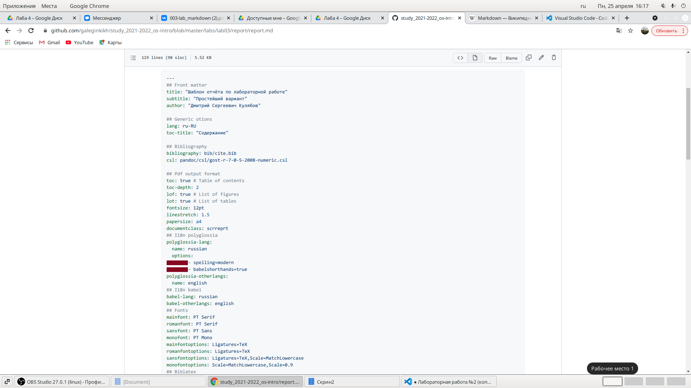
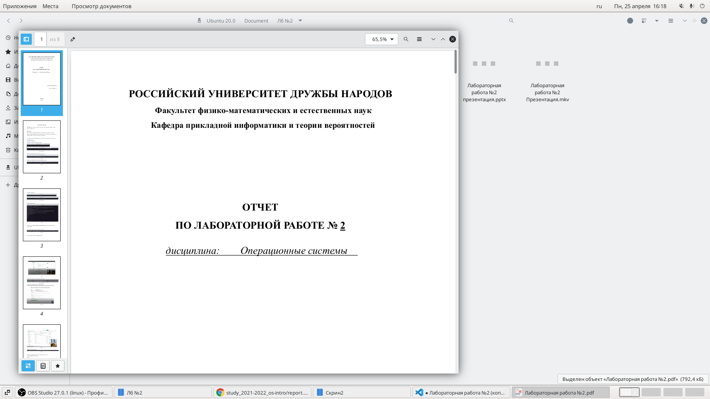
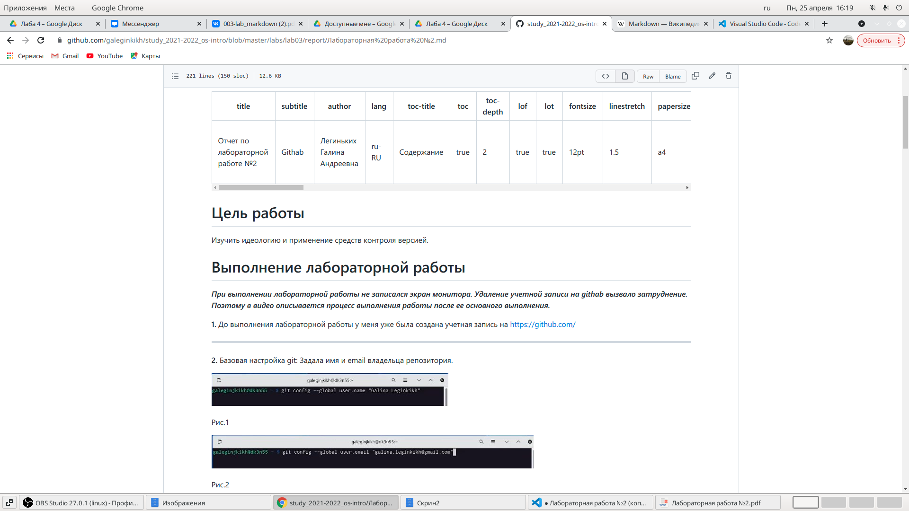
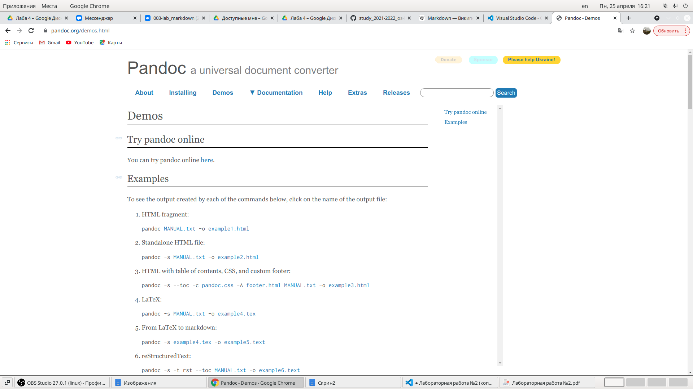

---
## Front matter
lang: ru-RU
title: Лабораторная работа №3
author: |
    Легиньких Галина - группа НФИбд-02-21
date: 25.04.2022

## Formatting
toc: false
slide_level: 2
theme: metropolis
header-includes: 
 - \metroset{progressbar=frametitle,sectionpage=progressbar,numbering=fraction}
 - '\makeatletter'
 - '\beamer@ignorenonframefalse'
 - '\makeatother'
aspectratio: 43
section-titles: true
---

# Markdown 

## Цель работы

Научиться оформлять отчёты с помощью легковесного языка разметки Markdown

## Задание

– Сделайте отчёт по предыдущей лабораторной работе в формате Markdown.

– В качестве отчёта просьба предоставить отчёты в 3 форматах: pdf, docx и md (в архиве,
поскольку он должен содержать скриншоты, Makefile и т.д.)

##

***Markdown (произносится маркда́ун)*** — облегчённый язык разметки, созданный с целью обозначения форматирования в простом тексте, с максимальным сохранением его читаемости человеком, и пригодный для машинного преобразования в языки для продвинутых публикаций (HTML, Rich Text и других).

##

**1.** Для начала я скачала Visual Studio Code. В нем можно удобно отслеживать изменения.(рис. [-@fig:001])

{ #fig:001 width=70% }

##

**2.** Воспользовалась шаблоном с githab.(рис. [-@fig:002])

{ #fig:002 width=70% }

##

**3.** Открыла лабораторную работу №2, чтобы взять оттуда информацию.(рис. [-@fig:004])

{ #fig:004 width=70% }

##

 **4.** Сохранила все скиншоты из лабораторной работы №2 в папку, которая рядом с файлом будующим отчетом.(рис. [-@fig:003])
 
{ #fig:003 width=70% }

##

 **5.** Данный файл сохранила с расширением .md и загрузила на githab.(рис. [-@fig:005])
 
 { #fig:005 width=70% }

##

 **6.** Затем конвертировала файл с помощью Pandoc.(рис. [-@fig:006])

{ #fig:006 width=70% }

## Вывод

 Я научилась оформлять отчёт с помощью легковесного языка разметки Markdown.

 
