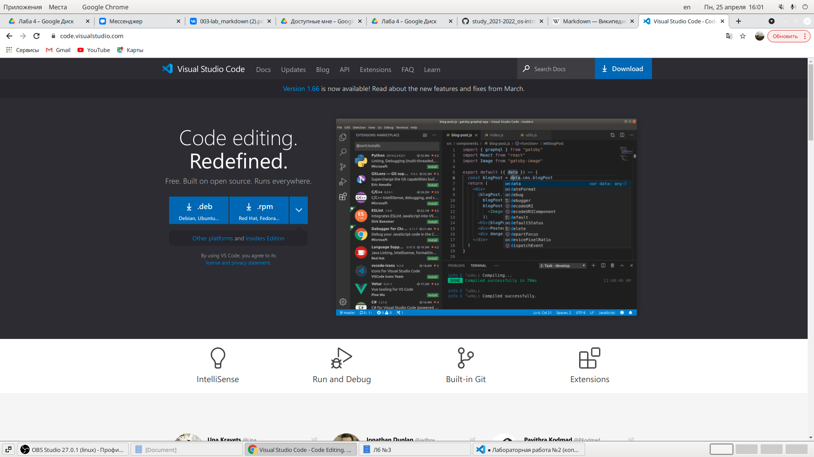
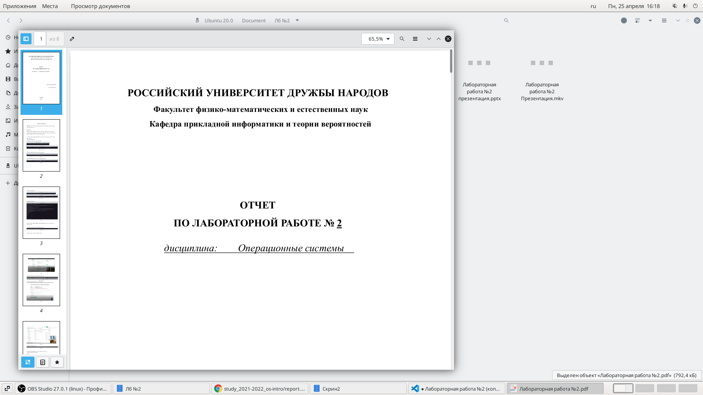
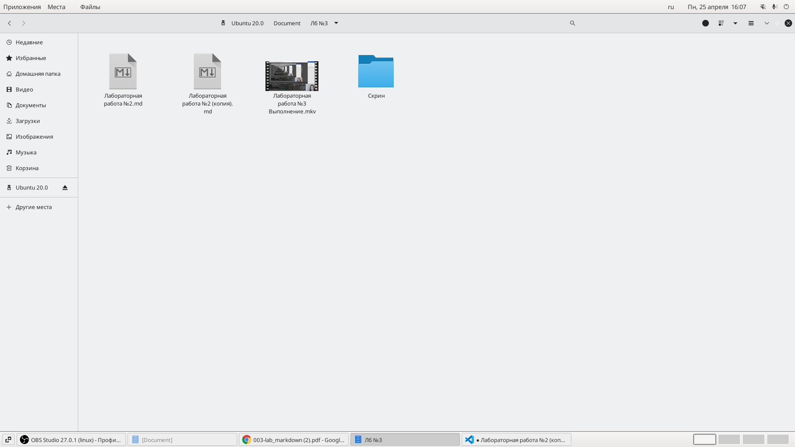
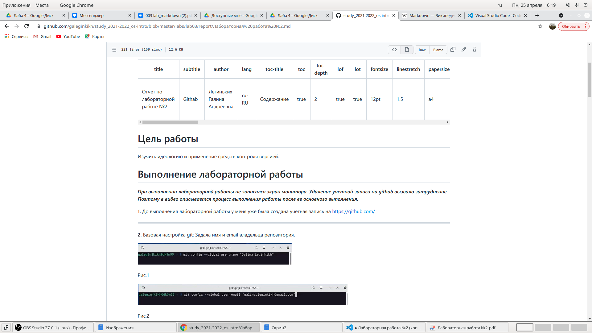
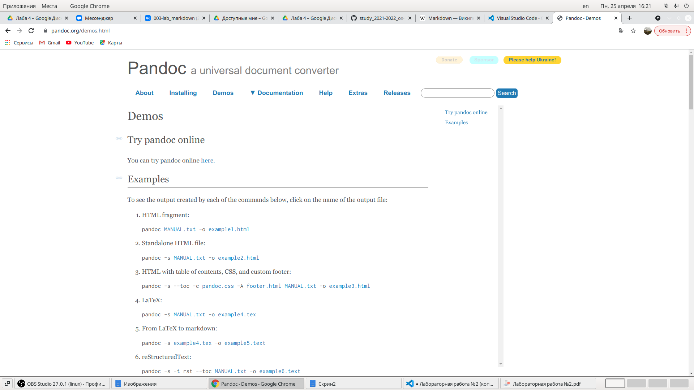

---
## Front matter
lang: ru-RU
title: Лабораторная работа №3
author: |
    Легиньких Галина - группа НФИбд-02-21
date: 25.04.2022

## Formatting
toc: false
slide_level: 2
theme: metropolis
header-includes: 
 - \metroset{progressbar=frametitle,sectionpage=progressbar,numbering=fraction}
 - '\makeatletter'
 - '\beamer@ignorenonframefalse'
 - '\makeatother'
aspectratio: 43
section-titles: true
---

# Markdown 

_ _ _

# Цель работы

    Научиться оформлять отчёты с помощью легковесного языка разметки Markdown

_ _ _

# Задание

– Сделайте отчёт по предыдущей лабораторной работе в формате Markdown.

– В качестве отчёта просьба предоставить отчёты в 3 форматах: pdf, docx и md (в архиве,
поскольку он должен содержать скриншоты, Makefile и т.д.)

_ _ _

# Теоретическая часть

***Markdown (произносится маркда́ун)*** — облегчённый язык разметки, созданный с целью обозначения форматирования в простом тексте, с максимальным сохранением его читаемости человеком, и пригодный для машинного преобразования в языки для продвинутых публикаций (HTML, Rich Text и других).

_ _ _

**1.** Для начала я скачала Visual Studio Code. В нем можно удобно отслеживать изменения.

Рис.1 Скачивание
_ _ _

**2.** Воспользовалась шаблоном с githab.

Рис.2 Шаблон
_ _ _

**3.** Открыла лабораторную работу №2, чтобы взять оттуда информацию.

Рис.3 Лб №2
 _ _ _

 **4.** Сохранила все скиншоты из лабораторной работы №2 в папку, которая рядом с файлом будующим отчетом.

 

Рис.4 Папка Скрин
 _ _ _

 **5.** Данный файл сохранила с расширением .md и загрузила на githab.
 
 

Рис.5 Файл на githab
 _ _ _

 **6.** Затем конвертировала файл с помощью Pandoc.

 

Рис.6 Pandoc
 _ _ _

 # Вывод

 Я научилась оформлять отчёт с помощью легковесного языка разметки Markdown.

 