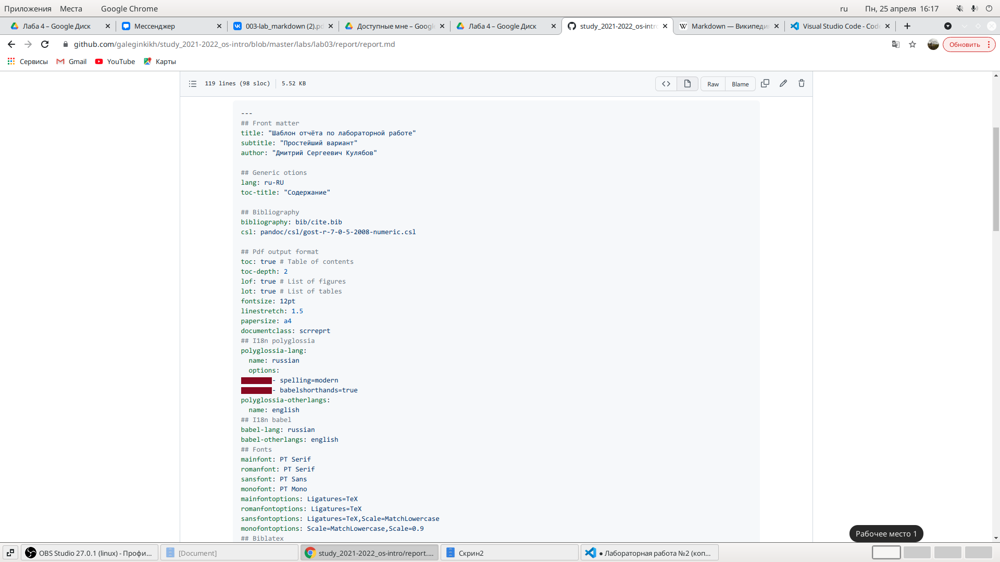
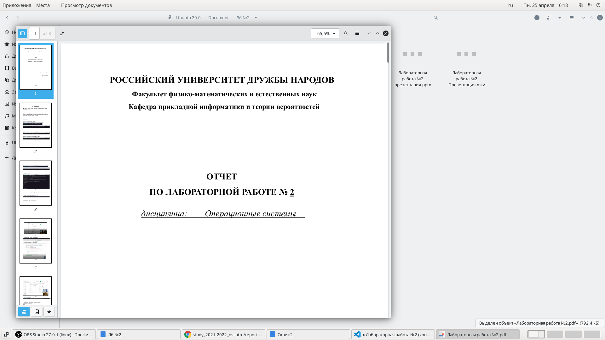
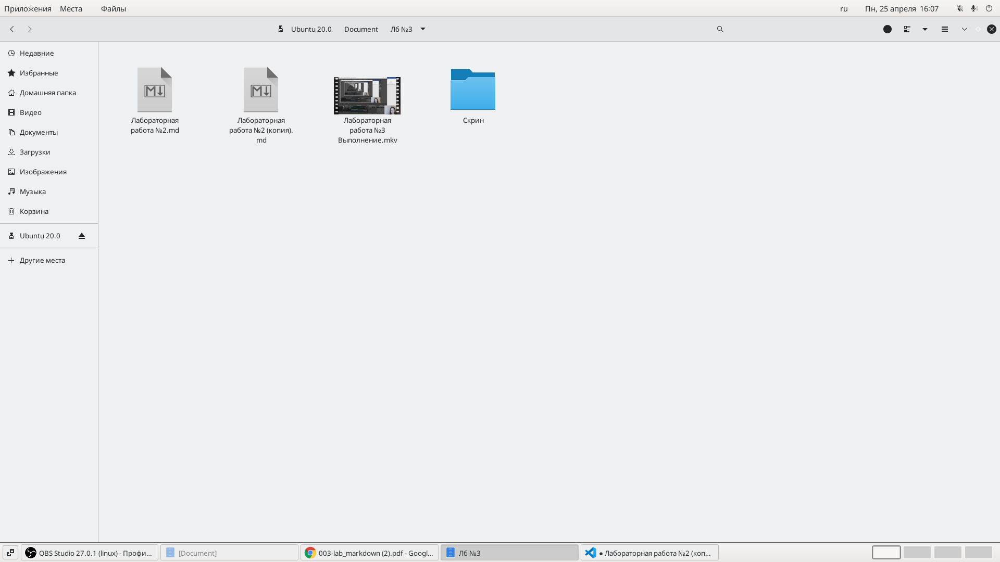
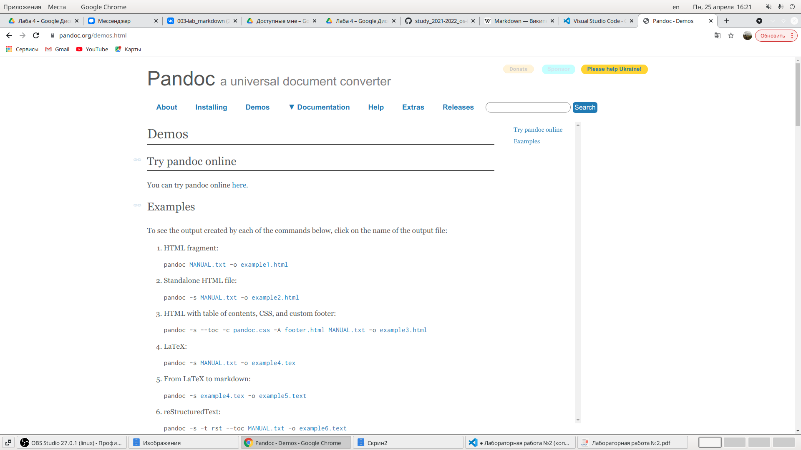

---
## Front matter
title: "Отчет по лабораторной работе №3"
subtitle: "Markdown"
author: "Легиньких Галина Андреевна"

## Generic otions
lang: ru-RU
toc-title: "Содержание"
## Pdf output format
toc: true # Table of contents
toc-depth: 2
lof: true # List of figures
lot: true # List of tables
fontsize: 12pt
linestretch: 1.5
papersize: a4
documentclass: scrreprt
## I18n polyglossia
polyglossia-lang:
  name: russian
  options:
  - spelling=modern
  - babelshorthands=true
polyglossia-otherlangs:
  name: english
## I18n babel
babel-lang: russian
babel-otherlangs: english
## Fonts
mainfont: PT Serif
romanfont: PT Serif
sansfont: PT Sans
monofont: PT Mono
mainfontoptions: Ligatures=TeX
romanfontoptions: Ligatures=TeX
sansfontoptions: Ligatures=TeX,Scale=MatchLowercase
monofontoptions: Scale=MatchLowercase,Scale=0.9
## Biblatex
biblatex: true
biblio-style: "gost-numeric"
biblatexoptions:
  - parentracker=true
  - backend=biber
  - hyperref=auto
  - language=auto
  - autolang=other*
  - citestyle=gost-numeric
## Pandoc-crossref LaTeX customization
figureTitle: "Рис."
tableTitle: "Таблица"
listingTitle: "Листинг"
lofTitle: "Список иллюстраций"
lotTitle: "Список таблиц"
lolTitle: "Листинги"
## Misc options
indent: true
header-includes:
  - \usepackage{indentfirst}
  - \usepackage{float} # keep figures where there are in the text
  - \floatplacement{figure}{H} # keep figures where there are in the text
---

# Цель работы

Научиться оформлять отчёты с помощью легковесного языка разметки Markdown

# Задание

– Сделайте отчёт по предыдущей лабораторной работе в формате Markdown.

– В качестве отчёта просьба предоставить отчёты в 3 форматах: pdf, docx и md (в архиве,
поскольку он должен содержать скриншоты, Makefile и т.д.)

# Теоретическая часть

***Markdown (произносится маркда́ун)*** — облегчённый язык разметки, созданный с целью обозначения форматирования в простом тексте, с максимальным сохранением его читаемости человеком, и пригодный для машинного преобразования в языки для продвинутых публикаций (HTML, Rich Text и других).

**Обработка файлов в формате Markdown**

Для обработки файлов в формате Markdown будем использовать Pandoc
https://pandoc.org/. Конкретно, нам понадобится программа pandoc ,
pandoc-citeproc https://github.com/jgm/pandoc/releases, pandoc-crossref
https://github.com/lierdakil/pandoc-crossref/releases.

# Выполнение лабораторной работы

**1.** Для начала я скачала Visual Studio Code. В нем можно удобно отслеживать изменения.(рис. [-@fig:001])

{ #fig:001 width=70% }

**2.** Воспользовалась шаблоном с githab.(рис. [-@fig:002])

{ #fig:002 width=70% }

**3.** Открыла лабораторную работу №2, чтобы взять оттуда информацию.(рис. [-@fig:004])

{ #fig:004 width=70% }

 **4.** Сохранила все скиншоты из лабораторной работы №2 в папку, которая рядом с файлом будующим отчетом. (рис. [-@fig:003])

{ #fig:003 width=70% }

 **5.** Данный файл сохранила с расширением .md и загрузила на githab. (рис. [-@fig:005])
 
{ #fig:005 width=70% }

 **6.** Затем конвертировала файл с помощью Pandoc. (рис. [-@fig:006])

{ #fig:006 width=70% }

 # Вывод

 Я научилась оформлять отчёт с помощью легковесного языка разметки Markdown.

 # Контрольные вопросы 

 (Не предусмотренны)
