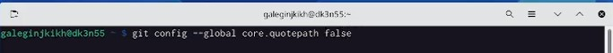
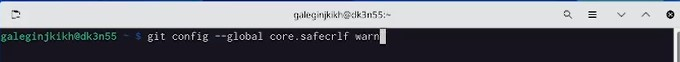

---
## Front matter
title: "Отчет по лабораторной работе №2"
subtitle: "Githab"
author: "Легиньких Галина Андреевна"

## Generic otions
lang: ru-RU
toc-title: "Содержание"

## Pdf output format
toc: true # Table of contents
toc-depth: 2
lof: true # List of figures
lot: true # List of tables
fontsize: 12pt
linestretch: 1.5
papersize: a4
documentclass: scrreprt
## I18n polyglossia
polyglossia-lang:
  name: russian
  options:
  - spelling=modern
  - babelshorthands=true
polyglossia-otherlangs:
  name: english
## I18n babel
babel-lang: russian
babel-otherlangs: english
## Fonts
mainfont: PT Serif
romanfont: PT Serif
sansfont: PT Sans
monofont: PT Mono
mainfontoptions: Ligatures=TeX
romanfontoptions: Ligatures=TeX
sansfontoptions: Ligatures=TeX,Scale=MatchLowercase
monofontoptions: Scale=MatchLowercase,Scale=0.9
## Biblatex
biblatex: true
biblio-style: "gost-numeric"
biblatexoptions:
  - parentracker=true
  - backend=biber
  - hyperref=auto
  - language=auto
  - autolang=other*
  - citestyle=gost-numeric
## Pandoc-crossref LaTeX customization
figureTitle: "Рис."
tableTitle: "Таблица"
listingTitle: "Листинг"
lofTitle: "Список иллюстраций"
lotTitle: "Список таблиц"
lolTitle: "Листинги"
## Misc options
indent: true
header-includes:
  - \usepackage{indentfirst}
  - \usepackage{float} # keep figures where there are in the text
  - \floatplacement{figure}{H} # keep figures where there are in the text
---

# Цель работы

Изучить идеологию и применение средств контроля версией.

# Выполнение лабораторной работы

***При выполнении лабораторной работы не записался экран монитора. Удаление учетной записи на githab вызвало затруднение. Поэтому в видео описывается процесс выполнения работы после ее основного выполнения.***

**1.** До выполнения лабораторной работы у меня уже была создана учетная запись на https://github.com/

**2.** Базовая настройка git:
Задала имя и email владельца репозитория.(рис. [-@fig:001])(рис. [-@fig:002])

{ #fig:001 width=70% }

{ #fig:002 width=70% }

Настроила верификацию и подписание коммитов git. (рис. [-@fig:003])

{ #fig:003 width=70% }

Зададим имя начальной ветки (будем называть её master).(рис. [-@fig:004])

{ #fig:004 width=70% }

Установила параметры.(рис. [-@fig:005])(рис. [-@fig:006])

{ #fig:005 width=70% }

{ #fig:006 width=70% }

**3.** Запросим SSH-ключ (рис. [-@fig:007])

{ #fig:007 width=70% }

**4.** Командой cat ~/.ssh/id_rsa.pub | xclip -sel clip копируем ключ в нужном виде и вводим на сайт

**5.** Сгенерировала ключ PGP и добавляем его на git. (рис. [-@fig:008])

{ #fig:008 width=70% }

Теперь терминал и githab синхронизированы.(рис. [-@fig:009])

{ #fig:009 width=70% }

**6.** Настроила автоматические подписи коммитов git.(рис. [-@fig:010])(рис. [-@fig:011])

{ #fig:010 width=70% }

{ #fig:011 width=70% }

**7.** Создала репозиторий курса на основе шаблона. (рис. [-@fig:012])(рис. [-@fig:013])

{ #fig:012 width=70% }

{ #fig:013 width=70% }

**8.** Перешла в каталог курса.(рис. [-@fig:014])

{ #fig:014 width=70% }

**9.** Удалила лишние файлы и создала необходимые каталоги.

**10.** Отправила файлы на сервер. (рис. [-@fig:015])
git add .
git commit -am 'feat(main): make course structure'
git push

{ #fig:015 width=70% }

# Выводы

Мы изучили идеологию и применение средств контроля версий. Зарегистрировались на githab. Создали репозиторий группы.

#Контрольные вопросы

1. Что такое системы контроля версий (VCS) и для решения каких задач они предназначаются? 
Система контроля версий (VCS) — это место хранения кода. Система управления версиями позволяет хранить несколько версий одного и того же документа, при необходимости возвращаться к более ранним версиям, определять, кто и когда сделал то или иное изменение, и многое другое. 
Такие системы наиболее широко используются при разработке программного обеспечения для хранения исходных кодов разрабатываемой программы. 

2. Объясните следующие понятия VCS и их отношения: хранилище, commit, история, рабочая копия. 
Репозиторий - хранилище версий - в нем хранятся все документы вместе с историей их изменения и другой служебной информацией 
Commit («[трудовой] вклад», не переводится) — процесс создания новой версии 
Рабочая копия (working copy) — текущее состояние файлов проекта, основанное на версии, загруженной из хранилища (обычно на последней). 
Версия (revision), или ревизия, — состояние всех файлов на определенный момент времени, сохраненное в репозитарии, с дополнительной информацией 

3. Что представляют собой и чем отличаются централизованные и децентрализованные VCS? Приведите примеры VCS каждого вида. 
Централизованные системы — это системы, которые используют архитектуру клиент / сервер, где один или несколько клиентских узлов напрямую подключены к центральному серверу. (Пример — Wikipedia.) 
В децентрализованных системах каждый узел принимает свое собственное решение. Конечное поведение системы является совокупностью решений отдельных узлов. (Пример — Bitcoin) 

4. Опишите действия с VCS при единоличной работе с хранилищем.
 
5. Опишите порядок работы с общим хранилищем VCS. 

6. Каковы основные задачи, решаемые инструментальным средством git? 
У Git есть две основные задачи: хранить информацию обо всех изменениях в коде, начиная с самой первой строчки, и обеспечить удобства командной работы над кодом.
 
7. Назовите и дайте краткую характеристику командам git. 
– создание основного дерева репозитория: git init – получение обновлений (изменений) текущего дерева из центрального репозитория: git pull – отправка всех произведённых изменений локального дерева в центральный репозиторий: git push – просмотр списка изменённых файлов в текущей директории: git status – просмотр текущих изменения: git diff – сохранение текущих изменений: – добавить все изменённые и/или созданные файлы и/или каталоги: git add . – добавить конкретные изменённые и/или созданные файлы и/или каталоги: git add имена_файлов – удалить файл и/или каталог из индекса репозитория (при этом файл и/или каталог остаётся в локальной директории): git rm имена_файлов – сохранение добавленных изменений: – сохранить все добавленные изменения и все изменённые файлы: git commit -am 'Описание коммита' – сохранить добавленные изменения с внесением комментария через встроенный редактор: git commit – создание новой ветки, базирующейся на текущей: git checkout -b имя_ветки – переключение на некоторую ветку: git checkout имя_ветки (при переключении на ветку, которой ещё нет в локальном репозитории, она будет создана и связана с удалённой) – отправка изменений конкретной ветки в центральный репозиторий: git push origin имя_ветки – сл ияние ветки с текущим деревом: git merge —no-ff имя_ветки – удаление ветки: – удаление локальной уже слитой с основным деревом ветки: git branch -d имя_ветки – принудительное удаление локальной ветки: git branch -D имя_ветки – удаление ветки с центрального репозитория: git push origin :имя_ветки 

9. Что такое и зачем могут быть нужны ветви (branches)? 
‘Git branch’ – это команда для управления ветками в репозитории Git. 
Ветка – это просто «скользящий» указатель на один из коммитов. Когда мы создаём новые коммиты, указатель ветки автоматически сдвигается вперёд, к вновь созданному коммиту. 
Ветки используются для разработки одной части функционала изолированно от других. Каждая ветка представляет собой отдельную копию кода проекта. Ветки позволяют одновременно работать над разными версиями проекта. 
Ветвление («ветка», branch) — один из параллельных участков истории в одном хранилище, исходящих из одной версии (точки ветвления). Ветки нужны для того, чтобы программисты могли вести совместную работу над проектом и не мешать друг другу при этом. 

10. Как и зачем можно игнорировать некоторые файлы при commit? 
Игнорируемые файлы обычно представляют собой файлы, специфичные для платформы, или автоматически созданные из сборочных систем. Временно игнорировать изменения в файле можно командой: git update-index —assume-unchanged <file>

