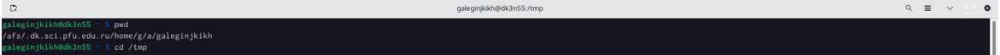

---
## Front matter
lang: ru-RU
title: Лабораторная работа №4
author: |
    Легиньких Галина - группа НФИбд-02-21
date: 25.04.2022

## Formatting
toc: false
slide_level: 2
theme: metropolis
header-includes: 
 - \metroset{progressbar=frametitle,sectionpage=progressbar,numbering=fraction}
 - '\makeatletter'
 - '\beamer@ignorenonframefalse'
 - '\makeatother'
aspectratio: 43
section-titles: true
---

# Основы интерфейса взаимодействия пользователя с системой Unix на уровне командной строки

## Цель работы

Приобретение практических навыков взаимодействия пользователя с системой посредством командной строки.

## Выполнение лабораторной работы

**1.** Определила полное имя домашнего каталога с помощью команды pwd. И перешла в каталог /tmp с помощью команды cd.(рис. [-@fig:001])

{ #fig:001 width=70% }

##

**2.** Вывела на экран содержимое каталога /tmp. Для этого использовала команду ls
с различными опциями.

##

**3.** Определила, есть ли в каталоге /var/spool подкаталог с именем cron. Он там был. Перешла в домашний каталог и вывела на экран его содержимое. (рис. [-@fig:006])

{ #fig:006 width=70% }

Определила, кто является владельцем файлов и подкаталогов. 

##

**4.** В домашнем каталоге создала новый каталог с именем newdir.

В каталоге ~/newdir создала новый каталог с именем morefun.

В домашнем каталоге создала одной командой три новых каталога с именами letters, memos, misk. Затем удалила эти каталоги одной командой.

Попробовала удалить ранее созданный каталог ~/newdir командой rm. Проверила, был ли каталог удалён. 

##

**5.** С помощью команды man определила, какую опцию команды ls нужно использовать для просмотра содержимого не только указанного каталога, но и подкаталогов, входящих в него. 

**6.** С помощью команды man определила набор опций команды ls, позволяющий отсортировать по времени последнего изменения выводимый список содержимого каталога с развёрнутым описанием файлов. 

##

**7.** Использовала команду man для просмотра описания следующих команд: cd, pwd, mkdir,
rmdir, rm.

**8.** Используя информацию, полученную при помощи команды history, выполнила модификацию и исполнение нескольких команд из буфера команд. (рис. [-@fig:019])

{ #fig:019 width=70% }

##

## Вывод

Приобрела практические навыки взаимодействия пользователя с системой посредством командной строки.

