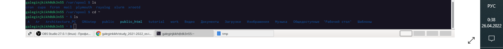

---
## Front matter
lang: ru-RU
title: Лабораторная работа №4
author: |
    Легиньких Галина - группа НФИбд-02-21
date: 25.04.2022

## Formatting
toc: false
slide_level: 2
theme: metropolis
header-includes: 
 - \metroset{progressbar=frametitle,sectionpage=progressbar,numbering=fraction}
 - '\makeatletter'
 - '\beamer@ignorenonframefalse'
 - '\makeatother'
aspectratio: 43
section-titles: true
---

# Основы интерфейса взаимодействия пользователя с системой Unix на уровне командной строки

# Цель работы

    Приобретение практических навыков взаимодействия пользователя с системой посредством командной строки.

_ _ _

# Выполнение лабораторной работы

**1.** Определила полное имя домашнего каталога с помощью команды pwd. И перешла в каталог /tmp с помощью команды cd. (Рис.1)

Рис.1 Домашний каталог

_ _ _

**2.** Вывела на экран содержимое каталога /tmp. Для этого использовала команду ls
с различными опциями.

_ _ _

**3.** Определила, есть ли в каталоге /var/spool подкаталог с именем cron. Он там был. Перешла в домашний каталог и вывела на экран его содержимое. (Рис.6)

Рис.6 spool

Определила, кто является владельцем файлов и подкаталогов. 

_ _ _

**4.** В домашнем каталоге создала новый каталог с именем newdir.

В каталоге ~/newdir создала новый каталог с именем morefun.

В домашнем каталоге создала одной командой три новых каталога с именами letters, memos, misk. Затем удалила эти каталоги одной командой.

Попробовала удалить ранее созданный каталог ~/newdir командой rm. Проверила, был ли каталог удалён. 

_ _ _

**5.** С помощью команды man определила, какую опцию команды ls нужно использовать для просмотра содержимого не только указанного каталога, но и подкаталогов, входящих в него. 

_ _ _

**6.** С помощью команды man определила набор опций команды ls, позволяющий отсортировать по времени последнего изменения выводимый список содержимого каталога с развёрнутым описанием файлов. 

_ _ _

**7.** Использовала команду man для просмотра описания следующих команд: cd, pwd, mkdir,
rmdir, rm.

_ _ _

**8.** Используя информацию, полученную при помощи команды history, выполнила модификацию и исполнение нескольких команд из буфера команд. (Рис.19)

Рис.19 history

# Вывод

Приобрела практические навыки взаимодействия пользователя с системой посредством командной строки.

