---
## Front matter
title: "Отчет по лабораторной работе №4"
subtitle: "Основы интерфейса взаимодействия пользователя с системой Unix на уровне командной строки"
author: "Легиньких Галина Андреевна"

## Generic otions
lang: ru-RU
toc-title: "Содержание"

## Pdf output format
toc: true # Table of contents
toc-depth: 2
lof: true # List of figures
lot: true # List of tables
fontsize: 12pt
linestretch: 1.5
papersize: a4
documentclass: scrreprt
## I18n polyglossia
polyglossia-lang:
  name: russian
  options:
  - spelling=modern
  - babelshorthands=true
polyglossia-otherlangs:
  name: english
## I18n babel
babel-lang: russian
babel-otherlangs: english
## Fonts
mainfont: PT Serif
romanfont: PT Serif
sansfont: PT Sans
monofont: PT Mono
mainfontoptions: Ligatures=TeX
romanfontoptions: Ligatures=TeX
sansfontoptions: Ligatures=TeX,Scale=MatchLowercase
monofontoptions: Scale=MatchLowercase,Scale=0.9
## Biblatex
biblatex: true
biblio-style: "gost-numeric"
biblatexoptions:
  - parentracker=true
  - backend=biber
  - hyperref=auto
  - language=auto
  - autolang=other*
  - citestyle=gost-numeric
## Pandoc-crossref LaTeX customization
figureTitle: "Рис."
tableTitle: "Таблица"
listingTitle: "Листинг"
lofTitle: "Список иллюстраций"
lotTitle: "Список таблиц"
lolTitle: "Листинги"
## Misc options
indent: true
header-includes:
  - \usepackage{indentfirst}
  - \usepackage{float} # keep figures where there are in the text
  - \floatplacement{figure}{H} # keep figures where there are in the text
---

# Цель работы

    Приобретение практических навыков взаимодействия пользователя с системой посредством командной строки.

# Теоретическое введение

- В операционной системе типа Linux взаимодействие пользователя с системой обычно
осуществляется с помощью командной строки посредством построчного ввода команд. При этом обычно используется командные интерпретаторы языка shell: /bin/sh;
/bin/csh; /bin/ksh.
- **Формат команды**. Командой в операционной системе называется записанный по
специальным правилам текст (возможно с аргументами), представляющий собой указание на выполнение какой-либо функций (или действий) в операционной системе.
Обычно первым словом идёт имя команды, остальной текст — аргументы или опции,
конкретизирующие действие.
Общий формат команд можно представить следующим образом:
<имя_команды><разделитель><аргументы>

# Выполнение лабораторной работы

**1.** Определила полное имя домашнего каталога с помощью команды pwd. И перешла в каталог /tmp с помощью команды cd. (Рис.1)

Рис.1 Домашний каталог

**2.** Вывела на экран содержимое каталога /tmp. Для этого использовала команду ls
с различными опциями.(Рис.2)

Для того, чтобы отобразить имена скрытых файлов, необходимо использовать команду ls
с опцией a. (Рис.2)

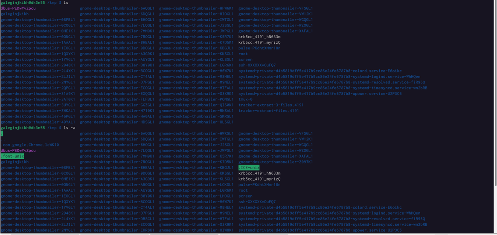

Рис.2 ls и ls -a

Можно также получить информацию о типах файлов (каталог, исполняемый файл,
ссылка), для чего используется опция F. (Рис.3)

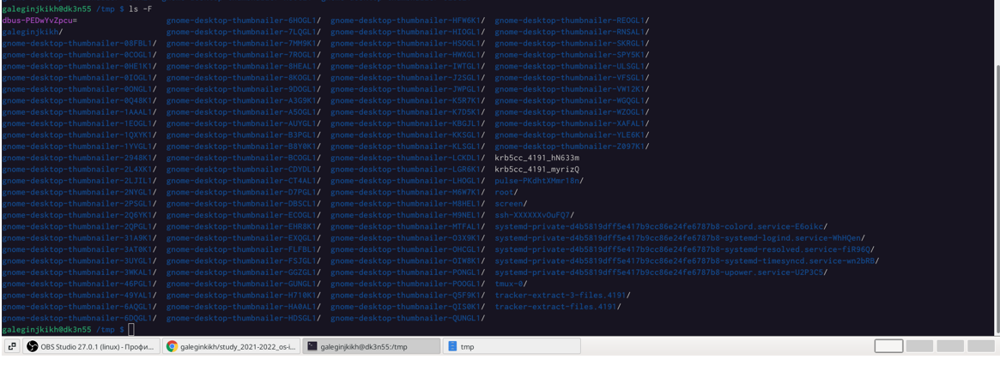

Рис.3 ls -F

Чтобы вывести на экран подробную информацию о файлах и каталогах, необходимо
использовать опцию l. (Рис.4)

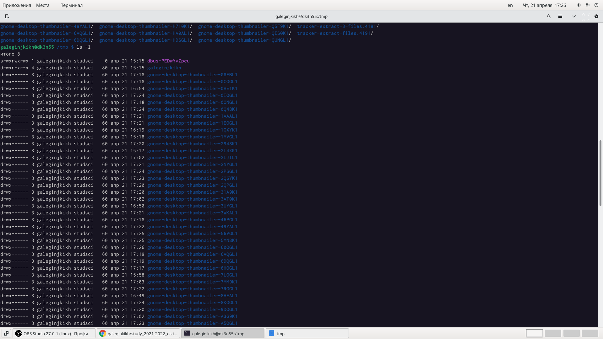

Рис.4 ls -l

В этом же каталоге команда ls -alF даст примерно следующий результат: (Рис.5)

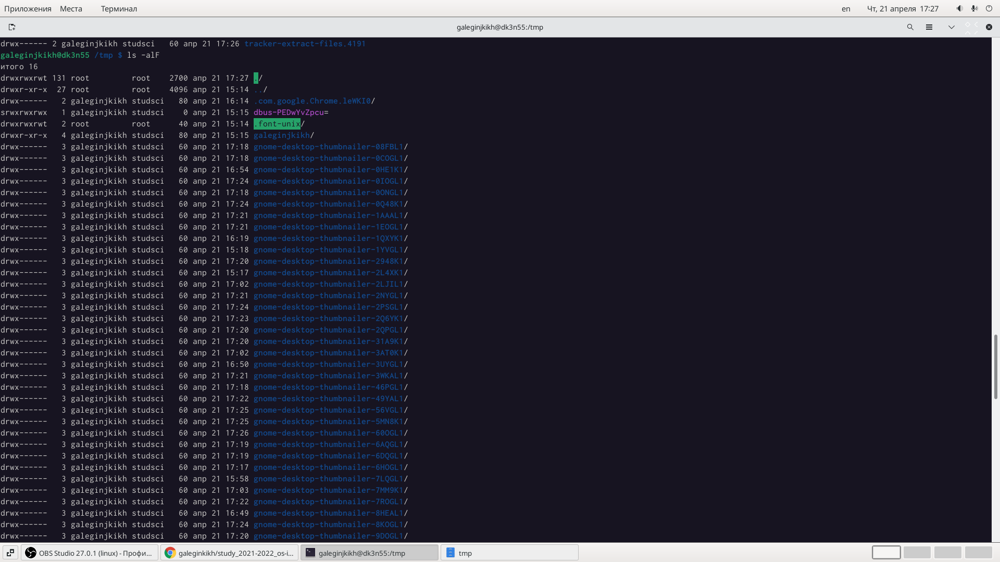

Рис.5 ls -alF

**3.** Определила, есть ли в каталоге /var/spool подкаталог с именем cron. Он там был. Перешла в домашний каталог и вывела на экран его содержимое. (Рис.6)

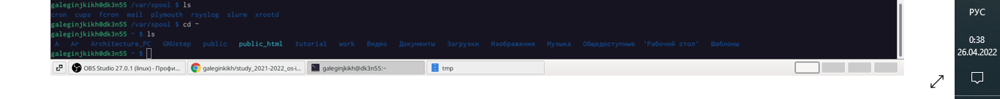

Рис.6 spool

Определила, кто является владельцем файлов и подкаталогов. (Рис.7)

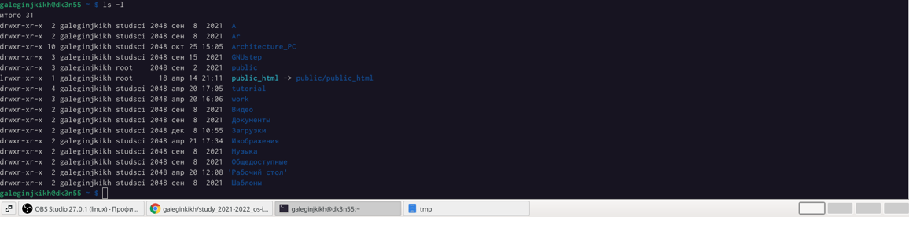

Рис.7 Владельцы

**4.** В домашнем каталоге создала новый каталог с именем newdir.

В каталоге ~/newdir создала новый каталог с именем morefun.

В домашнем каталоге создала одной командой три новых каталога с именами letters, memos, misk. Затем удалила эти каталоги одной командой.

Попробовала удалить ранее созданный каталог ~/newdir командой rm. Проверила, был ли каталог удалён. (Рис.8)

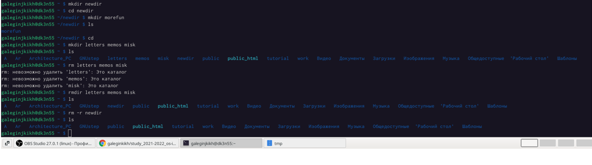

Рис.8 Каталоги

**5.** С помощью команды man определила, какую опцию команды ls нужно использовать для просмотра содержимого не только указанного каталога, но и подкаталогов, входящих в него. (Рис.9, 10)

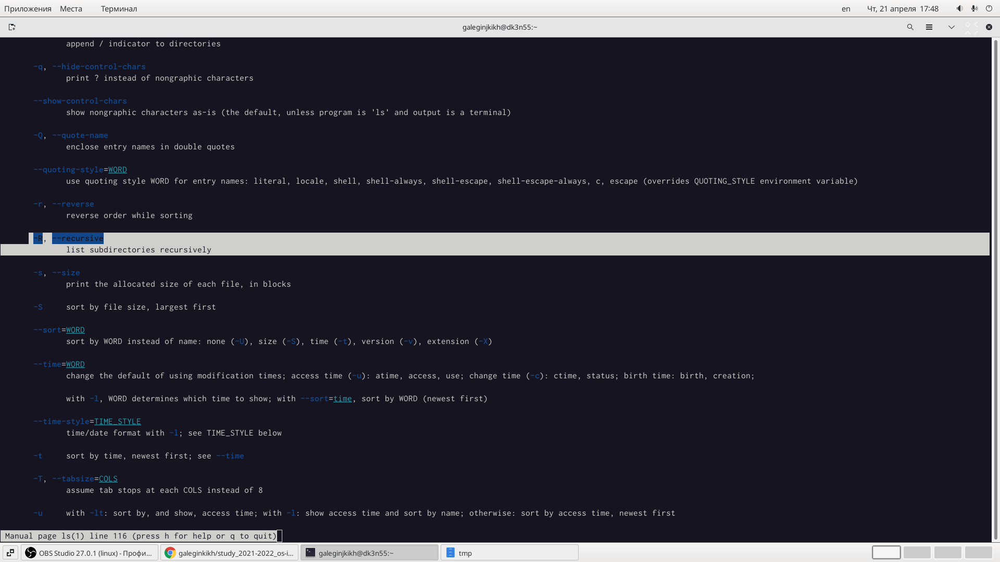 

Рис.9 Опции

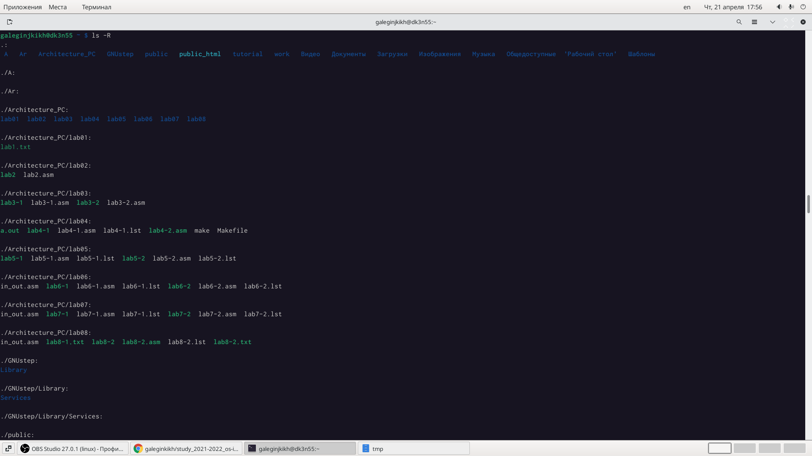

Рис.10 Выполнение опции

**6.** С помощью команды man определила набор опций команды ls, позволяющий отсортировать по времени последнего изменения выводимый список содержимого каталога с развёрнутым описанием файлов. (Рис.11, 12, 13)

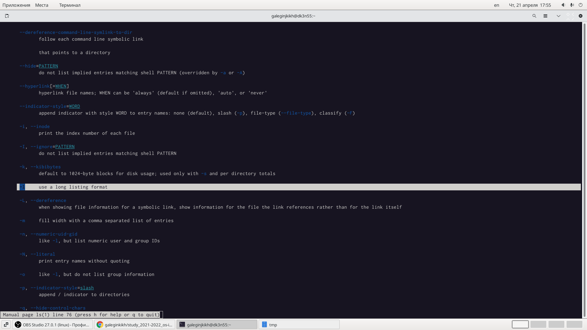

Рис.11 Опции1

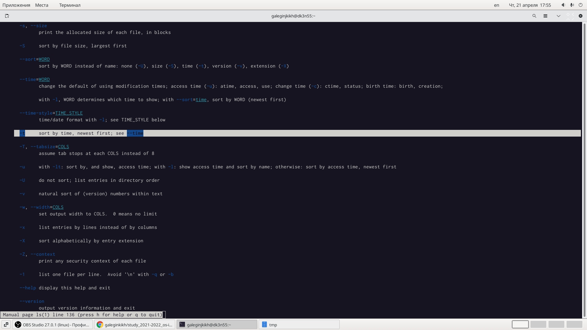

Рис.12 Опции2

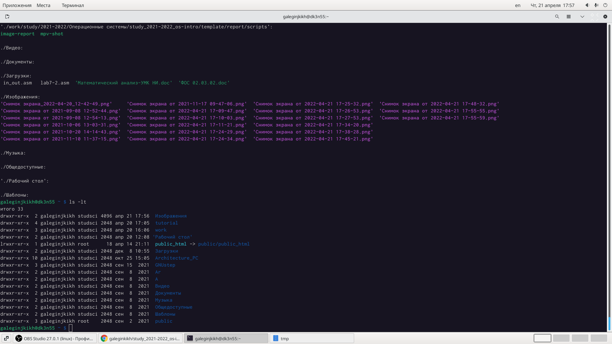

Рис.13 Выполнение опции

**7.** Использовала команду man для просмотра описания следующих команд: cd, pwd, mkdir,
rmdir, rm.

- Основные опции cd: 
- 
  -a — просмотр всех файлов, включая скрытые; 

  -l — отображение более подробной информации; 

  -R — выводить рекурсивно информацию о подкаталогах.
  (Рис.14)

  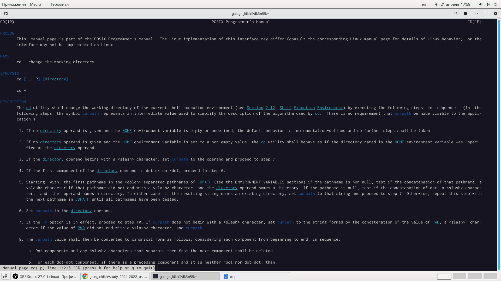

  Рис.14 cd

- Основные опции pwd:
- 
  -L, --logical - брать директорию из переменной окружения, даже если она содержит символические ссылки;

  -P - отбрасывать все символические ссылки;

  --help - отобразить справку по утилите;

  --version - отобразить версию утилиты.
  (Рис.15)

  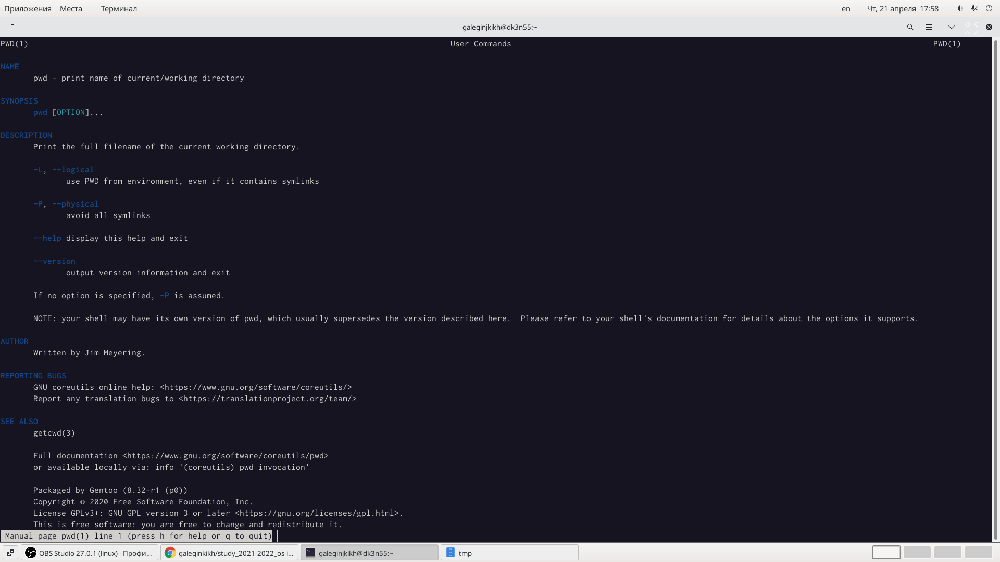

  Рис.15 pwd

- Основные опции mkdir:
  
  -m=MODE или --mode=MODE Устанавливает права доступа для создаваемой директории. Синтаксис MODE такой же как у команды chmod 

  -p или --parents Создать все директории, которые указаны внутри пути. Если какая-либо директория существует, то предупреждение об этом не выводится.
  
  -v или --verbose Выводить сообщение о каждой создаваемой директории.
  
  -Z Установить контекст SELinux для создаваемой директории по умолчанию
  
  --context[=CTX] Установить контекст SELinux для создаваемой директории в значение CTX
  
  --help Показать справку по команде mkdir
  
  --version Показать версию утилиты mkdir
  (Рис.16)

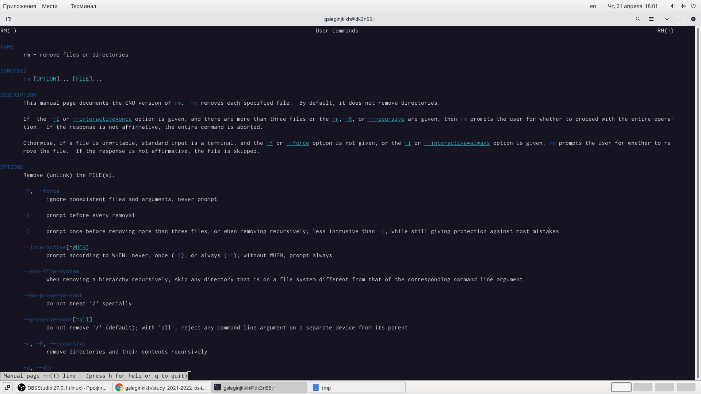

Рис.16 mkdir

- Основные опции rmdir:
  
  Опция -p позволяет удалить папку через командную строку, а также её родительские каталоги.

  Опция -v выводит диагностический текст для каждого обработанного каталога. Использование этой опции выведет подтверждение со списком всех каталогов, которые были удалены.
  (Рис.17)
  
  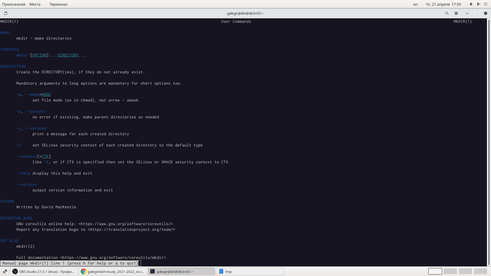

Рис.17 rmdir

- Основные опции rm:
  
  Опция -r рекурсивно удаляет каталоги и их содержимое.
  
  Ещё одна полезная опция -i. Она попросит вас подтвердить удаление каждого отдельного файла, благодаря чему вы сможете избежать любых неприятных ошибок.
  
  Вы также можете удалить пустые каталоги, используя опцию -d. 
  
  Опция -f позволяет принудительно удалить всё, что находится в каталоге.
  (Рис.18)

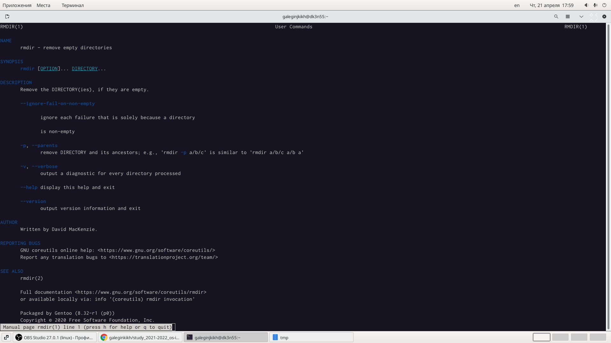

Рис.18 rm

**8.** Используя информацию, полученную при помощи команды history, выполнила модификацию и исполнение нескольких команд из буфера команд. (Рис.19)

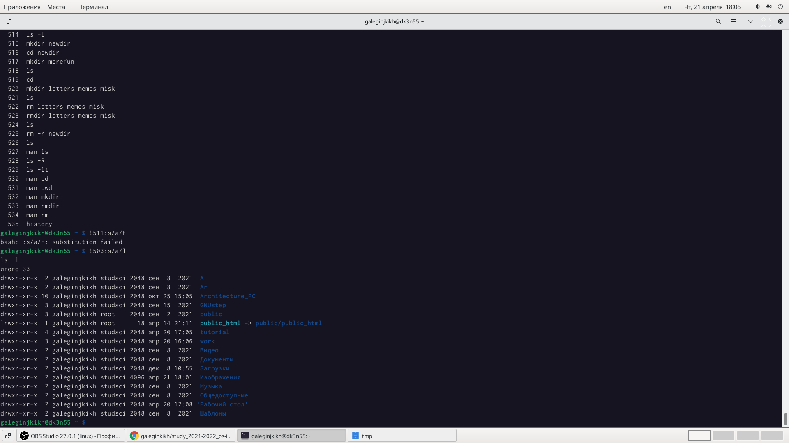

Рис.19 history

# Вывод

Приобрела практические навыки взаимодействия пользователя с системой посредством командной строки.

# Контрольные вопросы

1. Что такое командная строка?
Ответ: Командная строка (консоль или Терминал) – это специальная программа, которая позволяет управлять компьютером путем ввода текстовых команд с клавиатуры.

2. При помощи какой команды можно определить абсолютный путь текущего каталога? Приведите пример.
Ответ: При помощи команды pwd можно определить абсолютный путь текущего каталога.

3. При помощи какой команды и каких опций можно определить только тип файлов и их имена в текущем каталоге? Приведите примеры.
Ответ: При помощи команды ls -F можно определить только тип файлов и их имена в текущем каталоге.

4. Какие файлы считаются скрытыми? Как получить информацию о скрытых файлах? Приведите примеры.
Ответ: Файл считается скрытым, если его название начинается с символа точка «.». 

5. При помощи каких команд можно удалить файл и каталог? Можно ли это сделать одной и той же командой? Приведите примеры. 
Ответ: При помощи команд rm и rmdir можно удалить файл и каталог. Это нельзя сделать одной и той же командой. rmdir используется, чтобы удалить пустой каталог. rm используется, чтобы удалить непустые файлы или целые деревья каталогов.

6. Как определить, какие команды выполнил пользователь в сеансе работы? 
Ответ: При помощи команды history.

7. Каким образом можно исправить и запустить на выполнение команду, которую пользователь уже использовал в сеансе работы? Приведите примеры.
Ответ: С помощью следующей команды: !<номер_команды>:s/<что_меняем>/<на_что_меняем> Например: history 4 ls -a . !4:s/a/F ls -F

8. Можно ли в одной строке записать несколько команд? Если да, то как? Приведите примеры Ответ: В одной строке можно записать несколько команд. Если требуется выполнить последовательно несколько команд, записанный в одной строке, то для этого используется символ точка с запятой. Пример: cd; ls.

9. Что такое символ экранирования? Приведите примеры использования этого символа.
Ответ: Экранирующий символ сообщает интерпретатору, что следующий за ним символ должен восприниматься как обычный символ. 

10.  Какая информация выводится на экран о файлах и каталогах, если используется опция l в команде ls?
Ответ: Если используется опция l в команде ls, то на экран выводится подробный список, в котором будет отображаться владелец, группа, дата создания, размер и другая информация о файлах и каталогах.

11. Что такое относительный путь к файлу? Приведите примеры использования относительного и абсолютного пути при выполнении какой-либо команды.
Ответ: Относительный путь – это путь к файлу относительно текущей папки. При использовании команды pwd на экран выведется абсолютный путь текущей директории. Пример: ~ = /home/galeginjkikh. Первое относительный, второе абсолютный

12. Как получить информацию об интересующей вас команде?
Ответ: С помощью команды man.

13. Какая клавиша или комбинация клавиш служит для автоматического дополнения вводимых команд.
Ответ: Клавиша "Tab".