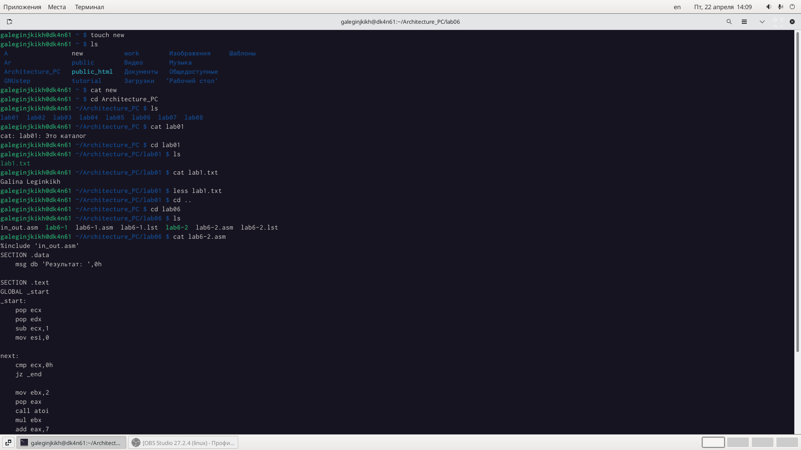
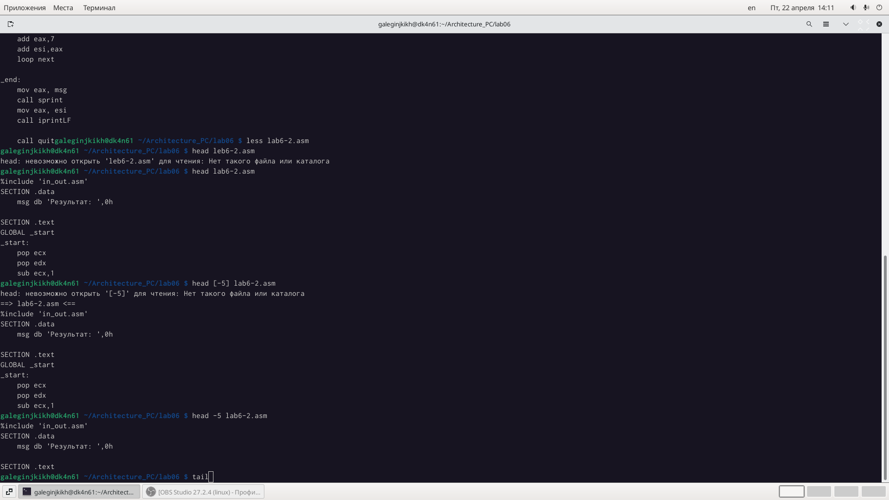
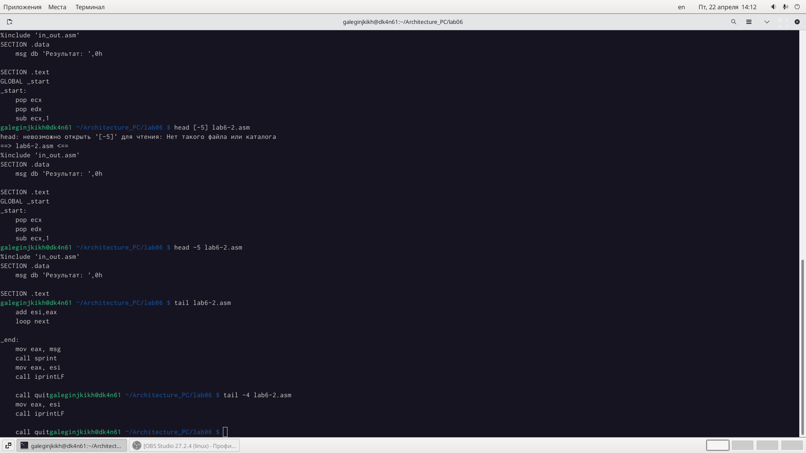
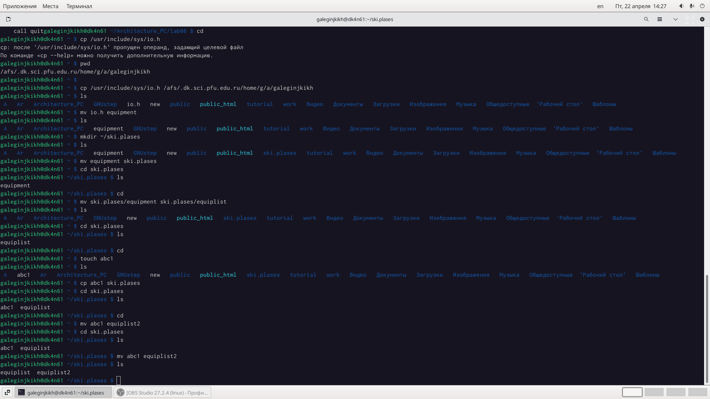
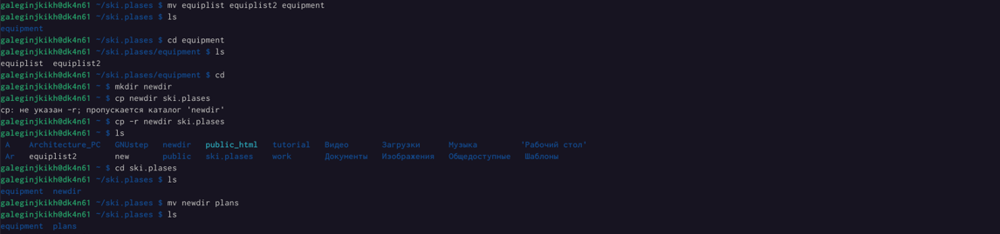
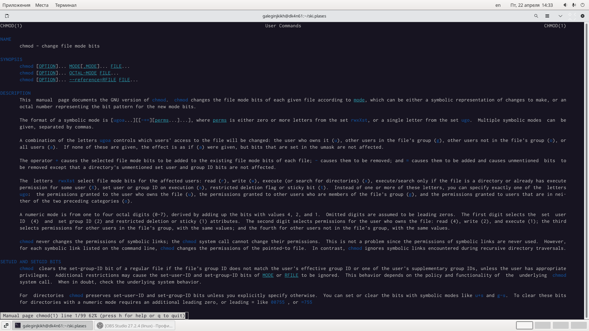
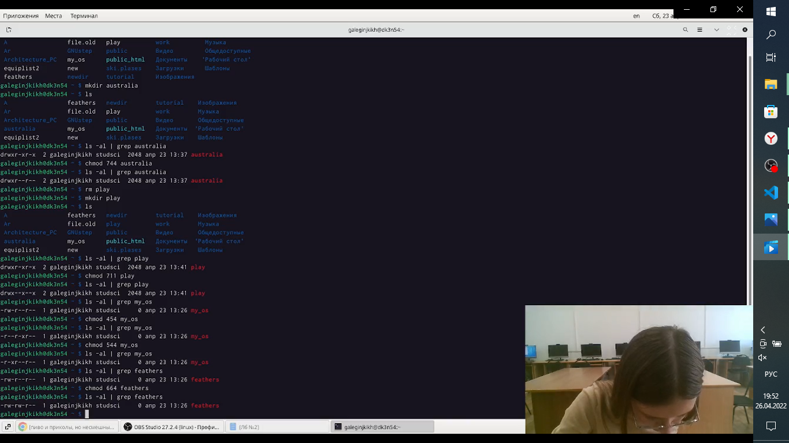
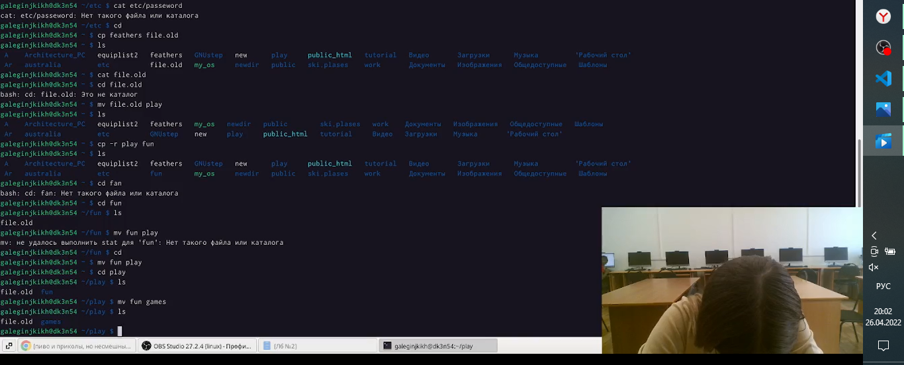
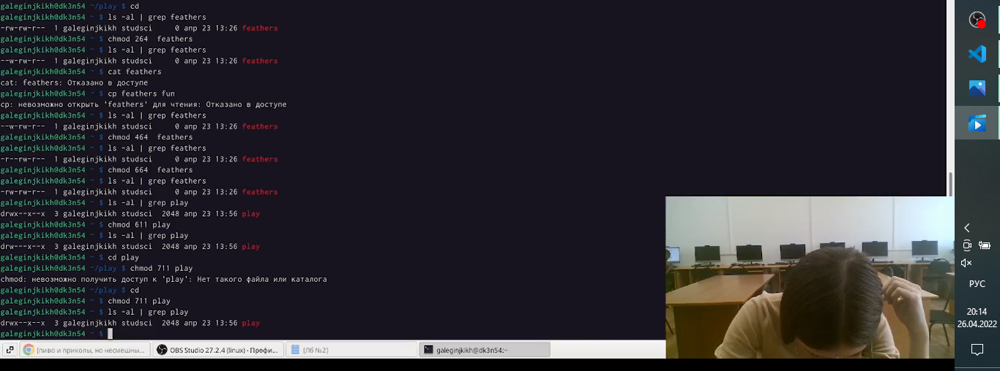

---
## Front matter
title: "Отчет по лабораторной работе №5"
subtitle: "Анализ файловой системы Linux. Команды для работы с файлами и каталогами"
author: "Легиньких Галина Андреевна"

## Generic otions
lang: ru-RU
toc-title: "Содержание"

## Pdf output format
toc: true # Table of contents
toc-depth: 2
lof: true # List of figures
lot: true # List of tables
fontsize: 12pt
linestretch: 1.5
papersize: a4
documentclass: scrreprt
## I18n polyglossia
polyglossia-lang:
  name: russian
  options:
  - spelling=modern
  - babelshorthands=true
polyglossia-otherlangs:
  name: english
## I18n babel
babel-lang: russian
babel-otherlangs: english
## Fonts
mainfont: PT Serif
romanfont: PT Serif
sansfont: PT Sans
monofont: PT Mono
mainfontoptions: Ligatures=TeX
romanfontoptions: Ligatures=TeX
sansfontoptions: Ligatures=TeX,Scale=MatchLowercase
monofontoptions: Scale=MatchLowercase,Scale=0.9
## Biblatex
biblatex: true
biblio-style: "gost-numeric"
biblatexoptions:
  - parentracker=true
  - backend=biber
  - hyperref=auto
  - language=auto
  - autolang=other*
  - citestyle=gost-numeric
## Pandoc-crossref LaTeX customization
figureTitle: "Рис."
tableTitle: "Таблица"
listingTitle: "Листинг"
lofTitle: "Список иллюстраций"
lotTitle: "Список таблиц"
lolTitle: "Листинги"
## Misc options
indent: true
header-includes:
  - \usepackage{indentfirst}
  - \usepackage{float} # keep figures where there are in the text
  - \floatplacement{figure}{H} # keep figures where there are in the text
---

# Цель работы

    Ознакомление с файловой системой Linux, её структурой, именами и содержанием каталогов. Приобретение практических навыков по применению команд для работы с файлами и каталогами, по управлению процессами (и работами), по проверке использования диска и обслуживанию файловой системы.

# Теоретическое введение

По ходу лабораторной работы.

# Выполнение лабораторной работы

**1.** Выполните все примеры, приведённые в первой части описания лабораторной работы.

- Для создания текстового файла использовала команду touch.

- Для просмотра файлов небольшого размера использовала команду cat.

- Для просмотра файлов постранично использовала команду less.

- Команда head вывела по умолчанию первые 10 строк файла.

- Команда tail вывела умолчанию 10 последних строк файла.
(рис. [-@fig:001])

{ #fig:001 width=70% }
 
Рис.1 Команда touch и cat

Рис.2 Команда less и head

 
Рис.3 Команда tail

_ _ _

**2.** Скопировала файл /usr/include/sys/io.h в домашний каталог и назовите его equipment. 

В домашнем каталоге создала директорию ~/ski.plases.

Переместила файл equipment в каталог ~/ski.plases.

Переименовала файл ~/ski.plases/equipment в ~ ski.plases/equiplist.

Создала в домашнем каталоге файл abc1 и скопировала его в каталог ~/ski.plases, назовите его equiplist2. 
(Рис.4)

Рис.4 Создание файлов и перемещение

Создала каталог с именем equipment в каталоге ~/ski.plases.

Переместила файлы ~/ski.plases/equiplist и equiplist2 в каталог ~/ski.plases/equipment.

Создала и переместила каталог ~/newdir в каталог ~/ski.plases и назвала
его plans.
(Рис.5)

Рис.5 Создание и перемещение файлов

_ _ _

**3.** Определила опции команды chmod, необходимые для того, чтобы присвоить перечисленным ниже файлам выделенные права доступа, считая, что в начале таких прав
нет. (Рис.6)

Рис.6 Опции команды chmod

Создала файлы и каталоги которые необходимы.
И установила нужные права. (Рис.7)

Рис.7 Права каталогов и файлов

_ _ _

**4.** Просмотрела содержимое файла /etc/password.

Скопировала файл ~/feathers в файл ~/file.old.

Переместила файл ~/file.old в каталог ~/play.

Скопировала каталог ~/play в каталог ~/fun.

Переместила каталог ~/fun в каталог ~/play и назовите его games. (Рис.8)

Рис.8 Работа с файлами

Лишила владельца файла ~/feathers права на чтение.

Что произойдёт, если вы попытаетесь просмотреть файл ~/feathers командой
cat?

Ответ: Отказано в доступе

Что произойдёт, если вы попытаетесь скопировать файл ~/feathers?

Ответ: Отказано в доступе

Дала владельцу файла ~/feathers право на чтение.

Лишила владельца каталога ~/play права на выполнение.

Перешла в каталог ~/play. 

Дала владельцу каталога ~/play право на выполнение. (Рис.9)

Рис.9 Работа с файлами и их правами

_ _ _

**5.** Прочитала man по командам mount, fsck, mkfs, kill и кратко их охарактеризовала,
приведя примеры.

- Опции mount:

-V - вывести версию утилиты;

-h - вывести справку;

-v - подробный режим;

-a, --all - примонтировать все устройства, описанные в fstab;

-F, --fork - создавать отдельный экземпляр mount для каждого отдельного раздела;

-f, --fake - не выполнять никаких действий, а только посмотреть что собирается делать утилита;

-n, --no-mtab - не записывать данные о монтировании в /etc/mtab;

-l, --show-labels - добавить метку диска к точке монтирования;

-c - использовать только абсолютные пути;

-r, --read-only - монтировать раздел только для чтения;

-w, --rw - монтировать для чтения и записи;

-L, --label - монтировать раздел по метке;

-U, --uuid - монтировать раздел по UUID;

-T, --fstab - использовать альтернативный fstab;

-B, --bind - монтировать локальную папку;

-R, --rbind - перемонтировать локальную папку.

- Опции fsck

-l - не выполнять другой экземпляр fsck для этого жесткого диска, пока текущий не завершит работу. Для SSD параметр игнорируется;

-t - задать типы файловых систем, которые нужно проверить. Необязательно указывать устройство, можно проверить несколько разделов одной командой, просто указав нужный тип файловой системы. Это может быть сама файловая система, например, ext4 или ее опции в формате opts=ro. Утилита просматривает все файловые системы, подключенные в fstab. Если задать еще и раздел то к нему будет применена проверка именно указанного типа, без автоопределения;

-A - проверить все файловые системы из /etc/fstab. Вот тут применяются параметры проверки файловых систем, указанные в /etc/fstab, в том числе и приоритетность. В первую очередь проверяется корень. Обычно используется при старте системы;

-C - показать прогресс проверки файловой системы;

-M - не проверять, если файловая система смонтирована;

-N - ничего не выполнять, показать, что проверка завершена успешно;

-R - не проверять корневую файловую систему;

-T - не показывать информацию об утилите;

-V - максимально подробный вывод.

- Опции mkfs
  
-с - проверить устройство на наличие битых секторов

-b - размер блока файловой системы

-j - использовать журналирование для ext3

-L - задать метку раздела

-v - показать подробную информацию о процессе работы

-V - версия программы

- Опции kill
  
-Сигнал или -s Сигнал или --signal Сигнал

Задает сигнал, который будет послан процессу. Сигнал может задаваться числом или названием.

-l или -l Сигнал или --list Сигнал
Вывести список всех сигналов.

Если задано значение Сигнал, то вывод зависит от того, чему равно заданное значение Сигнал:
- числовой номер сигнала — в таком случае будет выведено название сигнала;
- название сигнала — в таком случае будет - выведено числовое значение сигнала.

-L или --table

Вывести список сигналов в табличном виде. Выводится числовое значение и название каждого сигнала.

# Вывод

Ознакомилась с файловой системой Linux, её структурой, именами и содержанием
каталогов. Приобрела практические навыки по применению команд для работы с файлами и каталогами, по управлению процессами (и работами), по проверке использования диска и обслуживанию файловой системы.

# Контрольные вопросы

1. Дайте характеристику каждой файловой системе, существующей на жёстком диске компьютера, на котором вы выполняли лабораторную работу.
   
- Ext2, Ext3, Ext4 или Extended Filesystem - это стандартная файловая система для Linux. Она была разработана еще для Minix. Она самая стабильная из всех существующих, кодовая база изменяется очень редко и эта файловая система содержит больше всего функций. Версия ext2 была разработана уже именно для Linux и получила много улучшений. В 2001 году вышла ext3, которая добавила еще больше стабильности благодаря использованию журналирования. В 2006 была выпущена версия ext4, которая используется во всех дистрибутивах Linux до сегодняшнего дня. В ней было внесено много улучшений, в том числе увеличен максимальный размер раздела до одного экзабайта.

- JFS или Journaled File System была разработана в IBM для AIX UNIX и использовалась в качестве альтернативы для файловых систем ext. Сейчас она используется там, где необходима высокая стабильность и минимальное потребление ресурсов. При разработке файловой системы ставилась цель создать максимально эффективную файловую систему для многопроцессорных компьютеров. Также как и ext, это журналируемая файловая система, но в журнале хранятся только метаданные, что может привести к использованию старых версий файлов после сбоев.

- ReiserFS - была разработана намного позже, в качестве альтернативы ext3 с улучшенной производительностью и расширенными возможностями. Она была разработана под руководством Ганса Райзера и поддерживает только Linux. Из особенностей можно отметить динамический размер блока, что позволяет упаковывать несколько небольших файлов в один блок, что предотвращает фрагментацию и улучшает работу с небольшими файлами. Еще одно преимущество - в возможности изменять размеры разделов на лету. Но минус в некоторой нестабильности и риске потери данных при отключении энергии. Раньше ReiserFS применялась по умолчанию в SUSE Linux, но сейчас разработчики перешли на Btrfs.
  
- XFS - это высокопроизводительная файловая система, разработанная в Silicon Graphics для собственной операционной системы еще в 2001 году. Она изначально была рассчитана на файлы большого размера, и поддерживала диски до 2 Терабайт. Из преимуществ файловой системы можно отметить высокую скорость работы с большими файлами, отложенное выделение места, увеличение разделов на лету и незначительный размер служебной информации.

- XFS - журналируемая файловая система, однако в отличие от ext, в журнал записываются только изменения метаданных. Она используется по умолчанию в дистрибутивах на основе Red Hat. Из недостатков - это невозможность уменьшения размера, сложность восстановления данных и риск потери файлов при записи, если будет неожиданное отключение питания, поскольку большинство данных находится в памяти.

- Btrfs или B-Tree File System - это совершенно новая файловая система, которая сосредоточена на отказоустойчивости, легкости администрирования и восстановления данных. Файловая система объединяет в себе очень много новых интересных возможностей, таких как размещение на нескольких разделах, поддержка подтомов, изменение размера не лету, создание мгновенных снимков, а также высокая производительность. Но многими пользователями файловая система Btrfs считается нестабильной. Тем не менее, она уже используется как файловая система по умолчанию в OpenSUSE и SUSE Linux.

2. Приведите общую структуру файловой системы и дайте характеристику каждой директории первого уровня этой структуры.
/ — root каталог. Содержит в себе всю иерархию системы;

/bin — здесь находятся двоичные исполняемые файлы. Основные общие команды, хранящиеся отдельно от других программ в системе (прим.: pwd, ls, cat, ps);

/boot — тут расположены файлы, используемые для загрузки системы (образ initrd, ядро vmlinuz);

/dev — в данной директории располагаются файлы устройств (драйверов). С помощью этих файлов можно взаимодействовать с устройствами. К примеру, если это жесткий диск, можно подключить его к файловой системе. В файл принтера же можно написать напрямую и отправить задание на печать;

/etc — в этой директории находятся файлы конфигураций программ. Эти файлы позволяют настраивать системы, сервисы, скрипты системных демонов;

/home — каталог, аналогичный каталогу Users в Windows. Содержит домашние каталоги учетных записей пользователей (кроме root). При создании нового пользователя здесь создается одноименный каталог с аналогичным именем и хранит личные файлы этого пользователя;

/lib — содержит системные библиотеки, с которыми работают программы и модули ядра;

/lost+found — содержит файлы, восстановленные после сбоя работы системы. Система проведет проверку после сбоя и найденные файлы можно будет посмотреть в данном каталоге;

/media — точка монтирования внешних носителей. Например, когда вы вставляете диск в дисковод, он будет автоматически смонтирован в директорию /media/cdrom;

/mnt — точка временного монтирования. Файловые системы подключаемых устройств обычно монтируются в этот каталог для временного использования;

/opt — тут расположены дополнительные (необязательные) приложения. Такие программы обычно не подчиняются принятой иерархии и хранят свои файлы в одном подкаталоге (бинарные, библиотеки, конфигурации);

/proc — содержит файлы, хранящие информацию о запущенных процессах и о состоянии ядра ОС;

/root — директория, которая содержит файлы и личные настройки суперпользователя;

/run — содержит файлы состояния приложений. Например, PID-файлы или UNIX-сокеты;

/sbin — аналогично /bin содержит бинарные файлы. Утилиты нужны для настройки и администрирования системы суперпользователем;

/srv — содержит файлы сервисов, предоставляемых сервером (прим. FTP или Apache HTTP);

/sys — содержит данные непосредственно о системе. Тут можно узнать информацию о ядре, драйверах и устройствах;

/tmp — содержит временные файлы. Данные файлы доступны всем пользователям на чтение и запись. Стоит отметить, что данный каталог очищается при перезагрузке;

/usr — содержит пользовательские приложения и утилиты второго уровня, используемые пользователями, а не системой. Содержимое доступно только для чтения (кроме root). Каталог имеет вторичную иерархию и похож на корневой;

/var — содержит переменные файлы. Имеет подкаталоги, отвечающие за отдельные переменные. Например, логи будут храниться в /var/log, кэш в /var/cache, очереди заданий в /var/spool/ и так далее.

3. Какая операция должна быть выполнена, чтобы содержимое некоторой файловой системы было доступно операционной системе?

Монтирование тома.

4. Назовите основные причины нарушения целостности файловой системы. Как устранить повреждения файловой системы?
Отсутствие синхронизации между образом файловой системы в памяти и ее данными на диске в случае аварийного останова может привести к появлению следующих ошибок:

- Один блок адресуется несколькими mode (принадлежит нескольким файлам).

- Блок помечен как свободный, но в то же время занят (на него ссылается onode).

- Блок помечен как занятый, но в то же время свободен (ни один inode на него не ссылается).

- Неправильное число ссылок в inode (недостаток или избыток ссылающихся записей в каталогах).

- Несовпадение между размером файла и суммарным размером адресуемых inode блоков.

- Недопустимые адресуемые блоки (например, расположенные за пределами файловой системы).

- "Потерянные" файлы (правильные inode, на которые не ссылаются записи каталогов).

- Недопустимые или неразмещенные номера inode в записях каталогов.

5. Как создаётся файловая система?

mkfs - позволяет создать файловую систему Linux.

6. Дайте характеристику командам для просмотра текстовых файлов.

Cat - выводит содержимое файла на стандартное устройство вывода

7. Приведите основные возможности команды cp в Linux.

Cp – копирует или перемещает директорию, файлы.

8. Приведите основные возможности команды mv в Linux.

Mv - переименовать или переместить файл или директорию

9. Что такое права доступа? Как они могут быть изменены?

Права доступа к файлу или каталогу можно изменить, воспользовавшись командой chmod. 

Сделать это может владелец файла (или каталога) или пользователь с правами администратора.
