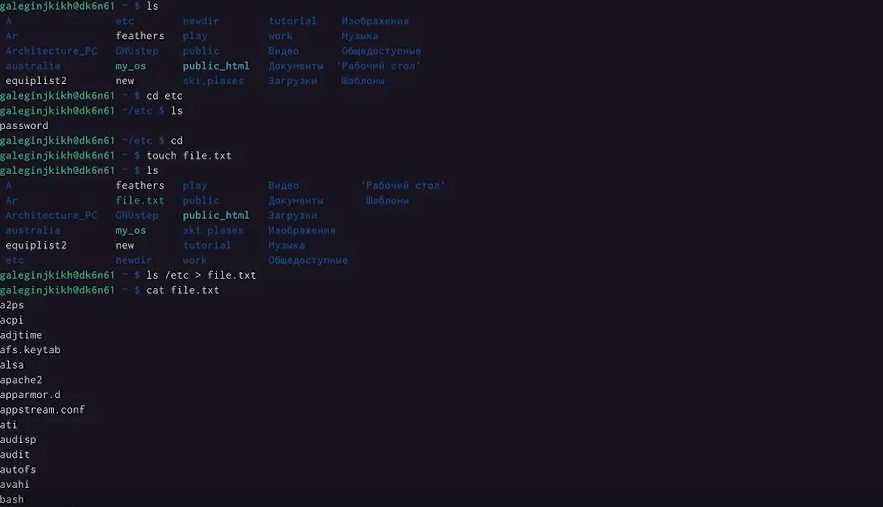
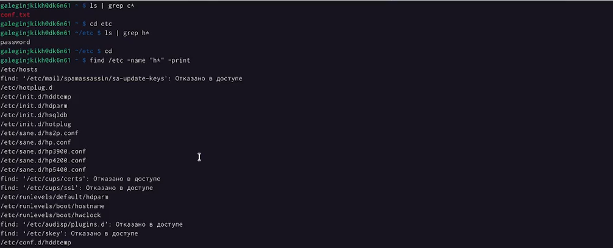
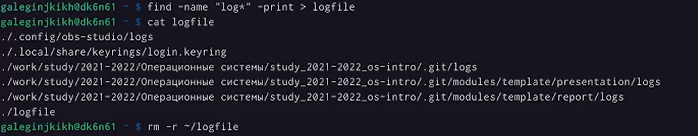
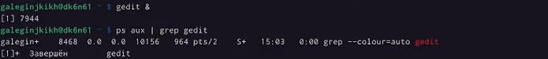
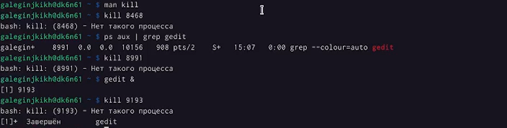

---
## Front matter
lang: ru-RU
title: Лабораторная работа №6
author: |
    Легиньких Галина - группа НФИбд-02-21
date: 25.04.2022

## Formatting
toc: false
slide_level: 2
theme: metropolis
header-includes: 
 - \metroset{progressbar=frametitle,sectionpage=progressbar,numbering=fraction}
 - '\makeatletter'
 - '\beamer@ignorenonframefalse'
 - '\makeatother'
aspectratio: 43
section-titles: true
---
# Поиск файлов. Перенаправление ввода-вывода. Просмотр запущенных процессов

# Цель работы

    Ознакомление с инструментами поиска файлов и фильтрации текстовых данных. Приобретение практических навыков: по управлению процессами (и заданиями), по проверке использования диска и обслуживанию файловых систем.
   

# Выполнение лабораторной работы

**1.** Осуществила вход в систему, используя соответствующее имя пользователя.

**2.** Записала в файл file.txt названия файлов, содержащихся в каталоге /etc. Дописала в этот же файл названия файлов, содержащихся в моем домашнем каталоге. (Рис.1, 2)

**3.** Вывела имена всех файлов из file.txt, имеющих расширение .conf, после чего
записала их в новый текстовой файл conf.txt. (Рис.3)

**4.** Определила, какие файлы в моем домашнем каталоге имеют имена, начинавшиеся
с символа c. 

Вывела на экран (по странично) имена файлов из каталога /etc, начинающиеся
с символа h. (Рис.4)

**5.** Запустила в фоновом режиме процесс, который будет записывать в файл ~/logfile
файлы, имена которых начинаются с log.

Удалила файл ~/logfile. (Рис.5)

**6.** Запустила из консоли в фоновом режиме редактор gedit.

Определила идентификатор процесса gedit, используя команду ps, конвейер и фильтр
grep. 

**7.** Прочтала справку (man) команды kill, после чего использовала её для завершения
процесса gedit.

**8.** Выполнила команды df и du, предварительно получив более подробную информацию об этих командах, с помощью команды man. (РИс.8, 9)

Воспользовавшись справкой команды find, вывела имена всех директорий, имеющихся в вашем домашнем каталоге.

# Вывод

Ознакомилась с инструментами поиска файлов и фильтрации текстовых данных. Приобрела практические навыки: по управлению процессами (и заданиями), по проверке использования диска и обслуживанию файловых систем.

