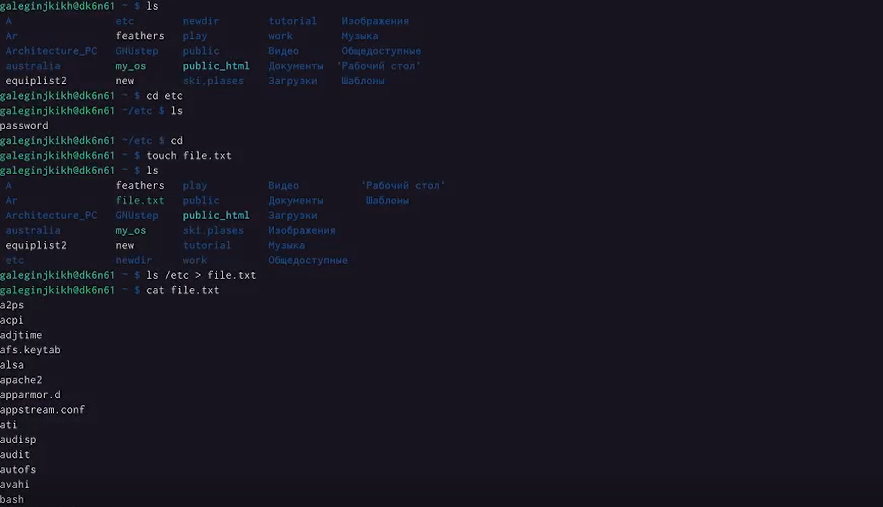
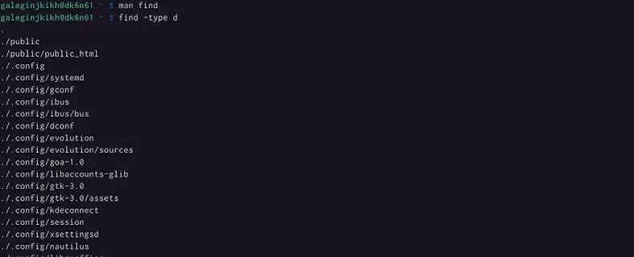

---
## Front matter
title: "Отчет по лабораторной работе №6"
subtitle: Поиск файлов. Перенаправление ввода-вывода. Просмотр запущенных процессов
author: "Легиньких Галина Андреевна"

## Generic otions
lang: ru-RU
toc-title: "Содержание"
## Pdf output format
toc: true # Table of contents
toc-depth: 2
lof: true # List of figures
lot: true # List of tables
fontsize: 12pt
linestretch: 1.5
papersize: a4
documentclass: scrreprt
## I18n polyglossia
polyglossia-lang:
  name: russian
  options:
  - spelling=modern
  - babelshorthands=true
polyglossia-otherlangs:
  name: english
## I18n babel
babel-lang: russian
babel-otherlangs: english
## Fonts
mainfont: PT Serif
romanfont: PT Serif
sansfont: PT Sans
monofont: PT Mono
mainfontoptions: Ligatures=TeX
romanfontoptions: Ligatures=TeX
sansfontoptions: Ligatures=TeX,Scale=MatchLowercase
monofontoptions: Scale=MatchLowercase,Scale=0.9
## Biblatex
biblatex: true
biblio-style: "gost-numeric"
biblatexoptions:
  - parentracker=true
  - backend=biber
  - hyperref=auto
  - language=auto
  - autolang=other*
  - citestyle=gost-numeric
## Pandoc-crossref LaTeX customization
figureTitle: "Рис."
tableTitle: "Таблица"
listingTitle: "Листинг"
lofTitle: "Список иллюстраций"
lotTitle: "Список таблиц"
lolTitle: "Листинги"
## Misc options
indent: true
header-includes:
  - \usepackage{indentfirst}
  - \usepackage{float} # keep figures where there are in the text
  - \floatplacement{figure}{H} # keep figures where there are in the text
---

# Цель работы

Ознакомление с инструментами поиска файлов и фильтрации текстовых данных. Приобретение практических навыков: по управлению процессами (и заданиями), по проверке использования диска и обслуживанию файловых систем.
   
# Теоретическое введение

В системе по умолчанию открыто три специальных потока:

– stdin — стандартный поток ввода (по умолчанию: клавиатура), файловый дескриптор
0;

– stdout — стандартный поток вывода (по умолчанию: консоль), файловый дескриптор
1;

– stderr — стандартный поток вывод сообщений об ошибках (по умолчанию: консоль),
файловый дескриптор 2.

Большинство используемых в консоли команд и программ записывают результаты
своей работы в стандартный поток вывода stdout. Например, команда ls выводит в стандартный поток вывода (консоль) список файлов в текущей директории. Потоки вывода
и ввода можно перенаправлять на другие файлы или устройства. Проще всего это делается
с помощью символов >, >>, <, <<.

# Выполнение лабораторной работы

**1.** Осуществила вход в систему, используя соответствующее имя пользователя.

**2.** Записала в файл file.txt названия файлов, содержащихся в каталоге /etc. Дописала в этот же файл названия файлов, содержащихся в моем домашнем каталоге.(рис. [-@fig:001])(рис. [-@fig:002])

{ #fig:001 width=70% }

{ #fig:002 width=70% }

**3.** Вывела имена всех файлов из file.txt, имеющих расширение .conf, после чего
записала их в новый текстовой файл conf.txt. (рис. [-@fig:003])

{ #fig:003 width=70% }

**4.** Определила, какие файлы в моем домашнем каталоге имеют имена, начинавшиеся
с символа c. 

Вывела на экран (по странично) имена файлов из каталога /etc, начинающиеся
с символа h.(рис. [-@fig:004])

{ #fig:004 width=70% }

**5.** Запустила в фоновом режиме процесс, который будет записывать в файл ~/logfile
файлы, имена которых начинаются с log.

Удалила файл ~/logfile.(рис. [-@fig:005])

{ #fig:005 width=70% }

**6.** Запустила из консоли в фоновом режиме редактор gedit.

Определила идентификатор процесса gedit, используя команду ps, конвейер и фильтр
grep.(рис. [-@fig:006])

{ #fig:006 width=70% }

**7.** Прочтала справку (man) команды kill, после чего использовала её для завершения
процесса gedit.(рис. [-@fig:007])

{ #fig:007 width=70% }

**8.** Выполнила команды df и du, предварительно получив более подробную информацию об этих командах, с помощью команды man. 

Воспользовавшись справкой команды find, вывела имена всех директорий, имеющихся в вашем домашнем каталоге.(рис. [-@fig:008])(рис. [-@fig:009])(рис. [-@fig:010])

{ #fig:008 width=70% }

{ #fig:009 width=70% }

{ #fig:010 width=70% } 

# Вывод

Ознакомилась с инструментами поиска файлов и фильтрации текстовых данных. Приобрела практические навыки: по управлению процессами (и заданиями), по проверке использования диска и обслуживанию файловых систем.

# Контрольные вопросы

1. Какие потоки ввода вывода вы знаете?

Stdin и stdout, stderr

2. Объясните разницу между операцией > и >>.

Первый перенаправляет, а второй открывает в режиме добавления.

3. Что такое конвейер?

Конвейер (pipe) служит для объединения простых команд или утилит в цепочки, в которых результат работы предыдущей команды передаётся последующей.

4. Что такое процесс? Чем это понятие отличается от программы?

Компьютерная программа сама по себе — лишь пассивная последовательность инструкций. В то время как процесс — непосредственное выполнение этих инструкций. Также, процессом называют выполняющуюся программу и все её элементы: адресное пространство, глобальные переменные, регистры, стек, открытые файлы и так далее.

5. Что такое PID и GID?

PID – это айди процесса.

GID - Группы пользователей применяются для организации доступа нескольких пользователей к некоторым ресурсам.

6. Что такое задачи и какая команда позволяет ими управлять?

Любую выполняющуюся в консоли команду или внешнюю программу можно запустить в фоновом режиме. Для этого следует в конце имени команды указать знак амперсанда &. Например: gedit &.

7. Найдите информацию об утилитах top и htop. Каковы их функции?

Top - отобразить запущенные процессы, используемые ими ресурсы и другую полезную информацию (с автоматическим обновлением данных)

Htop - показывает динамический список системных процессов, список обычно выравнивается по использованию ЦПУ. В отличие от top, htop показывает все процессы в системе. Также показывает время непрерывной работы, использование процессоров и памяти. Htop часто применяется в тех случаях, когда информации даваемой утилитой top недостаточно, например при поиске утечек памяти в процессах.

8. Назовите и дайте характеристику команде поиска файлов. Приведите примеры использования этой команды.

Команда find используется для поиска и отображения на экран имён файлов, соответствующих заданной строке символов. Формат команды: find путь [-опции]

9. Можно ли по контексту (содержанию) найти файл? Если да, то как?

Да, через команду grep. Например: grep Aug -R /var/log/* вывода строки, содержащие "Aug", во всех файлах, находящихся в директории /var/log и ниже

10. Как определить объем свободной памяти на жёстком диске?

Для определения объёма свободного пространства на файловой системе можно воспользоваться командой df, которая выведет на экран список всех файловых систем в соответствии с именами устройств, с указанием размера и точки монтирования.

11. Как определить объем вашего домашнего каталога?

Команда du показывает число килобайт, используемое каждым файлом или каталогом.

12. Как удалить зависший процесс?

Можно удалить через kill, написав айди процесса
