---
## Front matter
lang: ru-RU
title: Лабораторная работа №7
author: |
    Легиньких Галина - группа НФИбд-02-21
date: 25.04.2022

## Formatting
toc: false
slide_level: 2
theme: metropolis
header-includes: 
 - \metroset{progressbar=frametitle,sectionpage=progressbar,numbering=fraction}
 - '\makeatletter'
 - '\beamer@ignorenonframefalse'
 - '\makeatother'
aspectratio: 43
section-titles: true
---
# Командная оболочка Midnight Commander

## Цель работы

Освоение основных возможностей командной оболочки Midnight Commander. Приобретение навыков практической работы по просмотру каталогов и файлов; манипуляций с ними

## Выполнение лабораторной работы

**1.** Изучила информацию о mc, вызвав в командной строке man mc.(рис. [-@fig:001])

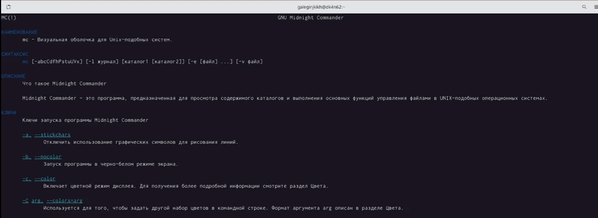{ #fig:001 width=70% }

##

**2.** Запустила из командной строки mc, изучила его структуру и меню.(рис. [-@fig:002])

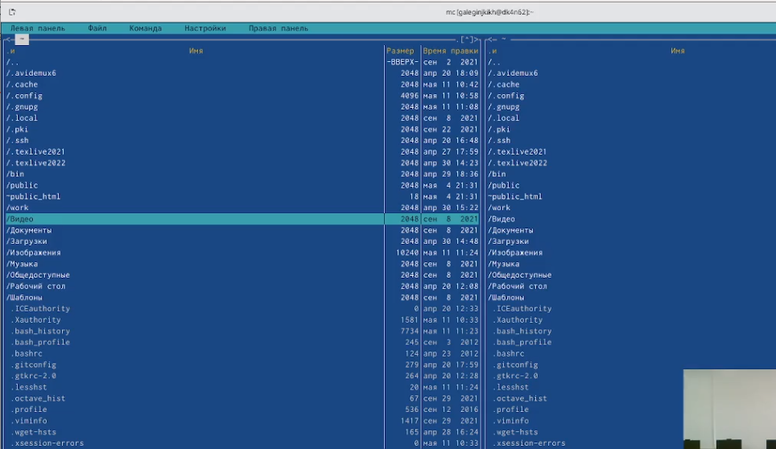{ #fig:002 width=70% }

##

**3.** Выполнила несколько операций в mc, используя управляющие клавиши (операции с панелями; выделение/отмена выделения файлов, копирование/перемещение файлов, получение информации о размере и правах доступа на файлы и/или каталоги
и т.п.)

##

**4.** Выполнила основные команды меню левой (или правой) панели. Оценила степень подробности вывода информации о файлах.(рис. [-@fig:003])

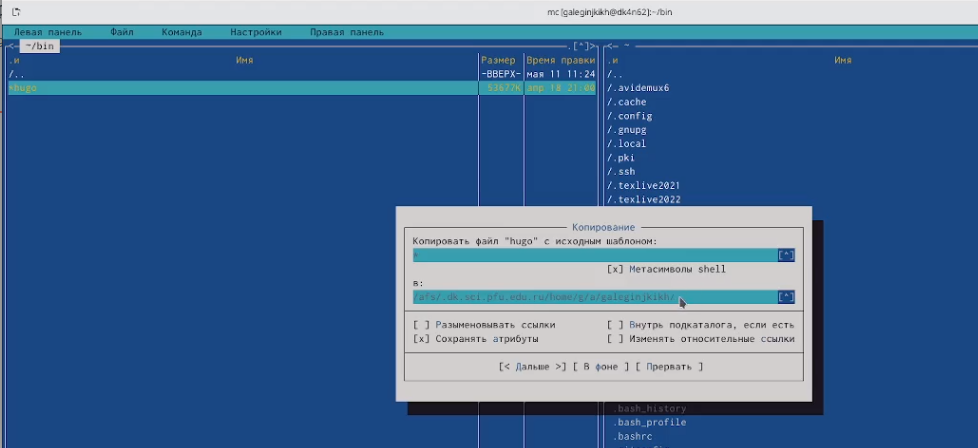{ #fig:003 width=70% }

##

**5.** Используя возможности подменю Файл , выполнила:

– просмотр содержимого текстового файла;(рис. [-@fig:004])

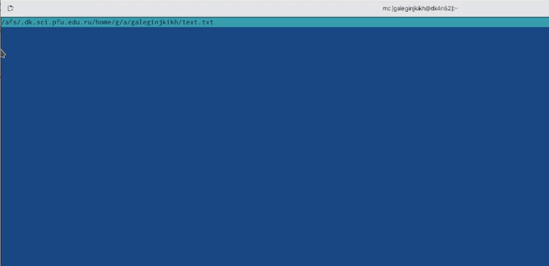{ #fig:004 width=70% }

##

– редактирование содержимого текстового файла (без сохранения результатов редактирования);(рис. [-@fig:005])

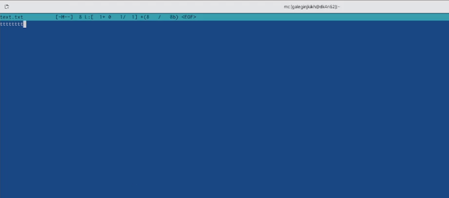{ #fig:005 width=70% }

##

– создание каталога;

– копирование файлов в созданный каталог.(рис. [-@fig:006])

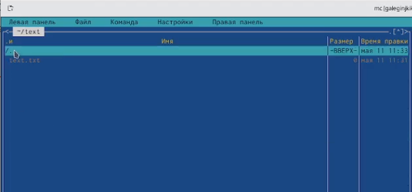{ #fig:006 width=70% }

##

**6.** С помощью соответствующих средств подменю Команда осуществила:

– поиск в файловой системе файла с заданными условиями (например, файла с расширением .c или .cpp, содержащего строку main);(рис. [-@fig:007])

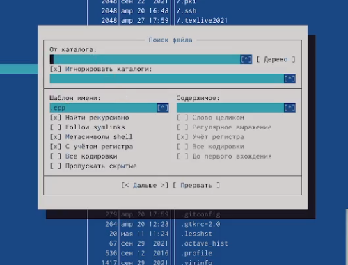{ #fig:007 width=70% }

##

– выбор и повторение одной из предыдущих команд;

– переход в домашний каталог;

– анализ файла меню и файла расширений.

##

**7.** Вызвала подменю Настройки. Освоила операции, определяющие структуру экрана mc (Full screen, Double Width, Show Hidden Files и т.д.).(рис. [-@fig:008])

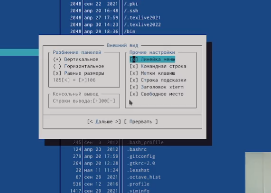{ #fig:008 width=70% }

##

**8.** Создала текстовой файл text.txt.(рис. [-@fig:009])

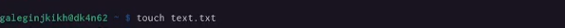{ #fig:009 width=70% }

**9.** Открыла этот файл с помощью встроенного в mc редактора.

##

**10.** Вставила в открытый файл небольшой фрагмент текста, скопированный из любого другого файла или Интернета.(рис. [-@fig:010])

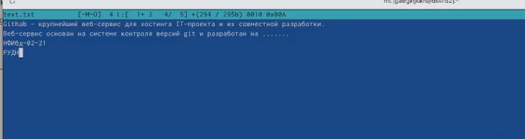{ #fig:010 width=70% }

##

**11.** Проделала с текстом следующие манипуляции, используя горячие клавиши:

11.1. Удалила строку текста.(рис. [-@fig:011])

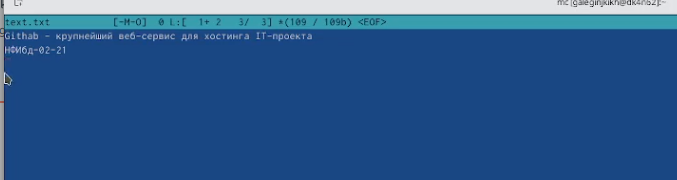{ #fig:011 width=70% }

##

11.2. Выделила фрагмент текста и скопировала его на новую строку.

11.3. Выделила фрагмент текста и перенесла его на новую строку.(рис. [-@fig:012])

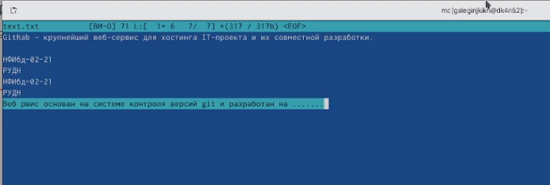{ #fig:012 width=70% }

##

11.4. Сохранила файл.

11.5. Отменила последнее действие.

##

11.6. Перешла в конец файла (нажав комбинацию клавиш) и напишите некоторый текст.(рис. [-@fig:013])

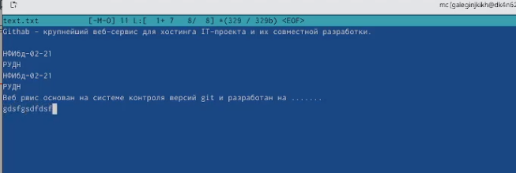{ #fig:013 width=70% }

##

11.7. Перешла в начало файла (нажав комбинацию клавиш) и напишите некоторый текст.(рис. [-@fig:014])

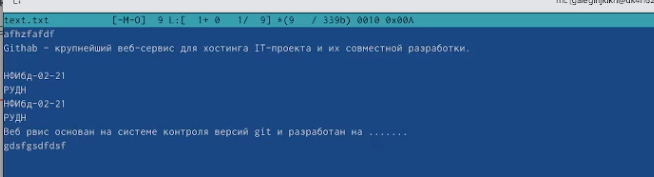{ #fig:014 width=70% }

##

11.8. Сохранила и закрыла файл.

**12.** Открыла файл с исходным текстом на некотором языке программирования (например C или Java).(рис. [-@fig:015])

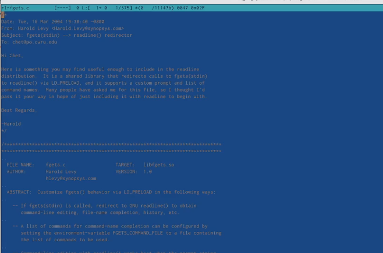{ #fig:015 width=70% }

##

**13.** Используя меню редактора, включила подсветку синтаксиса.(рис. [-@fig:016])

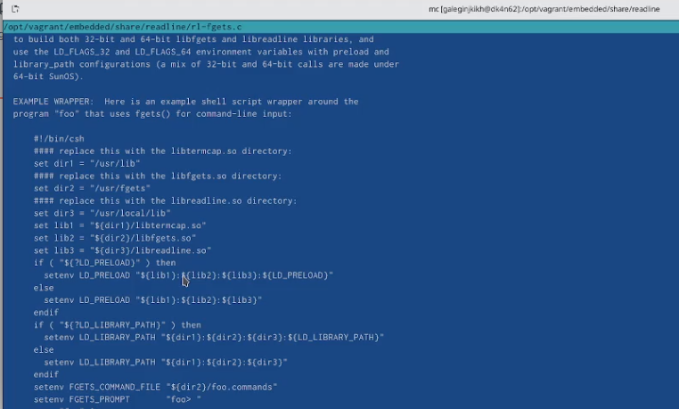{ #fig:016 width=70% }

## Выводы

Освоила основные возможности командной оболочки Midnight Commander. Приобрела навыки практической работы по просмотру каталогов и файлов; манипуляций с ними.
