---
## Front matter
title: "Лабораторная работа №7"
subtitle: "Командная оболочка Midnight Commander"
author: "Легиньких Галина Андреевна НФИбд-02-21"

## Generic otions
lang: ru-RU
toc-title: "Содержание"

## Bibliography
bibliography: bib/cite.bib
csl: pandoc/csl/gost-r-7-0-5-2008-numeric.csl

## Pdf output format
toc: true # Table of contents
toc-depth: 2
lof: true # List of figures
lot: true # List of tables
fontsize: 12pt
linestretch: 1.5
papersize: a4
documentclass: scrreprt
## I18n polyglossia
polyglossia-lang:
  name: russian
  options:
	- spelling=modern
	- babelshorthands=true
polyglossia-otherlangs:
  name: english
## I18n babel
babel-lang: russian
babel-otherlangs: english
## Fonts
mainfont: PT Serif
romanfont: PT Serif
sansfont: PT Sans
monofont: PT Mono
mainfontoptions: Ligatures=TeX
romanfontoptions: Ligatures=TeX
sansfontoptions: Ligatures=TeX,Scale=MatchLowercase
monofontoptions: Scale=MatchLowercase,Scale=0.9
## Biblatex
biblatex: true
biblio-style: "gost-numeric"
biblatexoptions:
  - parentracker=true
  - backend=biber
  - hyperref=auto
  - language=auto
  - autolang=other*
  - citestyle=gost-numeric
## Pandoc-crossref LaTeX customization
figureTitle: "Рис."
tableTitle: "Таблица"
listingTitle: "Листинг"
lofTitle: "Список иллюстраций"
lotTitle: "Список таблиц"
lolTitle: "Листинги"
## Misc options
indent: true
header-includes:
  - \usepackage{indentfirst}
  - \usepackage{float} # keep figures where there are in the text
  - \floatplacement{figure}{H} # keep figures where there are in the text
---

# Цель работы

Освоение основных возможностей командной оболочки Midnight Commander. Приобретение навыков практической работы по просмотру каталогов и файлов; манипуляций с ними

# Теоретическое введение

*Командная оболочка* — интерфейс взаимодействия пользователя с операционной системой и программным обеспечением посредством команд.

*Midnight Commander (или mc)* — псевдографическая командная оболочка для UNIX/Linux систем. Для запуска mc необходимо в командной строке набрать mc и нажать Enter.

Рабочее пространство mc имеет две панели, отображающие по умолчанию списки файлов двух каталогов.

Над панелями располагается меню, доступ к которому осуществляется с помощью клавиши F9 . Под панелями внизу расположены управляющие экранные кнопки, ассоциированные с функциональными клавишами F1 – F10. Над ними располагается
командная строка, предназначенная для ввода команд.

# Выполнение лабораторной работы

**1.** Изучила информацию о mc, вызвав в командной строке man mc.(рис. [-@fig:001])

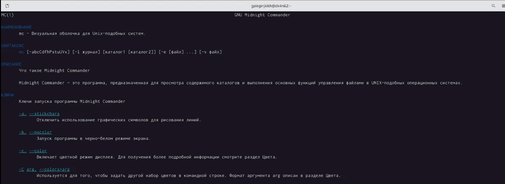{ #fig:001 width=70% }

**2.** Запустила из командной строки mc, изучила его структуру и меню.(рис. [-@fig:002])

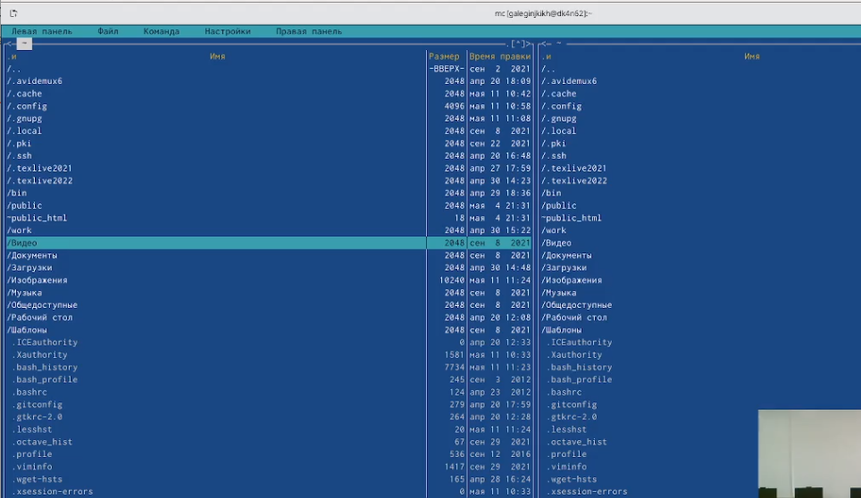{ #fig:002 width=70% }

**3.** Выполнила несколько операций в mc, используя управляющие клавиши (операции с панелями; выделение/отмена выделения файлов, копирование/перемещение файлов, получение информации о размере и правах доступа на файлы и/или каталоги
и т.п.)

**4.** Выполнила основные команды меню левой (или правой) панели. Оценила степень подробности вывода информации о файлах.(рис. [-@fig:003])

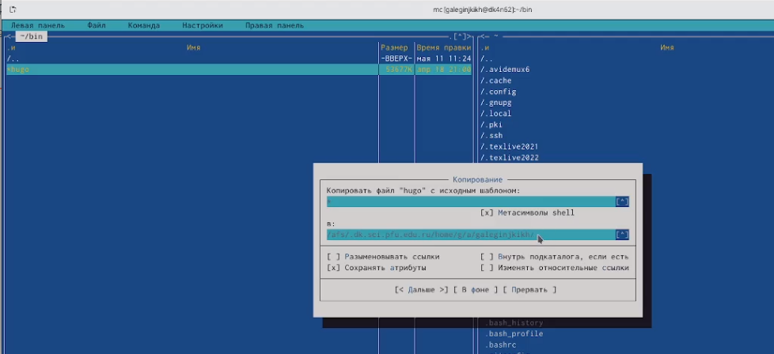{ #fig:003 width=70% }

**5.** Используя возможности подменю Файл , выполнила:

– просмотр содержимого текстового файла;(рис. [-@fig:004])

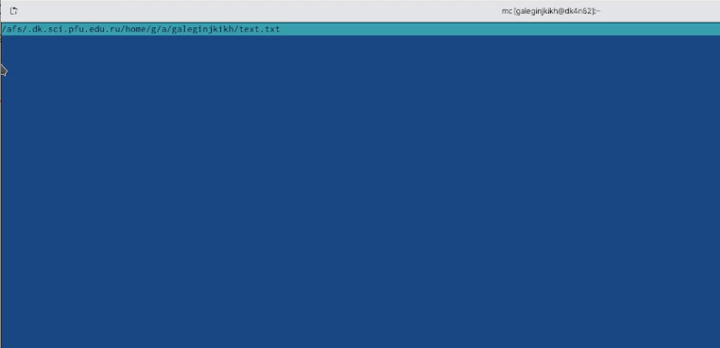{ #fig:004 width=70% }

– редактирование содержимого текстового файла (без сохранения результатов редактирования);(рис. [-@fig:005])

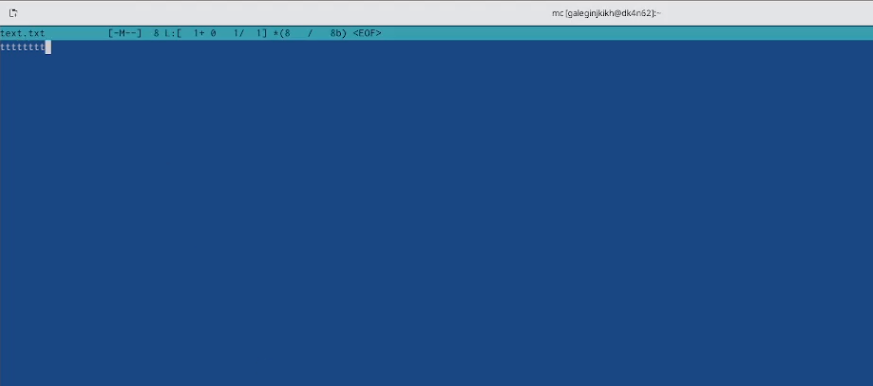{ #fig:005 width=70% }

– создание каталога;

– копирование файлов в созданный каталог.(рис. [-@fig:006])

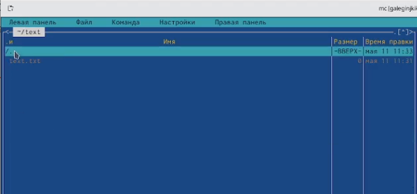{ #fig:006 width=70% }

**6.** С помощью соответствующих средств подменю Команда осуществила:

– поиск в файловой системе файла с заданными условиями (например, файла с расширением .c или .cpp, содержащего строку main);(рис. [-@fig:007])

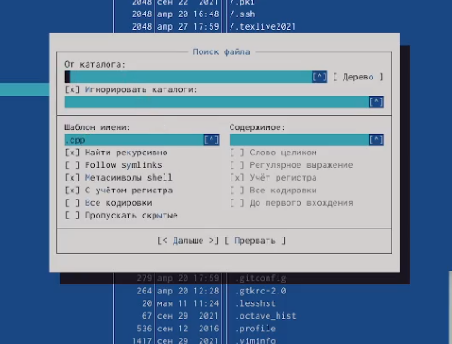{ #fig:007 width=70% }

– выбор и повторение одной из предыдущих команд;

– переход в домашний каталог;

– анализ файла меню и файла расширений.

**7.** Вызвала подменю Настройки. Освоила операции, определяющие структуру экрана mc (Full screen, Double Width, Show Hidden Files и т.д.).(рис. [-@fig:008])

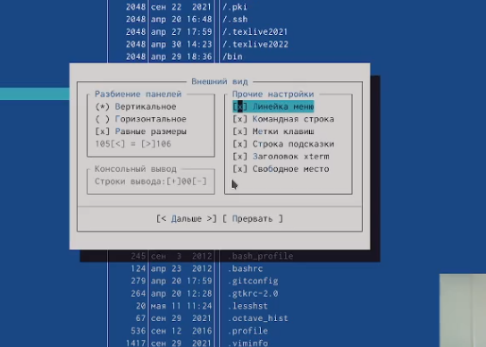{ #fig:008 width=70% }

**8.** Создала текстовой файл text.txt.(рис. [-@fig:009])

{ #fig:009 width=70% }

**9.** Открыла этот файл с помощью встроенного в mc редактора.

**10.** Вставила в открытый файл небольшой фрагмент текста, скопированный из любого другого файла или Интернета.(рис. [-@fig:010])

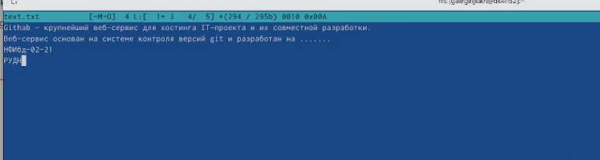{ #fig:010 width=70% }

**11.** Проделала с текстом следующие манипуляции, используя горячие клавиши:

11.1. Удалила строку текста.(рис. [-@fig:011])

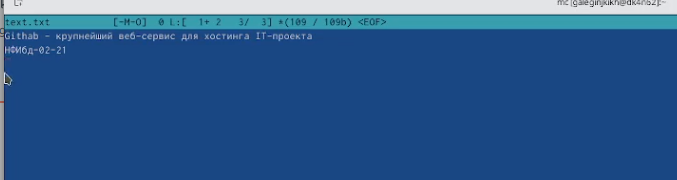{ #fig:011 width=70% }

11.2. Выделила фрагмент текста и скопировала его на новую строку.

11.3. Выделила фрагмент текста и перенесла его на новую строку.(рис. [-@fig:012])

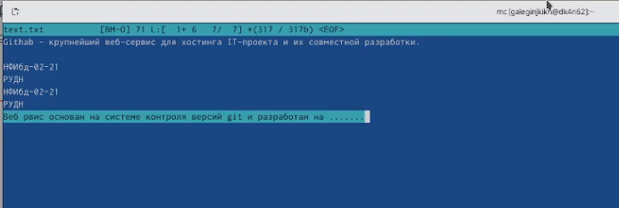{ #fig:012 width=70% }

11.4. Сохранила файл.

11.5. Отменила последнее действие.

11.6. Перешла в конец файла (нажав комбинацию клавиш) и напишите некоторый текст.(рис. [-@fig:013])

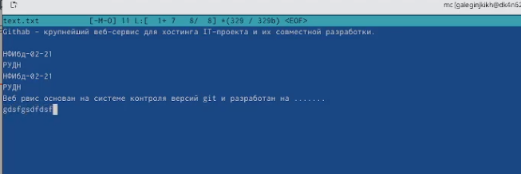{ #fig:013 width=70% }

11.7. Перешла в начало файла (нажав комбинацию клавиш) и напишите некоторый текст.(рис. [-@fig:014])

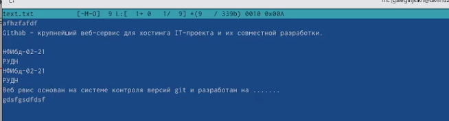{ #fig:014 width=70% }

11.8. Сохранила и закрыла файл.

**12.** Открыла файл с исходным текстом на некотором языке программирования (например C или Java).(рис. [-@fig:015])

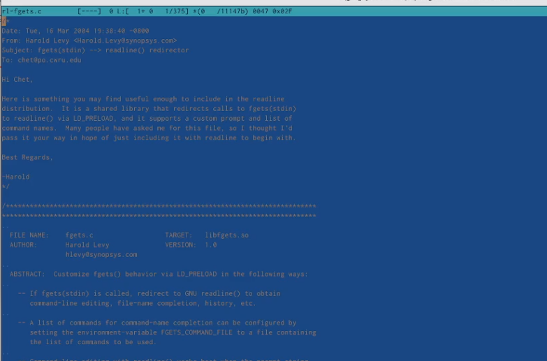{ #fig:015 width=70% }

**13.** Используя меню редактора, включила подсветку синтаксиса.(рис. [-@fig:016])

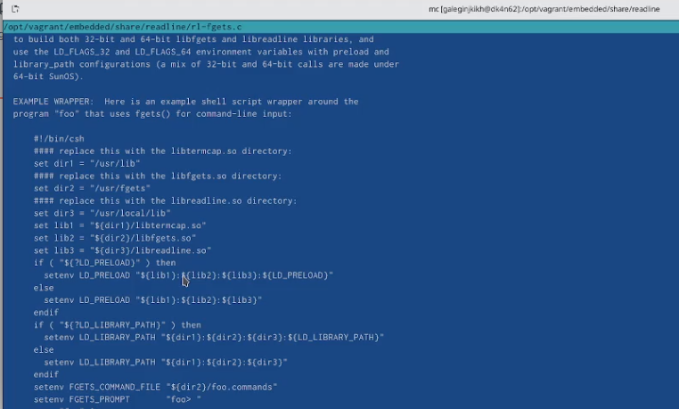{ #fig:016 width=70% }

# Выводы

Освоила основные возможности командной оболочки Midnight Commander. Приобрела навыки практической работы по просмотру каталогов и файлов; манипуляций с ними.

# Контрольные вопросы

1. Панель в mc отображает список файлов текущего каталога. Абсолютный путь к этому каталогу отображается в заголовке панели. У активной панели заголовок и одна из её строк подсвечиваются. Управление панелями осуществляется с помощью определённых комбинаций клавиш или пунктов меню mc.

Панели можно поменять местами. Для этого и используется комбинация клавиш Ctrl-u или команда меню mc Переставить панели. Также можно временно убрать отображение панелей (отключить их) с помощью комбинации клавиш Ctrl-o или команды меню mc Отключить панели. Это может быть полезно, например, если необходимо увидеть вывод какой-то информации на экран после выполнения какой-либо команды shell.

С помощью последовательного применения комбинации клавиш Ctrl-x d есть возможность сравнения каталогов, отображённых на двух панелях. Панели могут дополнительно быть переведены в один из двух режимов: Информация или Дерево. В режиме Информация на панель выводятся сведения о файле и текущей файловой системе,
расположенных на активной панели. В режиме Дерево на одной из панелей выводится структура дерева каталогов.

Управлять режимами отображения панелей можно через пункты меню mc Правая панель и Левая панель. 

2. Командные интерпретатор Shell и оболочка Midnight Commander имеют похожую структуру и многие одинаковые команды можно выполнить в обоих оболочках: 

· Системная информация 

· Поиск 

· Копирование

3. В меню каждой (левой или правой) панели можно выбрать Формат списка :

– стандартный — выводит список файлов и каталогов с указанием размера и времени
правки;

– ускоренный — позволяет задать число столбцов, на которые разбивается панель при выводе списка имён файлов или каталогов без дополнительной информации;

– расширенный — помимо названия файла или каталога выводит сведения о правах доступа, владельце, группе, размере, времени правки;

– определённый пользователем — позволяет вывести те сведения о файле или каталоге, которые задаст сам пользователь.

4. В меню Файл содержит перечень команд, которые могут быть применены к одному или нескольким файлам или каталогам.

Команды меню Файл :

– Просмотр ( F3 ) — позволяет посмотреть содержимое текущего (или выделенного) файла без возможности редактирования.

– Просмотр вывода команды ( М + ! ) — функция запроса команды с параметрами (аргумент к текущему выбранному файлу).

– Правка ( F4 ) — открывает текущий (или выделенный) файл для его редактирования.

– Копирование ( F5 ) — осуществляет копирование одного или нескольких файлов или каталогов в указанное пользователем во всплывающем окне место.

– Права доступа ( Ctrl-x c ) — позволяет указать (изменить) права доступа к одному или нескольким файлам или каталогам.

– Жёсткая ссылка ( Ctrl-x l ) — позволяет создать жёсткую ссылку к текущему (или выделенному) файлу.

– Символическая ссылка ( Ctrl-x s ) — позволяет создать символическую ссылку к текущему (или выделенному) файлу.

– Владелец/группа ( Ctrl-x o ) — позволяет задать (изменить) владельца и имя группы для одного или нескольких файлов или каталогов.

– Права (расширенные) — позволяет изменить права доступа и владения для одного или нескольких файлов или каталогов.

– Переименование ( F6 ) — позволяет переименовать (или переместить) один или несколько файлов или каталогов.

– Создание каталога ( F7 ) — позволяет создать каталог.

– Удалить ( F8 ) — позволяет удалить один или несколько файлов или каталогов.

– Выход ( F10 ) — завершает работу mc.

5. В меню Команда содержатся более общие команды для работы с mc.

Команды меню Команда :

– Дерево каталогов — отображает структуру каталогов системы.

– Поиск файла — выполняет поиск файлов по заданным параметрам.

– Переставить панели — меняет местами левую и правую панели.

– Сравнить каталоги ( Ctrl-x d ) — сравнивает содержимое двух каталогов.

– Размеры каталогов — отображает размер и время изменения каталога (по умолчанию в mc размер каталога корректно не отображается).

– История командной строки — выводит на экран список ранее выполненных в оболочке команд.

– Каталоги быстрого доступа ( Ctrl-\ ) — пр вызове выполняется быстрая смена текущего каталога на один из заданного списка.

– Восстановление файлов — позволяет восстановить файлы на файловых системах ext2 и ext3.

– Редактировать файл расширений — позволяет задать с помощью определённого синтаксиса действия при запуске файлов с определённым расширением (например, какое программного обеспечение запускать для открытия или редактирования файлов с расширением doc или docx).

– Редактировать файл меню — позволяет отредактировать контекстное меню пользователя, вызываемое по клавише F2.

– Редактировать файл расцветки имён — позволяет подобрать оптимальную для пользователя расцветку имён файлов в зависимости от их типа.

6. Меню Настройки содержит ряд дополнительных опций по внешнему виду и функциональности mc.

Меню Настройки содержит:

– Конфигурация — позволяет скорректировать настройки работы с панелями.

– Внешний вид и Настройки панелей — определяет элементы (строка меню, командная строка, подсказки и прочее), отображаемые при вызове mc, а также геометрию расположения панелей и цветовыделение.

– Биты символов — задаёт формат обработки информации локальным терминалом.

– Подтверждение — позволяет установить или убрать вывод окна с запросом подтверждения действий при операциях удаления и перезаписи файлов, а также при выходе из программы.

– Распознание клавиш — диалоговое окно используется для тестирования функциональных клавиш, клавиш управления курсором и прочее.

– Виртуальные ФС –– настройки виртуальной файловой системы: тайм-аут, пароль и прочее.

7. Встроенные команды mc: 

· F1 Вызов контекстно-зависимой подсказки. 

· F2 Вызов пользовательского меню с возможностью создания and/or. 

· F3 Просмотр содержимого файла, на который указывает подсветка в активной панели. 

· F4 Вызов встроенного в mc редактора для изменения содержания файла, на который указывает подсветка в активной панели. 

· F5 Копирование одного или нескольких файлов, отмеченных в первой (активной) панели, в каталог, отображаемый на второй панели. 

· F6 Перенос одного или нескольких файлов, отмеченных в первой панели, в каталог, отображаемый на второй панели. 

· F7 Создание подкаталога в каталоге, отображаемом в активной панели. 

· F8 Удаление одного или нескольких файлов, отмеченных в первой панели файлов. 

· F9 Вызов меню mc. 

· F10 Выход из mc.

8. Команды mc : 

· Ctrl+y удалить строку. 

· Ctrl+u отмена последней операции. 

· Ins вставка/замена. 

· F7 поиск. 

· Shift+F7 повтор последней операции поиска. 

· F4 замена файла. 

· F3 первое нажатие начало выделения, второе это окончание выделения. 

· F5 копировать выделенный фрагмент 

· F6 переместить выделенный фрагмент. 

· F8 удалить выделенный фрагмент. 

· F2 записать изменения в файл. 

· F10 выйти из редактора.

9. Один из четырех форматов списка в Midnight Commander –пользовательский, определённый самим пользователем позволяет ему редактировать меню любого из двух списков. А меню пользователя – это меню, состоящее из команд, определенных пользователем. При вызове меню используется файл ~/.mc.menu. Если такого файла нет, то по умолчанию используется системный файл меню /usr/lib/mc/mc.menu. Все строки в этих файлах , начинающиеся с пробела или табуляции, являются командами, которые выполняются при выборе записи.

10. Когда мы выделяем файл не являющегося исполняемым, Midnight Commander сравнивает расширение выбранного файла с расширениями, прописанными в «файле расширений» ~/ mc.ext. Если в файле расширений найдется подраздел, задающий процедуры обработки файлов с данным расширением, то обработка файла производится в соответствии с заданными в этом подразделе командами и файлами: 

· файл помощи для MC. /usr/lib/mc.hlp 

· файл расширений, используемый по умолчанию. /usr/lib/mc/mc.ext 

· файл расширений, конфигурации редактора. $HOME/.mc.ext 

· системный инициализационный файл. /usr/lib/mc/mc.ini 

· фаил который содержит основные установки. /usr/lib/mc/mc.lib 

· инициализационный файл пользователя. Если он существует, то системный файл mc.ini игнорируется. $HOME/.mc.ini 

· этот файл содержит подсказки, отображаемые в нижней части экрана. /usr/lib/mc/mc.hint 

· системный файл меню MC, используемый по умолчанию. /usr/lib/mc/mc.menu 

· файл меню пользователя. Если он существует, то системный файл меню игнорируется. $HOME/.mc.menu 

· инициализационный файл пользователя. Если он существует, то системный файл mc.ini игнорируется. $HOME/.mc.tree
