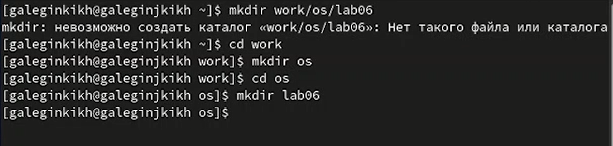
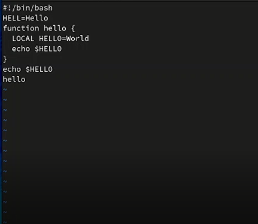
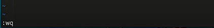
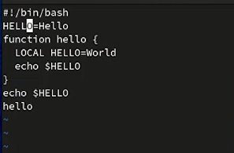
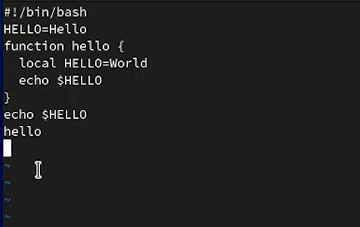
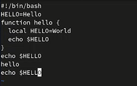

---
## Front matter
lang: ru-RU
title: Лабораторная работа №8
author: |
    Легиньких Галина - группа НФИбд-02-21
date: 06.05.2022

## Formatting
toc: false
slide_level: 2
theme: metropolis
header-includes: 
 - \metroset{progressbar=frametitle,sectionpage=progressbar,numbering=fraction}
 - '\makeatletter'
 - '\beamer@ignorenonframefalse'
 - '\makeatother'
aspectratio: 43
section-titles: true
---

# Текстовой редактор vi

## Цель работы

Познакомиться с операционной системой Linux. Получить практические навыки работы с редактором vi, установленным по умолчанию практически во всех дистрибутивах.

## Выполнение работы

1. Создала каталог с именем ~/work/os/lab06.(рис. [-@fig:001])

{ #fig:001 width=70% }

##

2. Перешла во вновь созданный каталог.

3. Вызвала vi и создала файл hello.sh.(рис. [-@fig:002])

{ #fig:002 width=70% }

##

4. Нажала клавишу i и ввела следующий текст.(рис. [-@fig:003])

{ #fig:003 width=70% }

##

5. Нажала клавишу Esc для перехода в командный режим после завершения ввода текста.

##

6. Нажала : для перехода в режим последней строки и внизу экрана появилось приглашение в виде двоеточия.

7. Нажала w (записать) и q (выйти), а затем нажала клавишу Enter для сохранения текста и завершения работы.(рис. [-@fig:004])

{ #fig:004 width=70% }

##

8. Сделала файл исполняемым.(рис. [-@fig:005])

{ #fig:005 width=70% }

9. Вызвала vi на редактирование файла.

##

10. Установила курсор в конец слова HELL второй строки. Перешла в режим вставки и заменила на HELLO. Нажала Esc для возврата в командный режим.(рис. [-@fig:006])

{ #fig:006 width=70% }

##

11. Установила курсор на четвертую строку и стерла слово LOCAL. Перешла в режим вставки и наберала следующий текст: local, нажала Esc для возврата в командный режим.(рис. [-@fig:007])

{ #fig:007 width=70% }

##

12. Установила курсор на последней строке файла. Вставила после неё строку, содержащую
следующий текст: echo $HELLO. Нажала Esc для перехода в командный режим.(рис. [-@fig:008])

{ #fig:008 width=70% }

##

13. Удалила последнюю строку. Ввела команду отмены изменений u для отмены последней команды. Ввела символ : для перехода в режим последней строки. Записала произведённые изменения и вышла из vi.

## Вывод

Познакомилась с операционной системой Linux. Получила практические навыки работы с редактором vi, установленным по умолчанию практически во всех дистрибутивах.

