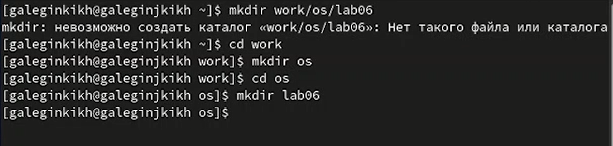
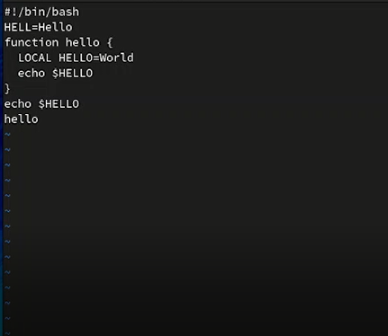
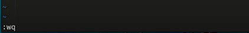
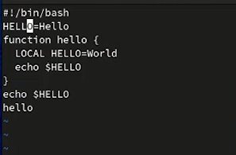
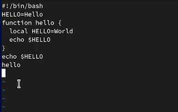
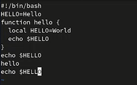

---
## Front matter
title: "Отчет по лабораторной работе №8"
subtitle: "Текстовой редактор vi"
author: "Легиньких Галина Андреевна"

## Generic otions
lang: ru-RU
toc-title: "Содержание"

## Pdf output format
toc: true # Table of contents
toc-depth: 2
lof: true # List of figures
lot: true # List of tables
fontsize: 12pt
linestretch: 1.5
papersize: a4
documentclass: scrreprt
## I18n polyglossia
polyglossia-lang:
  name: russian
  options:
  - spelling=modern
  - babelshorthands=true
polyglossia-otherlangs:
  name: english
## I18n babel
babel-lang: russian
babel-otherlangs: english
## Fonts
mainfont: PT Serif
romanfont: PT Serif
sansfont: PT Sans
monofont: PT Mono
mainfontoptions: Ligatures=TeX
romanfontoptions: Ligatures=TeX
sansfontoptions: Ligatures=TeX,Scale=MatchLowercase
monofontoptions: Scale=MatchLowercase,Scale=0.9
## Biblatex
biblatex: true
biblio-style: "gost-numeric"
biblatexoptions:
  - parentracker=true
  - backend=biber
  - hyperref=auto
  - language=auto
  - autolang=other*
  - citestyle=gost-numeric
## Pandoc-crossref LaTeX customization
figureTitle: "Рис."
tableTitle: "Таблица"
listingTitle: "Листинг"
lofTitle: "Список иллюстраций"
lotTitle: "Список таблиц"
lolTitle: "Листинги"
## Misc options
indent: true
header-includes:
  - \usepackage{indentfirst}
  - \usepackage{float} # keep figures where there are in the text
  - \floatplacement{figure}{H} # keep figures where there are in the text
---

# Цель работы

Познакомиться с операционной системой Linux. Получить практические навыки работы с редактором vi, установленным по умолчанию практически во всех дистрибутивах.

# Теоретическое введение

В большинстве дистрибутивов Linux в качестве текстового редактора по умолчанию
устанавливается интерактивный экранный редактор vi (Visual display editor).
Редактор vi имеет три режима работы:
– командный режим — предназначен для ввода команд редактирования и навигации по
редактируемому файлу;
– режим вставки — предназначен для ввода содержания редактируемого файла;
– режим последней (или командной) строки — используется для записи изменений в файл
и выхода из редактора.
Для вызова редактора vi необходимо указать команду vi и имя редактируемого файла:
vi <имя_файла>
При этом в случае отсутствия файла с указанным именем будет создан такой файл.
Переход в командный режим осуществляется нажатием клавиши Esc . Для выхода из
редактора vi необходимо перейти в режим последней строки: находясь в командном
режиме, нажать Shift-; (по сути символ : — двоеточие), затем:
– набрать символы wq, если перед выходом из редактора требуется записать изменения
в файл;
– набрать символ q (или q!), если требуется выйти из редактора без сохранения.

# Выполнение работы

1. Создала каталог с именем ~/work/os/lab06.(рис. [-@fig:001])

{ #fig:001 width=70% }

2. Перешла во вновь созданный каталог.

3. Вызовала vi и создала файл hello.sh.(рис. [-@fig:002])

{ #fig:002 width=70% }

4. Нажала клавишу i и ввела следующий текст.(рис. [-@fig:003])

{ #fig:003 width=70% }

5. Нажала клавишу Esc для перехода в командный режим после завершения ввода текста.

6. Нажала : для перехода в режим последней строки и внизу экрана появилось приглашение в виде двоеточия.

7. Нажала w (записать) и q (выйти), а затем нажала клавишу Enter для сохранения текста и завершения работы.(рис. [-@fig:004])

{ #fig:004 width=70% }

8. Сделала файл исполняемым.(рис. [-@fig:005])

{ #fig:005 width=70% }

9. Вызовала vi на редактирование файла.

10. Установила курсор в конец слова HELL второй строки. Перешла в режим вставки и заменила на HELLO. Нажала Esc для возврата в командный режим.(рис. [-@fig:006])

{ #fig:006 width=70% }

11. Установила курсор на четвертую строку и стерла слово LOCAL. Перешла в режим вставки и наберала следующий текст: local, нажала Esc для возврата в командный режим.(рис. [-@fig:007])

{ #fig:007 width=70% }

12. Установила курсор на последней строке файла. Вставила после неё строку, содержащую
следующий текст: echo $HELLO. Нажала Esc для перехода в командный режим.(рис. [-@fig:008])

{ #fig:008 width=70% }

13. Удалила последнюю строку. Ввела команду отмены изменений u для отмены последней команды. Ввела символ : для перехода в режим последней строки. Записала произведённые изменения и вышла из vi.

# Вывод

Познакомилась с операционной системой Linux. Получила практические навыки работы с редактором vi, установленным по умолчанию практически во всех дистрибутивах.

# Контрольные вопросы

1. Редактор vi имеет три режима работы:

– командный режим — предназначен для ввода команд редактирования и навигации по
редактируемому файлу;

– режим вставки — предназначен для ввода содержания редактируемого файла;

– режим последней (или командной) строки — используется для записи изменений в файл
и выхода из редактора.

2. Если необходимо просто выйти Vi (без сохранения выполненных изменений), то необходимо в последней строке набрать символ q (или q!).

3. 0 (ноль) - перейти в начало строки; 

$ - перейти в конец строки; 

G - перейти в конец файла; 

nG - перейти на строку номер n.

4. Редактор vi предполагает, что слово - это строка символов, которая может включать в себя буквы, цифры и символы подчеркивания.

5. 0 (ноль) - перейти в начало строки; $ - перейти в конец строки; 

6.  1.Команды позиционирования:

– 0 (ноль) — переход в начало строки;

– $ — переход в конец строки;

– G — переход в конец файла;

– 𝑛 G — переход на строку с номером 𝑛.

2.Команды перемещения по файлу:

– Ctrl-d — перейти на пол-экрана вперёд;

– Ctrl-u — перейти на пол-экрана назад;

– Ctrl-f — перейти на страницу вперёд;

– Ctrl-b — перейти на страницу назад.

3.Команды перемещения по словам:

– W или w — перейти на слово вперёд;

– 𝑛 W или 𝑛 w — перейти на 𝑛 слов вперёд;

– b или B — перейти на слово назад;

– 𝑛 b или 𝑛 B — перейти на 𝑛 слов назад.

7. c$ - заменить текст от курсора до конца строки.

8. u- отменить последнее изменение.

9. 1.Копирование и перемещение текста:

– : 𝑛,𝑚 d — удалить строки с 𝑛 по 𝑚;

– : 𝑖,𝑗 m 𝑘 — переместить строки с 𝑖 по 𝑗, начиная со строки 𝑘;

– : 𝑖,𝑗 t 𝑘 — копировать строки с 𝑖 по 𝑗 в строку 𝑘;

– : 𝑖,𝑗 w имя-файла — записать строки с 𝑖 по 𝑗 в файл с именем имя-файла.

2.Запись в файл и выход из редактора:

– : w — записать изменённый текст в файл, не выходя из vi;

– : w имя-файла — записать изменённый текст в новый файл с именем имя-файла;

– : w ! имя-файла — записать изменённый текст в файл с именем имя-файла;

– : w q — записать изменения в файл и выйти из vi;

– : q — выйти из редактора vi;

– : q ! — выйти из редактора без записи;

– : e ! — вернуться в командный режим, отменив все изменения, произведённые со времени последней записи.

10. $ - перемещает курсор в конец строки.

11. Опции редактора Vi позволяют настроить рабочую среду. Для задания опций используется команда set (в режиме последней строки):

: set all - вывести полный список опций; 

: set nu - вывести номера строк; 

: set list - вывести невидимые символы; 

: set ic - не учитывать при поиске, является ли символ прописным или строчным.

12. Нажатие клавиши ESC всегда переводит Vi в командный режим (это удобно, когда вы точно не помните в каком режиме находитесь. Если вы нажмете клавишу ESC, находясь в командном режиме, машина напомнит вам об этом, подав звуковой сигнал.

13. Командный –>вставки– >последняя строка (командная строка).
    

