---
## Front matter
lang: ru-RU
title: Лабораторная работа №9
author: |
    Легиньких Галина - группа НФИбд-02-21
date: 11.05.2022

## Formatting
toc: false
slide_level: 2
theme: metropolis
header-includes: 
 - \metroset{progressbar=frametitle,sectionpage=progressbar,numbering=fraction}
 - '\makeatletter'
 - '\beamer@ignorenonframefalse'
 - '\makeatother'
aspectratio: 43
section-titles: true
---
# Текстовой редактор emacs

## Цель работы

Познакомиться с операционной системой Linux. Получить практические навыки работы с редактором Emacs.
   
## Выполнение лабораторной работы

**1.** Открыла emacs.(рис. [-@fig:001])

{ #fig:001 width=70% }

##

**2.** Создала файл lab07.sh с помощью комбинации Ctrl-x Ctrl-f (C-x C-f).(рис. [-@fig:002])

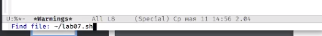{ #fig:002 width=70% }

##

**3.** Набрала текст.(рис. [-@fig:003])

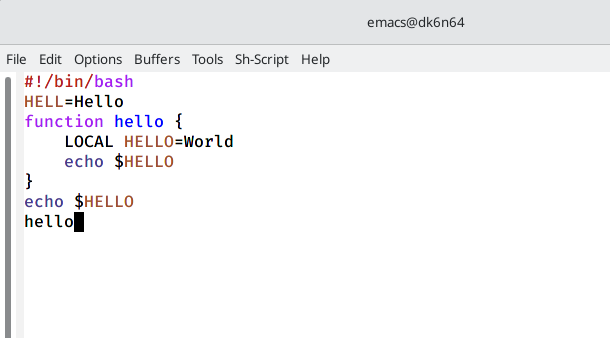{ #fig:003 width=70% }

##

**4.** Сохранила файл с помощью комбинации Ctrl-x Ctrl-s (C-x C-s).

**5.** Проделала с текстом стандартные процедуры редактирования:

5.1. Вырезала одной командой целую строку (С-k).(рис. [-@fig:004])

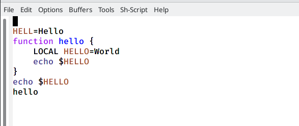{ #fig:004 width=70% }

##

5.2. Вставила эту строку в конец файла (C-y).(рис. [-@fig:005])

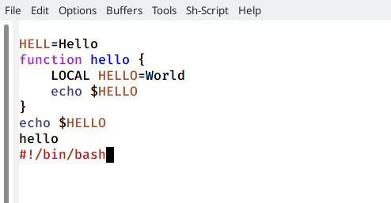{ #fig:005 width=70% }

##

5.3. Выделила область текста (C-space).(рис. [-@fig:006])

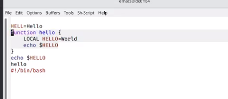{ #fig:006 width=70% }

##

5.4. Скопировала область в буфер обмена (M-w).

5.5. Вставила область в конец файла.(рис. [-@fig:007])

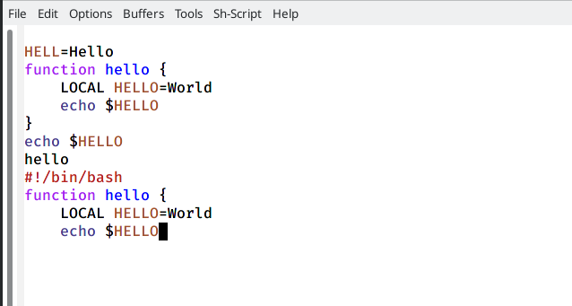{ #fig:007 width=70% }

##

5.6. Вновь выделила эту область и на этот раз вырезала её (C-w).

5.7. Отменила последнее действие (C-/).

##

**6.** Научилась использовать команды по перемещению курсора:

6.1. Переместила курсор в начало строки (C-a).(рис. [-@fig:008])

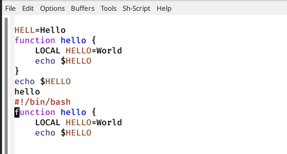{ #fig:008 width=70% }

##

6.2. Переместила курсор в конец строки (C-e).(рис. [-@fig:009])

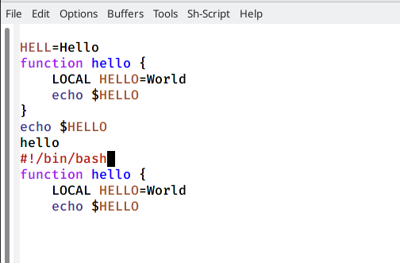{ #fig:009 width=70% }

##

6.3. Переместила курсор в начало буфера (M-<).

6.4. Переместила курсор в конец буфера (M->).

##

**7.** Научилась управлять буфером:

7.1. Вывела список активных буферов на экран (C-x C-b).(рис. [-@fig:010])

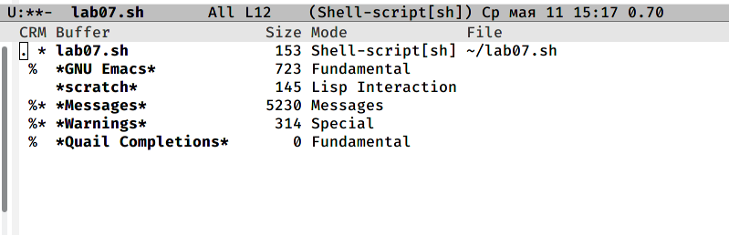{ #fig:010 width=70% }

##

7.2. Переместилась во вновь открытое окно (C-x) со списком открытых буферов и переключилась на другой буфер.

7.3. Закрыла это окно (C-x 0).(рис. [-@fig:011])

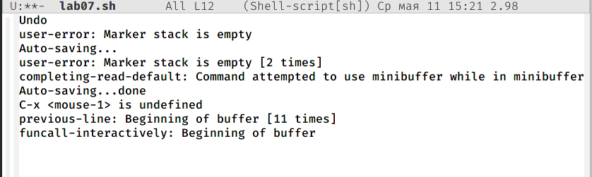{ #fig:011 width=70% }

##

7.4. Теперь вновь переключилась между буферами, но уже без вывода их списка на экран (C-x b).

##

**8.** Управление окнами:

8.1. Поделила фрейм на 4 части: разделила фрейм на два окна по вертикали (C-x 3), а затем каждое из этих окон на две части по горизонтали (C-x 2).(рис. [-@fig:012])

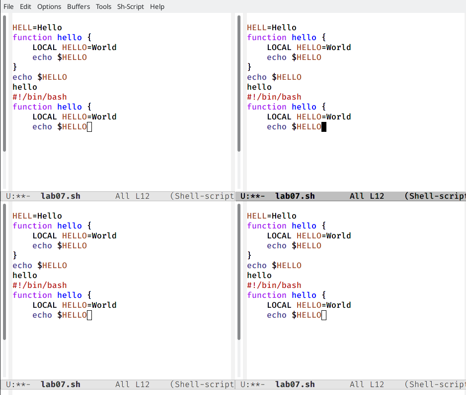{ #fig:012 width=70% }

##

8.2. В каждом из четырёх созданных окон открыла новый буфер (файл) и ввела несколько строк текста.(рис. [-@fig:013])

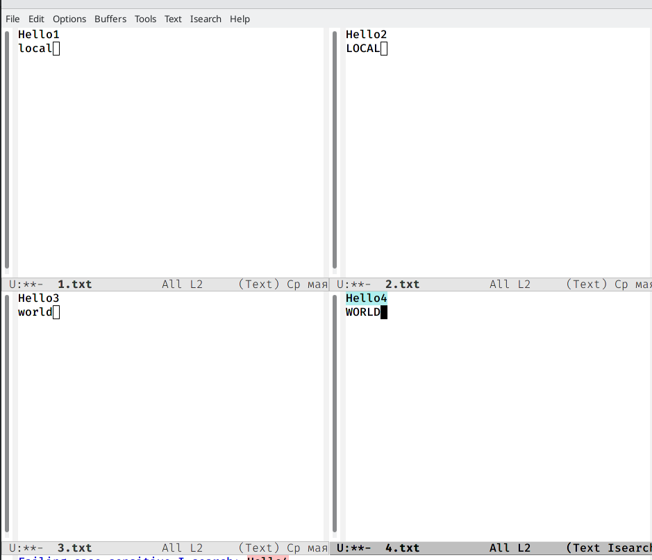{ #fig:013 width=70% }

##

**9.** Режим поиска:

9.1. Переключилась в режим поиска (C-s) и нашла несколько слов, присутствующих в тексте.(рис. [-@fig:014])(рис. [-@fig:015])

{ #fig:014 width=70% }

##

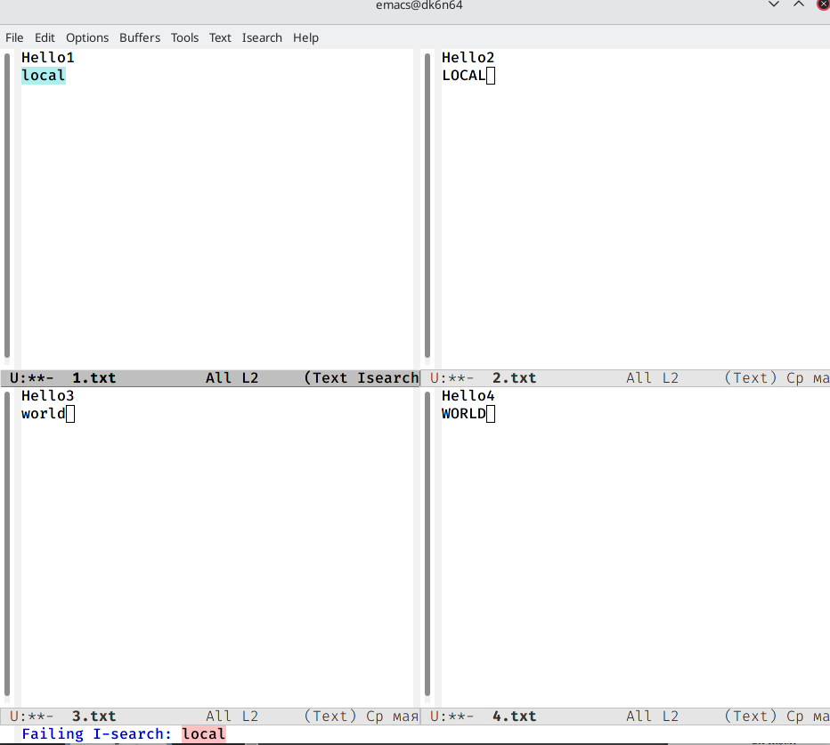{ #fig:015 width=70% }

9.2. Переключилась между результатами поиска, нажимая C-s.

##

9.3. Вышла из режима поиска, нажав C-g.

9.4. Перешла в режим поиска и замены (M-%), ввела текст, который следует найти и заменила, нажала Enter , затем ввела текст для замены. После того как были подсвечены результаты поиска, нажала ! для подтверждения замены.

9.5. Испробовала другой режим поиска, нажав M-s o. 

## Вывод

Познакомилась с операционной системой Linux. Получила практические навыки работы с редактором Emacs.
