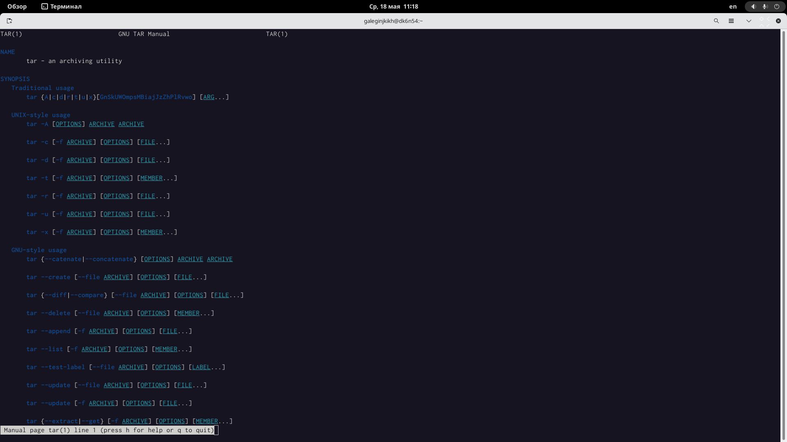
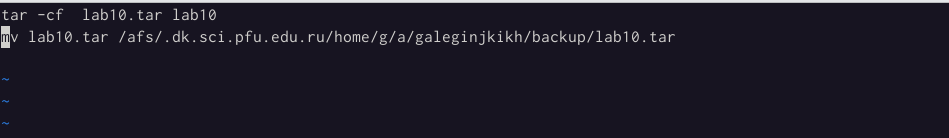
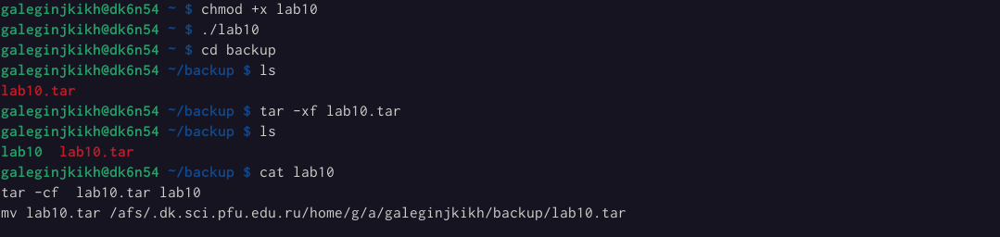
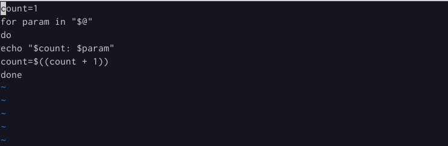
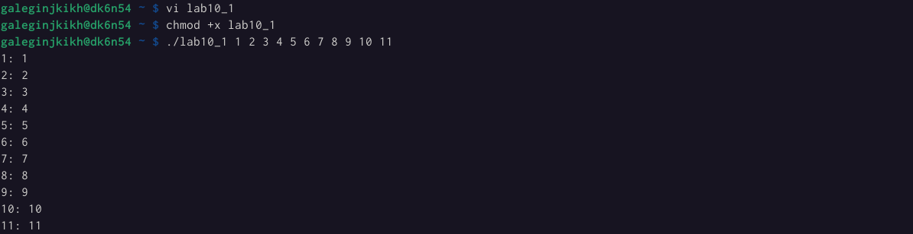
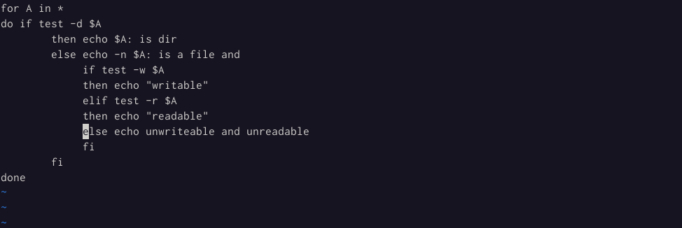
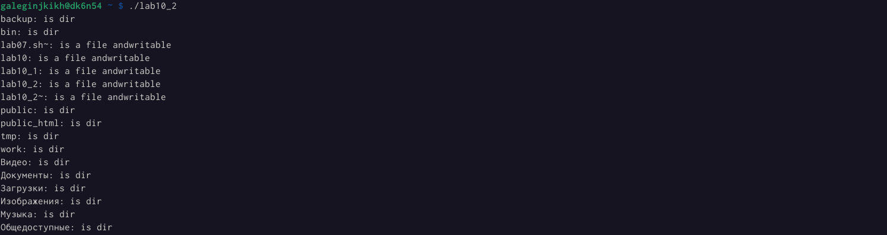
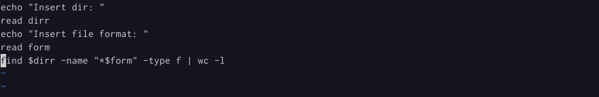
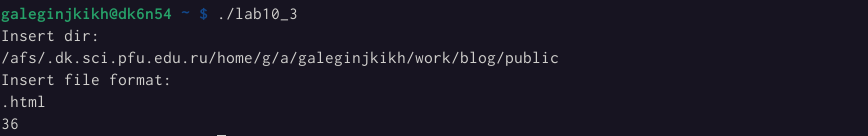

---
## Front matter
lang: ru-RU
title: Лабораторная работа №10
author: |
    Легиньких Галина - группа НФИбд-02-21
date: 11.05.2022

## Formatting
toc: false
slide_level: 2
theme: metropolis
header-includes: 
 - \metroset{progressbar=frametitle,sectionpage=progressbar,numbering=fraction}
 - '\makeatletter'
 - '\beamer@ignorenonframefalse'
 - '\makeatother'
aspectratio: 43
section-titles: true
---
# Программирование в командном процессоре ОС UNIX. Командные файлы.

## Цель работы

Изучить основы программирования в оболочке ОС UNIX/Linux. Научиться писать небольшие командные файлы.

## Выполнение работы

**1.** Я написала скрипт, который при запуске будет делать резервную копию самого себя (то есть файла, в котором содержится его исходный код) в другую директорию backup в моем домашнем каталоге. При этом файл должен архивироваться одним из архиваторов на выбор zip, bzip2 или tar.(рис. [-@fig:002])(рис. [-@fig:003])

Изучим справку tar:(рис. [-@fig:001])

##

{ #fig:001 width=70% }

##

{ #fig:002 width=70% }

##

{ #fig:003 width=70% }

##

**2.** Я написала пример командного файла, обрабатывающего любое произвольное число аргументов командной строки, в том числе превышающее десять. Например, мой скрипт может последовательно распечатывать значения всех переданных аргументов.(рис. [-@fig:004])(рис. [-@fig:005)

{ #fig:004 width=70% }

##

{ #fig:005 width=70% }

##

**3.** Я написала командный файл — аналог команды ls (без использования самой этой команды и команды dir). Он выдает информацию о нужном каталоге и выводит информацию о возможностях доступа к файлам этого каталога.(рис. [-@fig:006])(рис. [-@fig:007])

{ #fig:006 width=70% }

##

{ #fig:007 width=70% }

##

**4.** Я написала командный файл, который получает в качестве аргумента командной строки формат файла (.txt,.doc,.jpg,.pdf и т.д.) и вычисляет количество таких файлов в указанной директории. Путь к директории также передаётся ввиде аргумента командной строки.(рис. [-@fig:008])(рис. [-@fig:009])

{ #fig:008 width=70% }

##

{ #fig:009 width=70% }

## Вывод

Изучила основы программирования в оболочке ОС UNIX. Научилась писать небольшие командные файлы.
