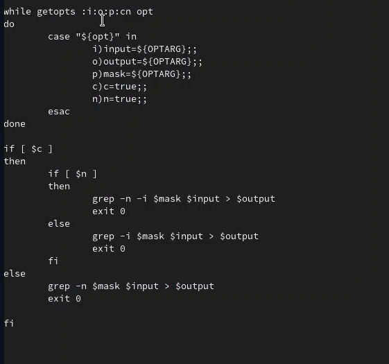
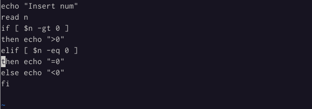
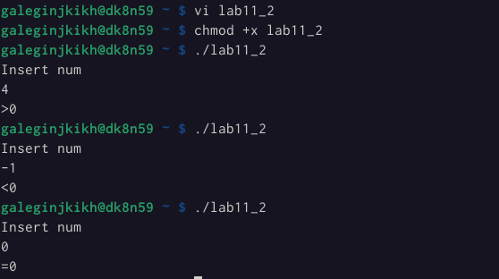
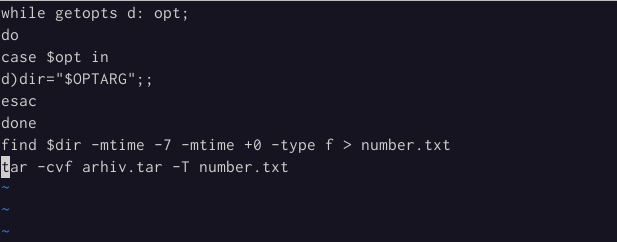
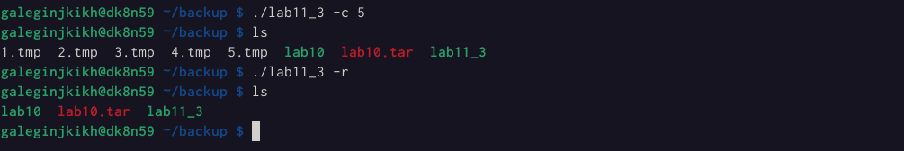
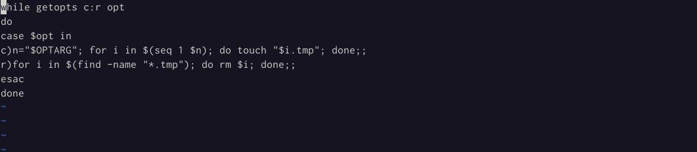
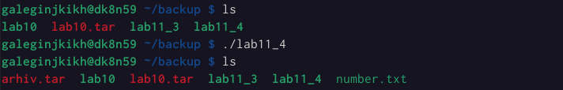

---
## Front matter
lang: ru-RU
title: Лабораторная работа №11
author: |
    Легиньких Галина - группа НФИбд-02-21
date: 20.05.2022

## Formatting
toc: false
slide_level: 2
theme: metropolis
header-includes: 
 - \metroset{progressbar=frametitle,sectionpage=progressbar,numbering=fraction}
 - '\makeatletter'
 - '\beamer@ignorenonframefalse'
 - '\makeatother'
aspectratio: 43
section-titles: true
---
# Программирование в командном процессоре ОС UNIX. Ветвления и циклы

## Цель работы

Изучить основы программирования в оболочке ОС UNIX. Научится писать более сложные командные файлы с использованием логических управляющих конструкций и циклов.

## Выполнение работы

**1.** Используя команды getopts grep, написала командный файл, который анализирует командную строку с ключами:

– -iinputfile — прочитать данные из указанного файла;

– -ooutputfile — вывести данные в указанный файл;

– -pшаблон — указать шаблон для поиска;

– -C — различать большие и малые буквы;

– -n — выдавать номера строк.

а затем ищет в указанном файле нужные строки, определяемые ключом -p.(рис. [-@fig:001])

##

{ #fig:001 width=70% }

##

**2.** Написала программу, которая вводит число и определяет, является ли оно больше нуля, меньше нуля или равно нулю.(рис. [-@fig:002])(рис. [-@fig:003])

{ #fig:002 width=70% }

##

{ #fig:003 width=70% }

##

**3.** Написала командный файл, создающий указанное число файлов, пронумерованных последовательно от 1 до 𝑁 (например 1.tmp, 2.tmp, 3.tmp,4.tmp и т.д.).(рис. [-@fig:004])(рис. [-@fig:005])

{ #fig:004 width=70% }

##

{ #fig:005 width=70% }

##

**4.** Написала командный файл, который с помощью команды tar запаковывает в архив все файлы в указанной директории. Модифицировала его так, чтобы запаковывались только те файлы, которые были изменены менее недели тому назад.(рис. [-@fig:006])(рис. [-@fig:007])

{ #fig:006 width=70% }

##

{ #fig:007 width=70% }

## Вывод

Изучила основы программирования в оболочке ОС UNIX. Научилась писать более сложные командные файлы с использованием логических управляющих конструкций и циклов.
