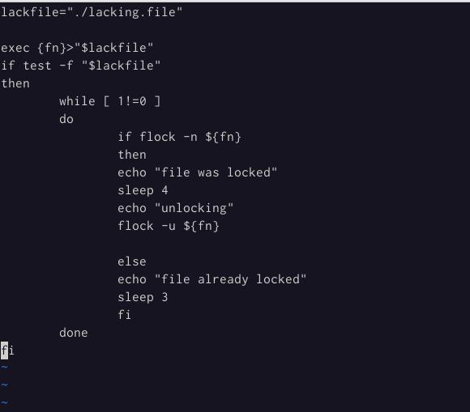
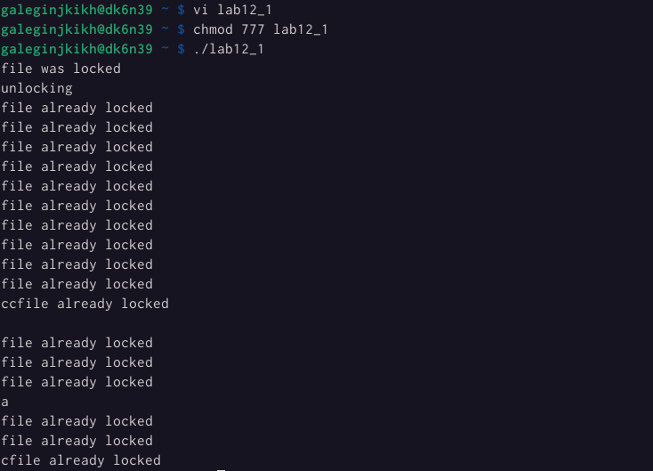
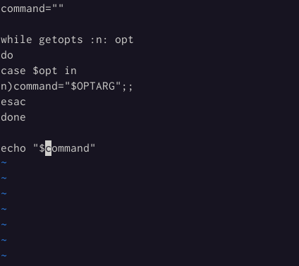
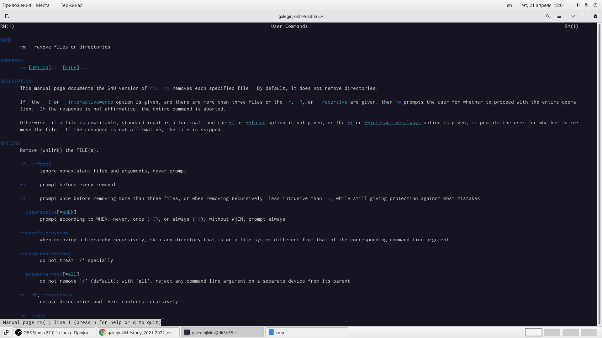
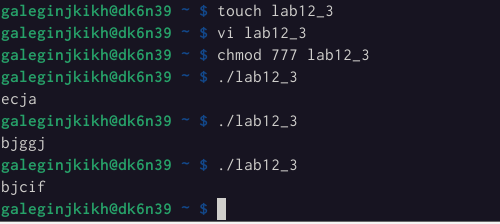

---
## Front matter
lang: ru-RU
title: Лабораторная работа №12
author: |
    Легиньких Галина - группа НФИбд-02-21
date: 20.05.2022

## Formatting
toc: false
slide_level: 2
theme: metropolis
header-includes: 
 - \metroset{progressbar=frametitle,sectionpage=progressbar,numbering=fraction}
 - '\makeatletter'
 - '\beamer@ignorenonframefalse'
 - '\makeatother'
aspectratio: 43
section-titles: true
---
# Программирование в командном процессоре ОС UNIX. Расширенное программирование

## Цель работы

Изучить основы программирования в оболочке ОС UNIX. Научиться писать более сложные командные файлы с использованием логических управляющих конструкций и циклов.

## Выполнение работы

**1.** Написала командный файл, реализующий упрощённый механизм семафоров. Командный файл в течение некоторого времени t1 дожидается освобождения ресурса, выдавая об этом сообщение, а дождавшись его освобождения, использует его в течение некоторого времени t2<>t1, также выдавая информацию о том, что ресурс используется соответствующим командным файлом (процессом). Запустила командный файл в одном виртуальном терминале в фоновом режиме, перенаправив его вывод в другой (> /dev/tty#, где # — номер терминала куда перенаправляется вывод), в котором также запущен этот файл, но не фоновом, а в привилегированном режиме. Доработала программу так, чтобы имелась возможность взаимодействия трёх и более процессов.(рис. [-@fig:001])(рис. [-@fig:002])

##

{ #fig:001 width=70% }

##

{ #fig:002 width=70% }

##

**2.** Реализовала команду man с помощью командного файла. Изучила содержимое каталога ```/usr/share/man/man1```. В нем находятся архивы текстовых файлов, содержащих справку по большинству установленных в системе программ и команд. Каждый архив можно открыть командой less сразу же просмотрев содержимое справки. Командный файл должен получать в виде аргумента команднойстроки название команды и в виде результата выдавать справку об этой команде или сообщение об отсутствии справки, если соответствующего файла нет вкаталоге ```man1```.(рис. [-@fig:003])(рис. [-@fig:004])

##

{ #fig:003 width=70% }

##

{ #fig:004 width=70% }

##

**3.** Используя встроенную переменную $RANDOM, написала командный файл, генерирующий случайную последовательность букв латинского алфавита. Учтя,что $RANDOM выдаёт псевдослучайные числа в диапазоне от 0 до 32767.(рис. [-@fig:005])

{ #fig:005 width=70% }

##

Для наглядности запустила скрипт несколько раз, чтобы увидеть, что генерируются разные случайные пароли.(рис. [-@fig:006])

{ #fig:006 width=70% }

## Вывод

В ходе лабораторной работы я изучила основы программирования в оболочке ОС UNIX, научилась писать более сложные командные файлы с использованием логических управляющих конструкций и циклов.
