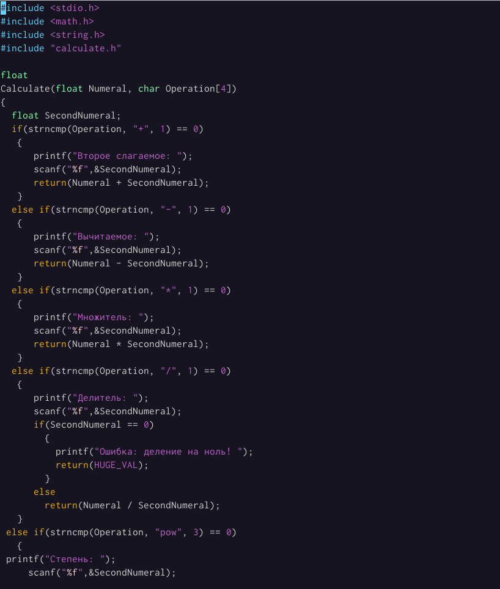
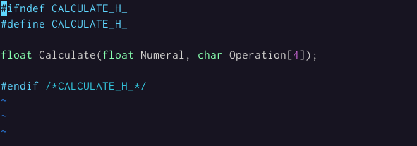
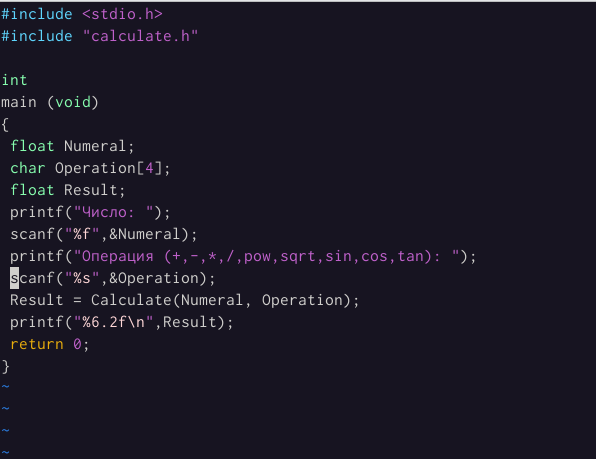
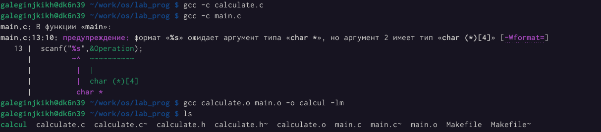
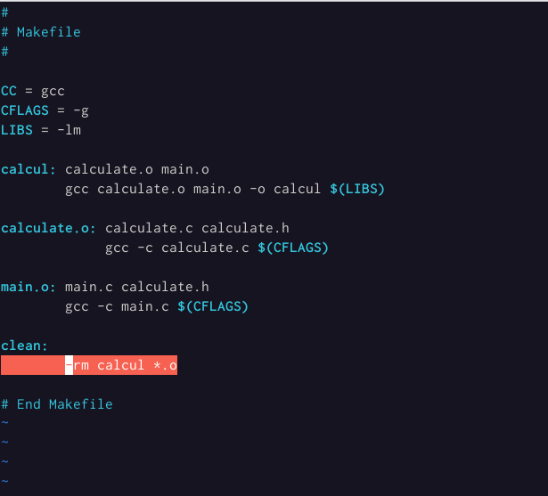
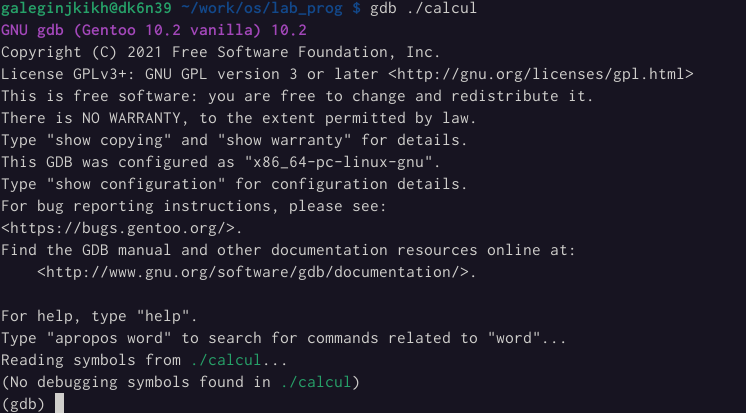

---
## Front matter
lang: ru-RU
title: Лабораторная работа №13
author: |
    Легиньких Галина - группа НФИбд-02-21
date: 20.05.2022

## Formatting
toc: false
slide_level: 2
theme: metropolis
header-includes: 
 - \metroset{progressbar=frametitle,sectionpage=progressbar,numbering=fraction}
 - '\makeatletter'
 - '\beamer@ignorenonframefalse'
 - '\makeatother'
aspectratio: 43
section-titles: true
---
# Средства, применяемые при разработке программного обеспечения в ОС типа UNIX/Linux

## Цель работы

Приобрести простейшие навыки разработки, анализа, тестирования и отладки приложений в ОС типа UNIX/Linux на примере создания на языке программирования С калькулятора с простейшими функциями.

## Выполнение работа

**1.** В домашнем каталоге создала подкаталог ~/work/os/lab_prog.(рис. [-@fig:001])

{ #fig:001 width=70% }

##

**2.** Создала в подкаталоге файлы: calculate.h, calculate.c, main.c.

У меня получился примитивнейший калькулятор, способный складывать, вычитать, умножать и делить, возводить число в степень, брать квадратный корень, вычислять sin, cos, tan.

При запуске он запрашивать первое число, операцию, второе число. После этого программа выведит результат и остановливается.

##

Реализация функций калькулятора в файле calculate.c:(рис. [-@fig:002])(рис. [-@fig:003])

{ #fig:002 width=70% }

#3

{ #fig:003 width=70% }

##

Интерфейсный файл calculate.h, описывающий формат вызова функциикалькулятора:(рис. [-@fig:004])

{ #fig:004 width=70% }

##

Основной файл main.c, реализующий интерфейс пользователя к калькулятору:(рис. [-@fig:005])

{ #fig:005 width=70% }

##

**3.** Выполнила компиляцию программы посредством gcc:(рис. [-@fig:006])

{ #fig:006 width=70% }

##

**4.** Создала Makefile со следующим содержанием:(рис. [-@fig:007])

{ #fig:007 width=70% }

##

**5.** С помощью gdb выполнила отладку программы calcul (перед использованием gdb исправьте Makefile):

##

**6.** С помощью утилиты splint попробовала проанализировать коды файлов calculate.c и main.c.

## Вывод

Приобрела простейшие навыки разработки, анализа, тестирования и отладки приложений в ОС типа UNIX/Linux на примере создания на языке программирования С калькулятора с простейшими функциями.

