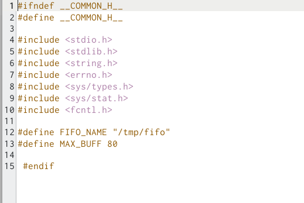
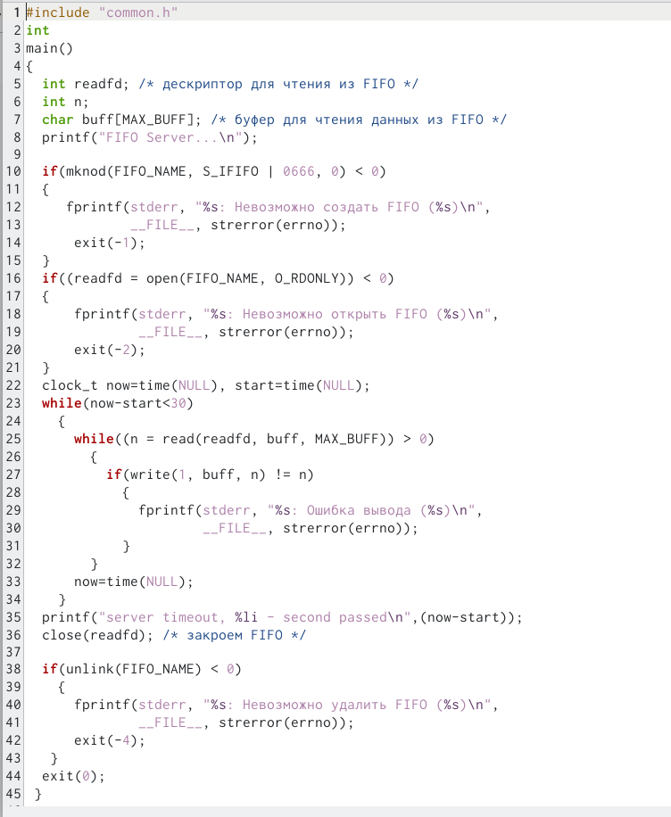
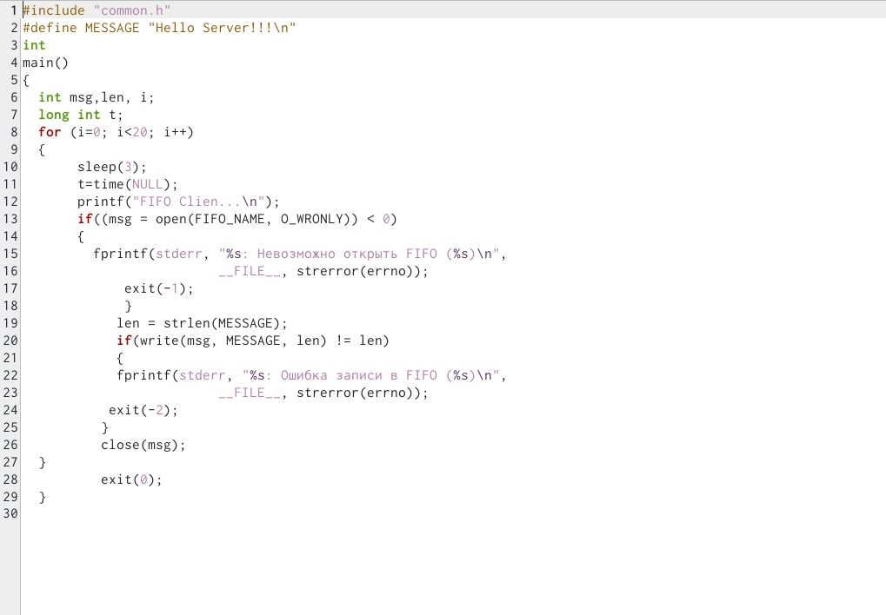
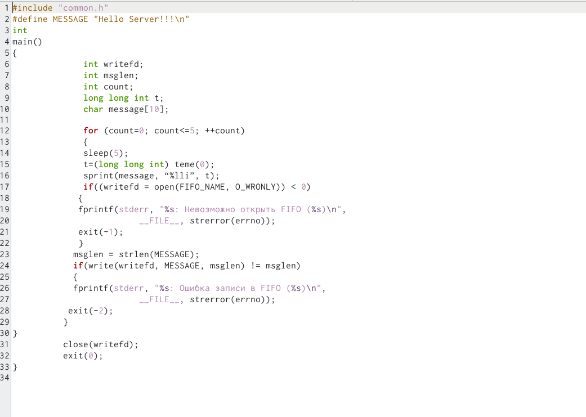
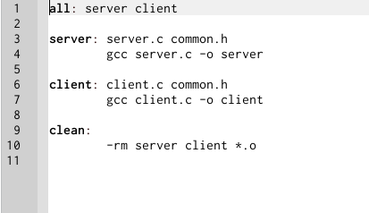
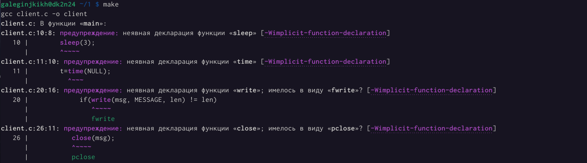
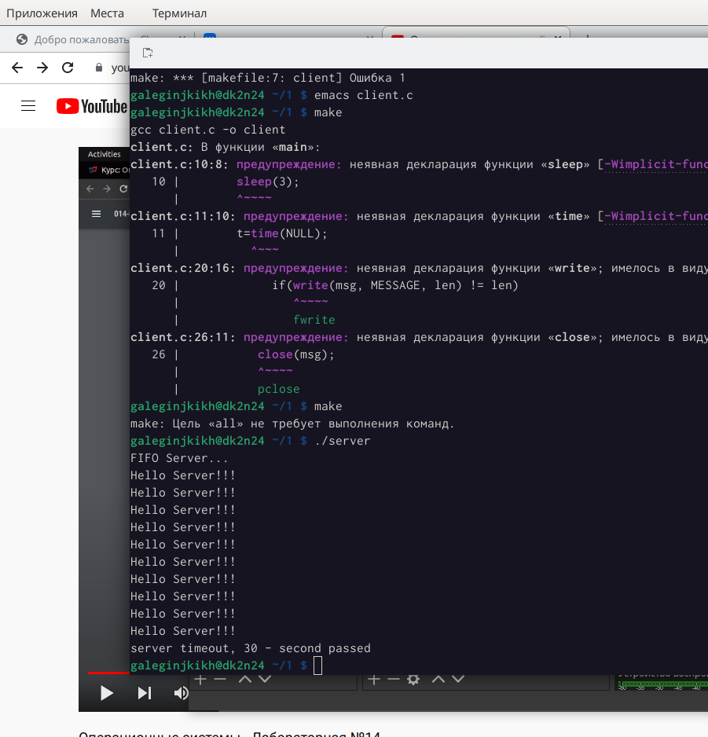

---
## Front matter
lang: ru-RU
title: Лабораторная работа №14
author: |
    Легиньких Галина - группа НФИбд-02-21
date: 20.05.2022

## Formatting
toc: false
slide_level: 2
theme: metropolis
header-includes: 
 - \metroset{progressbar=frametitle,sectionpage=progressbar,numbering=fraction}
 - '\makeatletter'
 - '\beamer@ignorenonframefalse'
 - '\makeatother'
aspectratio: 43
section-titles: true
---
# Именованные каналы

## Цель работы

Приобретение практических навыков работы с именованными каналами.

## Выполнение работы

**1.** Изучила теорию по теми и примеры программ server.c и client.c.

**2.** Файл *common.h* - заголовочный файл со стандартными определениями (рис. [-@fig:001])

{ #fig:001 width=70% }

##

**3.** Файл *server.c* - реализация сервера. Чтобы запустить пример, необходимо:

  1. запустить программу server на одной консоли;
  2. запустить программу client на другой консоли.(рис. [-@fig:002])

{ #fig:002 width=40% }

##

**4.** Файл *client.c* - реализация клиента. Чтобы запустить пример, необходимо:

  1. запустить программу server на одной консоли;
  2. запустить программу client на другой консоли.(рис. [-@fig:003])

{ #fig:003 width=70% }

##

**5.** Файл *clien2.c* - реализация клиента. (рис. [-@fig:004])

{ #fig:004 width=70% }

##

**6.** Makefile (рис. [-@fig:005])

{ #fig:005 width=70% }

##

**7.** Запускаем make: (рис. [-@fig:006])

{ #fig:006 width=70% }

##

**8.** Запускаем программу: (рис. [-@fig:007])

{ #fig:007 width=40% }

## Вывод 

Приобрела практические навыки работы с именованными каналами.
