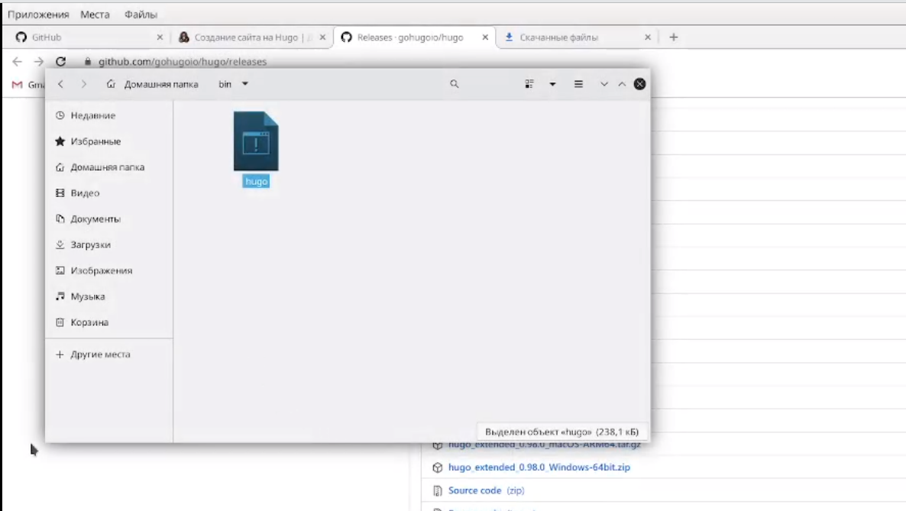
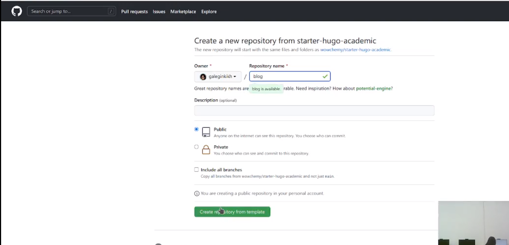
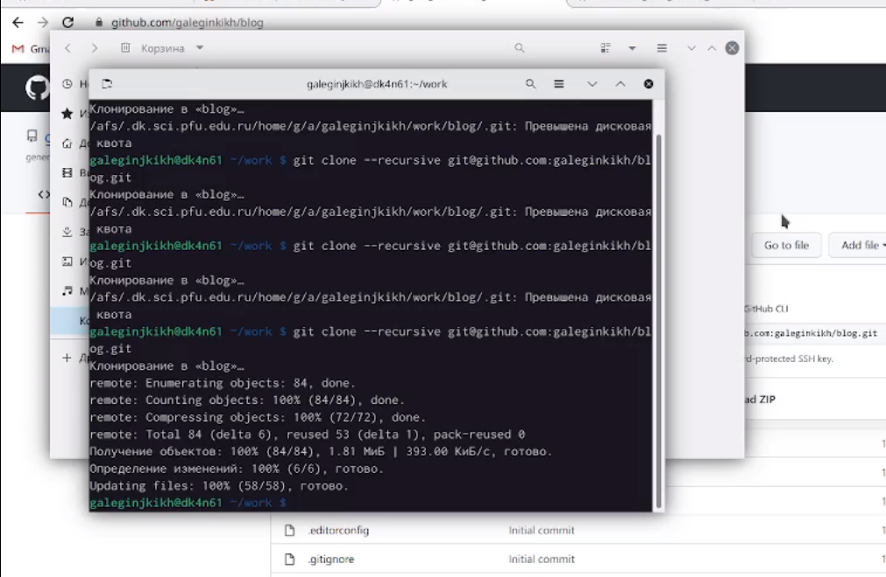
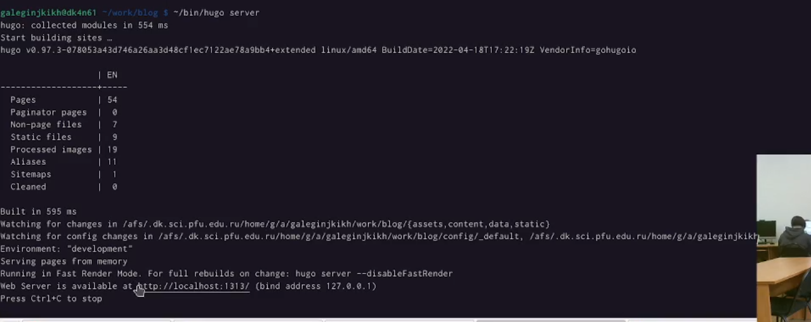
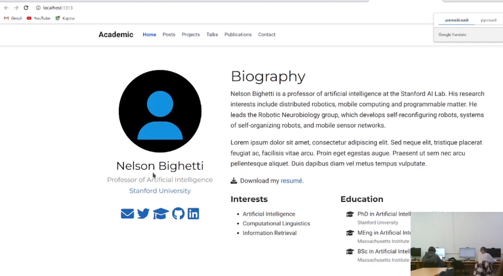
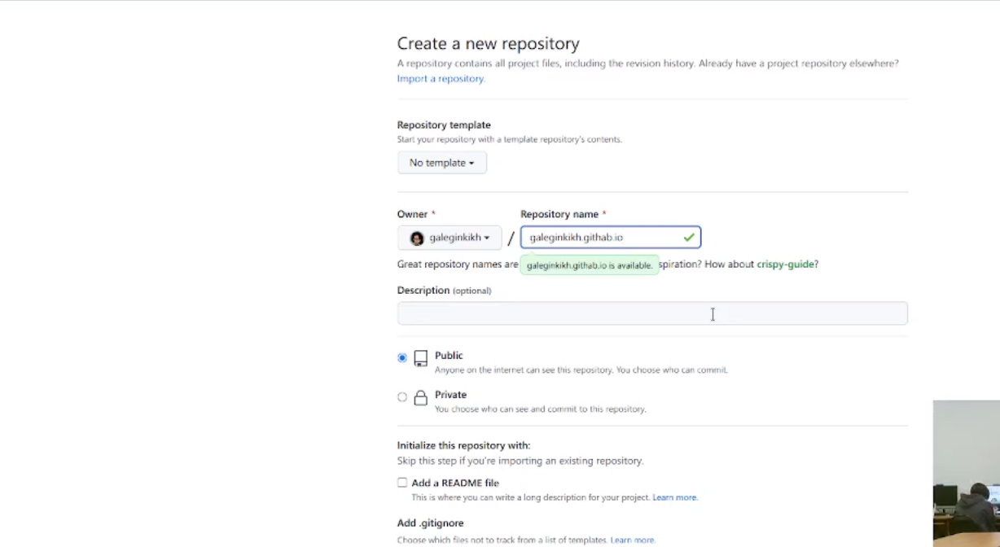
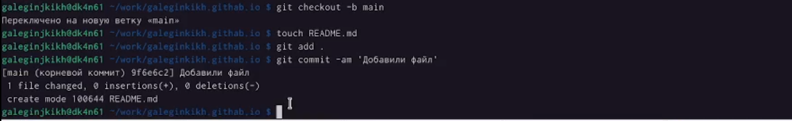
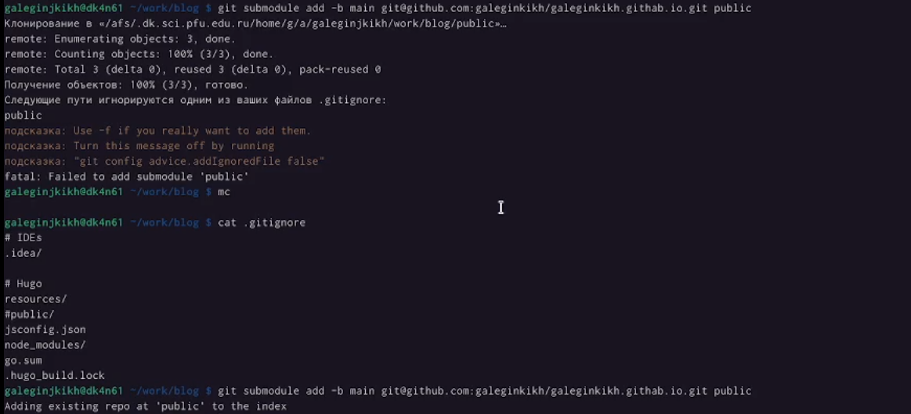
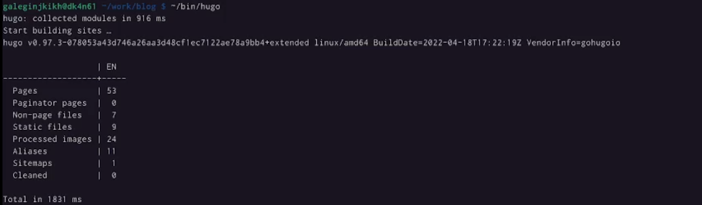
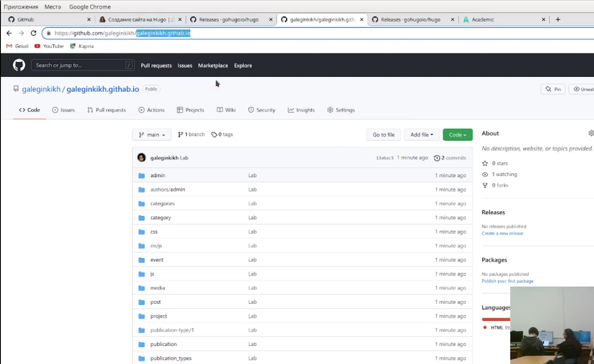

---
## Front matter
lang: ru-RU
title: Индивидуальный проект. Этап 1
author: |
    Легиньких Галина - группа НФИбд-02-21
date: 30.04.2022

## Formatting
toc: false
slide_level: 2
theme: metropolis
header-includes: 
 - \metroset{progressbar=frametitle,sectionpage=progressbar,numbering=fraction}
 - '\makeatletter'
 - '\beamer@ignorenonframefalse'
 - '\makeatother'
aspectratio: 43
section-titles: true
---

## Цель работы

Размещение на Github pages заготовки для персонального сайта.

## Выполнение лабораторной работы

**1.** Скачала Hugo

**2.** Создала папку bin и копировала туда файл hugo(рис. [-@fig:001])

{ #fig:001 width=70% }

##

**3.** Использовала данный репозиторий как шаблон и назвала blog(рис. [-@fig:002]) Клонировала(рис. [-@fig:003])

{ #fig:002 width=70% }

##

{ #fig:003 width=70% }

##

**4.** Использовала команду hugo server и перешла по ссылке(рис. [-@fig:004])

{ #fig:004 width=70% }

##

**5.** Удалила файл demo.md, чтобы убрать зелёный фон с сайта(рис. [-@fig:005])

{ #fig:005 width=70% }

##

**6.** Создала новый репозиторий с определённым именем и клонировала его(рис. [-@fig:006])

{ #fig:006 width=70% }

##

**7.** Создала ветку main, создала файл и активировала репозиторий(рис. [-@fig:007])

{ #fig:007 width=70% }

##

**8.** Подключила новый репозиторий к папке public(рис. [-@fig:008])

{ #fig:008 width=70% }

##

**9.** ~/bin/hugo(рис. [-@fig:009])

{ #fig:009 width=70% }

##

**10.** Скопировала ссылку на сайт(рис. [-@fig:010])

{ #fig:010 width=70% } 

## Вывод

Создала сайт и разместила его на githab.

