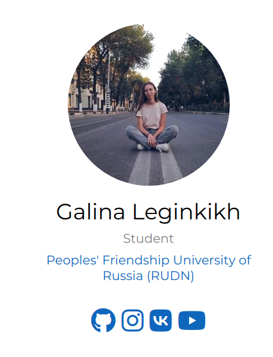
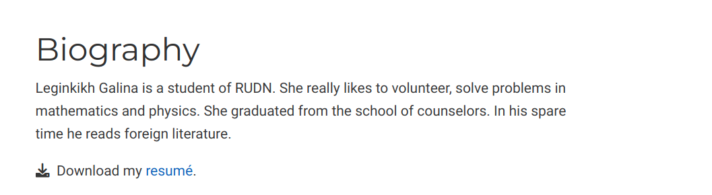
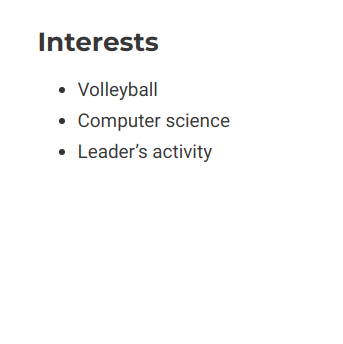
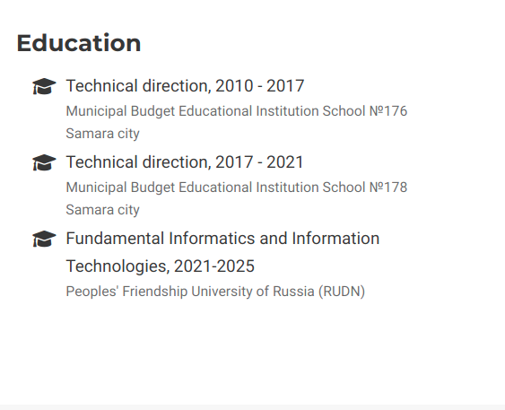
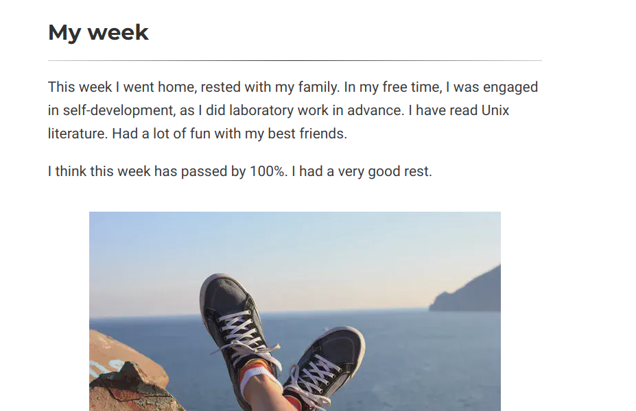
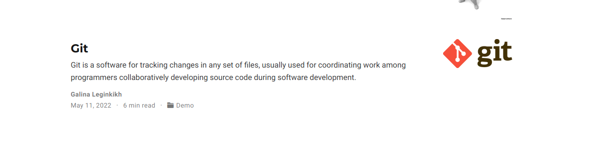

---
## Front matter
lang: ru-RU
title: Индивидуальный проект. Этап 2
author: |
    Легиньких Галина - группа НФИбд-02-21
date: 16.05.2022

## Formatting
toc: false
slide_level: 2
theme: metropolis
header-includes: 
 - \metroset{progressbar=frametitle,sectionpage=progressbar,numbering=fraction}
 - '\makeatletter'
 - '\beamer@ignorenonframefalse'
 - '\makeatother'
aspectratio: 43
section-titles: true
---

## Цель работы

Добавить к сайту данные о себе.

Список добавляемых данных:

- Разместить фотографию владельца сайта.
- Разместить краткое описание владельца сайта (Biography).
- Добавить информацию об интересах (Interests).
- Добавить информацию от образовании (Education).
- Сделать пост по прошедшей неделе.
- Добавить пост на тему по выбору.

## Выполнение лабораторной работы

**1.** Разместила фотографию.(рис. [-@fig:001])

{ #fig:001 width=40% }

##

**2.** Разместила краткую информацию о себе. (рис. [-@fig:002])

{ #fig:002 width=50% }

##

**3.** Добавила информацию о интересах. (рис. [-@fig:003])

{ #fig:003 width=50% }

##

**4.** Добавила информацию о образовании. (рис. [-@fig:004])

{ #fig:004 width=50% }

##

**5.** Сделала пост по прошедшей неделе. (рис. [-@fig:005])

{ #fig:005 width=70% }

##

**6.** Сделала пост на тему "Управление версиями. Git." (рис. [-@fig:006])

{ #fig:006 width=70% }

## Вывод 

Научилась менять информацию на сайте. Разнообразила сайт новой информацией. Написала первые посты.

