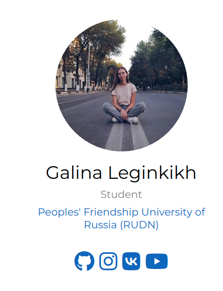
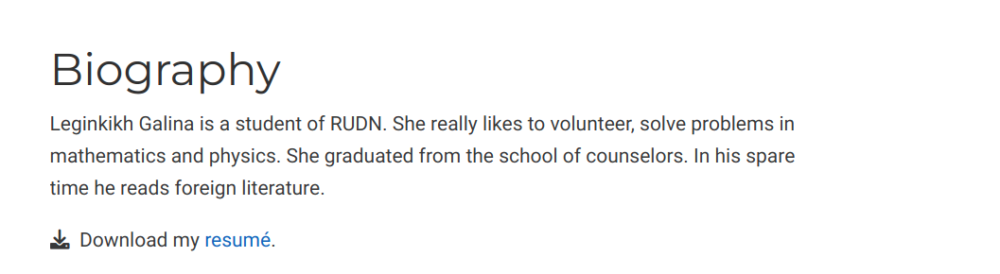
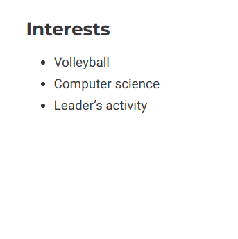
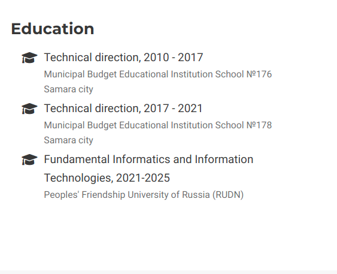
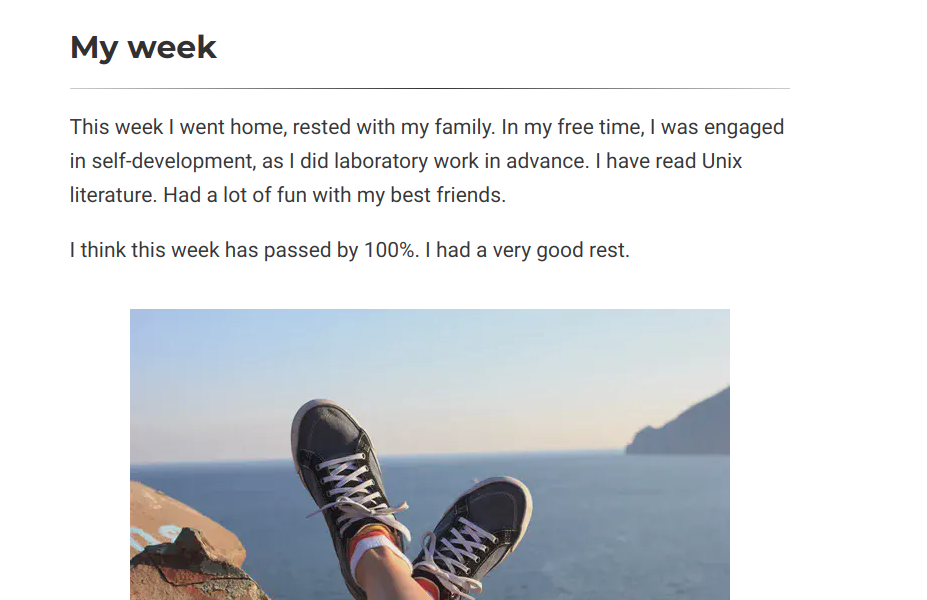
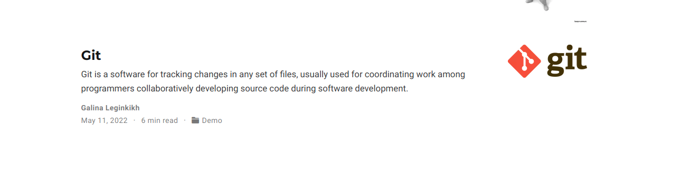

---
## Front matter
title: "Индивидуальный проект. Этап 2"
author: "Легиньких Галина Андреевна НФИбд-02-21"

## Generic otions
lang: ru-RU
toc-title: "Содержание"

## Pdf output format
toc: true # Table of contents
toc-depth: 2
lof: true # List of figures
lot: true # List of tables
fontsize: 12pt
linestretch: 1.5
papersize: a4
documentclass: scrreprt
## I18n polyglossia
polyglossia-lang:
  name: russian
  options:
  - spelling=modern
  - babelshorthands=true
polyglossia-otherlangs:
  name: english
## I18n babel
babel-lang: russian
babel-otherlangs: english
## Fonts
mainfont: PT Serif
romanfont: PT Serif
sansfont: PT Sans
monofont: PT Mono
mainfontoptions: Ligatures=TeX
romanfontoptions: Ligatures=TeX
sansfontoptions: Ligatures=TeX,Scale=MatchLowercase
monofontoptions: Scale=MatchLowercase,Scale=0.9
## Biblatex
biblatex: true
biblio-style: "gost-numeric"
biblatexoptions:
  - parentracker=true
  - backend=biber
  - hyperref=auto
  - language=auto
  - autolang=other*
  - citestyle=gost-numeric
## Pandoc-crossref LaTeX customization
figureTitle: "Рис."
tableTitle: "Таблица"
listingTitle: "Листинг"
lofTitle: "Список иллюстраций"
lotTitle: "Список таблиц"
lolTitle: "Листинги"
## Misc options
indent: true
header-includes:
  - \usepackage{indentfirst}
  - \usepackage{float} # keep figures where there are in the text
  - \floatplacement{figure}{H} # keep figures where there are in the text
---

# Цель работы

Добавить к сайту данные о себе.

Список добавляемых данных:

- Разместить фотографию владельца сайта.
- Разместить краткое описание владельца сайта (Biography).
- Добавить информацию об интересах (Interests).
- Добавить информацию от образовании (Education).
- Сделать пост по прошедшей неделе.
- Добавить пост на тему по выбору.

# Выполнение лабораторной работы

**1.** Разместила фотографию.(рис. [-@fig:001])

{ #fig:001 width=70% }

**2.** Разместила краткую информацию о себе. (рис. [-@fig:002])

{ #fig:002 width=70% }

**3.** Добавила информацию о интересах. (рис. [-@fig:003])

{ #fig:003 width=70% }

**4.** Добавила информацию о образовании. (рис. [-@fig:004])

{ #fig:004 width=70% }

**5.** Сделала пост по прошедшей неделе. (рис. [-@fig:005])

{ #fig:005 width=70% }

**6.** Сделала пост на тему "Управление версиями. Git." (рис. [-@fig:006])

{ #fig:006 width=70% }

# Вывод 

Научилась менять информацию на сайте. Разнообразила сайт новой информацией. Написала первые посты.

