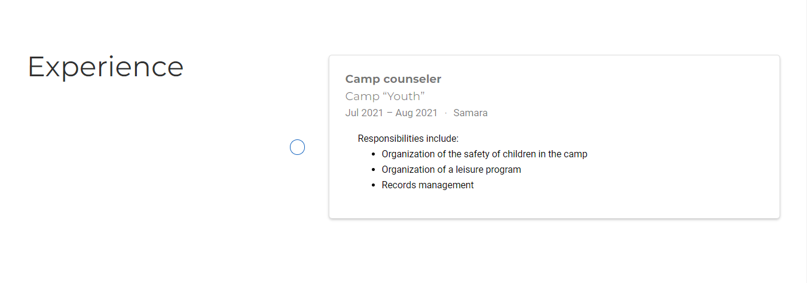

---
## Front matter
lang: ru-RU
title: Индивидуальный проект. Этап 3
author: |
    Легиньких Галина - группа НФИбд-02-21
date: 12.05.2022

## Formatting
toc: false
slide_level: 2
theme: metropolis
header-includes: 
 - \metroset{progressbar=frametitle,sectionpage=progressbar,numbering=fraction}
 - '\makeatletter'
 - '\beamer@ignorenonframefalse'
 - '\makeatother'
aspectratio: 43
section-titles: true
---

## Цель работы

- Добавить к сайту достижения. 

- Написать пост по прошедшей неделе.

- Написать пост на тему по выбору.

# Выполнение лабораторной работы

**1.** Список добавленных данных:

- Добавить информацию о навыках (Skills).

- Добавить информацию об опыте (Experience).

- Добавить информацию о достижениях (Accomplishments).

##

**2.**  Для того чтобы изменить информацию о своих навыках, зашла в файл `content/home/skills.md` и изменила там необходимые данные. (рис. [-@fig:001])

{ #fig:001 width=70% }

##

**3.** Для того чтобы изменить информацию о своем опыте, зашла в файл `content/home/experience.md` и изменила там необходимые данные. (рис. [-@fig:002])

{ #fig:002 width=70% }

##

**4.** Для того чтобы изменить информацию о своих достижениях, зашла в файл `content/home/accomplishments.md` и изменила там необходимые данные. (рис. [-@fig:003])

{ #fig:003 width=70% }

##

**5.** Сделала пост по прошедшей неделе. 02.05.2022 - 08.05.2022 (рис. [-@fig:004])

{ #fig:004 width=70% }

##

**6.** Сделала пост на тему "Язык разметки Markdown" (рис. [-@fig:005])

{ #fig:005 width=70% }

##

**7.** Обновила данные моего сайта на github pages, чтобы все что я сделала было не только на localhost.

## Вывод 

Я изенила данные на сайте обо мне. Выложила пост по прошедшей неделе. Выложила пост на тему "Язык разметки Markdown".

