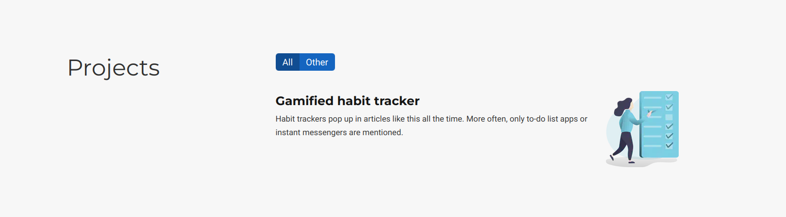
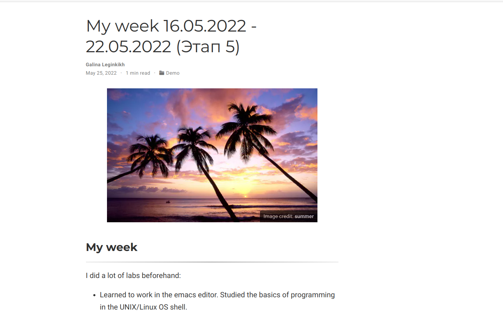
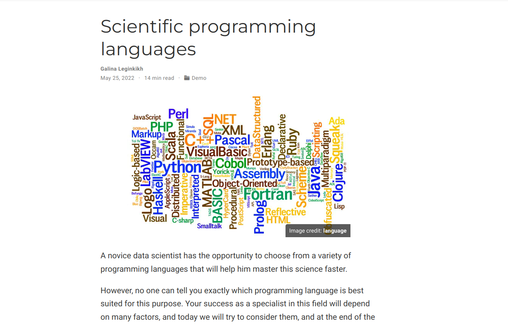

---
## Front matter
lang: ru-RU
title: Индивидуальный проект. Этап 5
author: |
    Легиньких Галина - группа НФИбд-02-21
date: 25.05.2022

## Formatting
toc: false
slide_level: 2
theme: metropolis
header-includes: 
 - \metroset{progressbar=frametitle,sectionpage=progressbar,numbering=fraction}
 - '\makeatletter'
 - '\beamer@ignorenonframefalse'
 - '\makeatother'
aspectratio: 43
section-titles: true
---

## Цель работы

- Сделать записи для персональных проектов.

- Написать пост по прошедшей неделе.

- Написать пост на тему по выбору.

## Выполнение лабораторной работы

**1.** Сделала записи для персональных проектов.

{ #fig:001 width=70% }

##

**2.** Сделала пост по прошедшей неделе. 16.05.2022 - 22.05.2022 (рис. [-@fig:002])

{ #fig:002 width=70% }

##

**3.** Сделала пост на тему "Языки научного программирования" (рис. [-@fig:003])

{ #fig:003 width=70% }

##

**4.** Обновила данные моего сайта на github pages, чтобы все что я сделала было не только на localhost.

## Вывод 

Я сделала заметки про проекту. Написала о том, как прошла моя неделя. Выложила пост на етму "Языки научного программирования"

