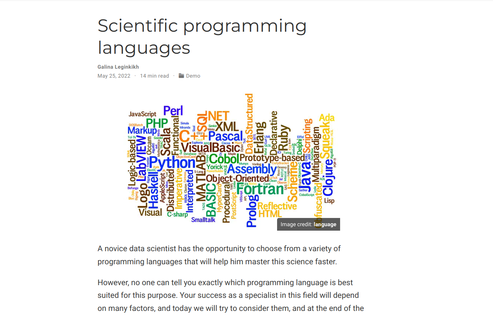

---
## Front matter
title: "Индивидуальный проект. Этап 5"
author: "Легиньких Галина Андреевна НФИбд-02-21"

## Generic otions
lang: ru-RU
toc-title: "Содержание"

## Pdf output format
toc: true # Table of contents
toc-depth: 2
lof: true # List of figures
lot: true # List of tables
fontsize: 12pt
linestretch: 1.5
papersize: a4
documentclass: scrreprt
## I18n polyglossia
polyglossia-lang:
  name: russian
  options:
  - spelling=modern
  - babelshorthands=true
polyglossia-otherlangs:
  name: english
## I18n babel
babel-lang: russian
babel-otherlangs: english
## Fonts
mainfont: PT Serif
romanfont: PT Serif
sansfont: PT Sans
monofont: PT Mono
mainfontoptions: Ligatures=TeX
romanfontoptions: Ligatures=TeX
sansfontoptions: Ligatures=TeX,Scale=MatchLowercase
monofontoptions: Scale=MatchLowercase,Scale=0.9
## Biblatex
biblatex: true
biblio-style: "gost-numeric"
biblatexoptions:
  - parentracker=true
  - backend=biber
  - hyperref=auto
  - language=auto
  - autolang=other*
  - citestyle=gost-numeric
## Pandoc-crossref LaTeX customization
figureTitle: "Рис."
tableTitle: "Таблица"
listingTitle: "Листинг"
lofTitle: "Список иллюстраций"
lotTitle: "Список таблиц"
lolTitle: "Листинги"
## Misc options
indent: true
header-includes:
  - \usepackage{indentfirst}
  - \usepackage{float} # keep figures where there are in the text
  - \floatplacement{figure}{H} # keep figures where there are in the text
---

# Цель работы

- Сделать записи для персональных проектов.

- Написать пост по прошедшей неделе.

- Написать пост на тему по выбору.

# Выполнение лабораторной работы

**1.** Сделала записи для персональных проектов.

{ #fig:001 width=70% }

**2.** Сделала пост по прошедшей неделе. 09.05.2022 - 15.05.2022 (рис. [-@fig:002])

{ #fig:002 width=70% }

**3.** Сделала пост на тему "Языки научного программирования" (рис. [-@fig:003])

{ #fig:003 width=70% }

**4.** Обновила данные моего сайта на github pages, чтобы все что я сделала было не только на localhost.

# Вывод 

Я сделала заметки про проекту. Написала о том, как прошла моя неделя. Выложила пост на етму "Языки научного программирования"

