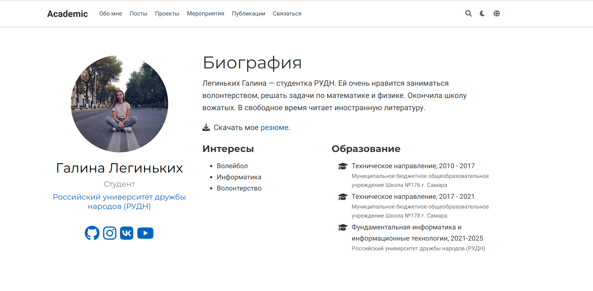

---
## Front matter
lang: ru-RU
title: Индивидуальный проект. Этап 6
author: |
    Легиньких Галина - группа НФИбд-02-21
date: 25.05.2022

## Formatting
toc: false
slide_level: 2
theme: metropolis
header-includes: 
 - \metroset{progressbar=frametitle,sectionpage=progressbar,numbering=fraction}
 - '\makeatletter'
 - '\beamer@ignorenonframefalse'
 - '\makeatother'
aspectratio: 43
section-titles: true
---

## Цель работы

- Сделать поддержку английского и русского языков.
- Разместить элементы сайта на обоих языках.
- Разместить контент на обоих языках.
- Сделать пост по прошедшей неделе.
- Добавить пост на тему по выбору (на двух языках).

## Выполнение лабораторной работы

**1.** Добавила шапку сайта на русском.

{ #fig:001 width=70% }

##

**2.** Добавила в папку content папку ru и en (рис. [-@fig:002])

{ #fig:002 width=70% }

##

**3.** Сделала поддержку на русском (рис. [-@fig:003])

{ #fig:003 width=70% }

##

**4.** Сделала пост "Python" и "Моя неделя" (рис. [-@fig:004])

{ #fig:004 width=70% }

##

**5.** Обновила данные моего сайта на github pages, чтобы все что я сделала было не только на localhost.

## Вывод 

Я научилась делать поддержку сайта на русском и английском. Сделала пост на тему по выбору.

